<p align="center">
  <picture>
    <source media="(prefers-color-scheme: dark)" srcset="assets/brand/cuteafd-logo-color-dark.svg">
    
  </picture>
</p>

CuteAFD brings frontier-scale open-weights models into the home lab at
data-center speed. It disaggregates attention from the routed experts: one or
two consumer-Blackwell RTX PRO 6000 cards run attention, the dense
backbone, routing and sampling, while a pool of DGX Sparks (GB10, SM121) holds
the routed experts and answers over RoCE. The same engine loads a model's
standard Hugging Face checkpoint directly — no side files, no repacking — and
runs it on the formats it actually ships in: official FP8 and MXFP4,
NVIDIA ModelOpt NVFP4, and EXL3, with native kernels that honor each
checkpoint's own numerics instead of converting everything to one internal
format.

- Attention/FFN disaggregation (AFD): RTX cards own the backbone, Sparks own
  the experts, exchanging activations over RoCE with GPU-direct landing.
- Robust quant support: official FP8/MXFP4, NVIDIA ModelOpt NVFP4, and EXL3,
  loaded from the checkpoint's own `config.json` and tensor headers.
- Sliced HF snapshots need no annotation: MiMo, GLM Flash and Qwen coordinators
  need only their role's shards; official V4.1 Spark workers need only expert shards.
  `cuteafd plan MODEL --files --role coordinator --spark-ranks 4` emits an rsync
  file list; add `--fetch --destination /path/to/snapshot --dry-run` to preview a
  role-only copy (omit `--dry-run` to copy). Transfers materialize HF blob symlinks
  as plain snapshot files; matching sizes are skipped and nothing is deleted.
  For host unions, `--file-layout layout.json --host worker` accepts a JSON host-to-role
  map such as `{"worker":["spark0","vision"]}`; omit `--host` with `--json` to list all
  hosts. `--host worker --fetch` copies via SSH; add `--source peer:/snapshot` to
  pull from a peer (MODEL supplies the local index/config). Remote size checks are
  batched into one SSH session before and after copying. `--forward-agent` opts into
  `ssh -A` for peer-to-target copies (default off). `--source auto` reports whether
  sparknest serves a sealed local copy or streams; without it, the local snapshot
  is used. Omit `--host` with `--file-layout --fetch` to copy the whole layout,
  capped by `--fetch-parallel` (default 2). Add `--drafter-snapshot`, `--vision-snapshot`
  or `--audio-snapshot` with `--json` to include separate repos for the selected
  host's enabled roles; fetch those snapshot roots individually.
- Exact prefix caching for agentic work: the deepest cached snapshot that
  prefixes a request is restored byte-identical, not approximated.
- Own your intelligence: your weights, your hardware, your rate limits (none),
  agentic coding at full speed on a machine you control, not a shared tenant.

## v2.0.0 changes since v1.0.0

- Bundled image input for shipped vision-capable families where the planner admits the tower: V4.1 vision on Spark rank 0; GLM Flash, MiMo and Qwen (simulated 5090) on a Spark; Qwen on the RTX for the no-Spark card. MiMo audio is placed automatically and its tower ships in release images. The Qwen 1× RTX default cells run text-only because automatic admission keeps the 2M KV target and drops the tower (see Remaining limits).
- One SM120 image for RTX PRO 6000 and RTX 5090; runtime SM/grid sizing, GPU/RDMA probing and 32 GB memory admission. The automatic KV target is 2M tokens on PRO cards and 1M on small cards, subject to family admission.
- Hugh Madden's GLM Flash ports #14-#29: pooled prefix marks and pinned host tier, lane/workspace and graph accounting, compact-index/BF16-state/GB10 schedules, opt-in 128-row decode/verify and drafter modes, Spark transport warm-up, prefix-mark count correction and warm-up stream RAII.
- MiMo V2.6 Flash MOPD, bounded serving graphs, fidelity tiers (quick/standard/full) and published family goldens; quants score against their family's highest-precision official reference through model-card ancestry.
- Release-smoke cards add C8 aggregate code throughput alongside C1 and cold ~8K prefill. The grid is 5090 | 1× RTX | 2× RTX; Qwen's unsupported two-GPU split is n/a.
- Concurrent coordinator/Spark release builds, a published pinned toolchain-only dev image, and persistent architecture-specific Cargo/JIT/compiler caches.

## rc3 changes since rc2

- **V4 Flash fits a 32 GB card again** (f802bbb6, 2a758f74): exact small-card workspace/graph reserves and V4 scratch and startup programs scoped to the serving family (31 programs on one GPU, 43 under the head split, instead of every program in the image). The simulated-5090 card now runs: effective context 904,960 tokens.
- **V4.1 on a 32 GB coordinator starts** (3af226db): a replaced Spark expert endpoint now releases its rings before the replacement is admitted, and V4.1 Spark ring admission is exact and enforced on every worker path. The simulated-5090 card now passes.
- **GLM Flash defaults** (c9dcc9e2, 5beb668f): compact DSA index cache, shared replay records, tensor-core draft head and W8A8 draft GEMMs are on where they apply; 128-row decode/verify remains opt-in. Simulated-5090 planner pools roughly double (EXL3/tr3 319,488 → 710,912 tokens).
- **V4.1 NVFP4 is now scored** against the official V4.1 Flash reference: it fails the confident-top-1 fidelity check and is **not recommended** (see Remaining limits).
- **Sliced checkpoints:** role-local shard reads for MiMo, GLM Flash and Qwen coordinators and official V4.1 Spark workers; `cuteafd plan --files/--fetch`.
- **Qwen 1× RTX with no Sparks and vision** is published as its own card (fixed 262,144-token pool, vision on RTX0).
- Docs: the V4.1 NVFP4 execution path is native W4A4 with BF16 rows on the wire (the earlier "W4A8 / lossless downcast" description was wrong).

rc3 publishes no rc2 → rc3 speed or prefill comparisons. Because the Spark ring fix changed the transport shared by every
Spark family, the rc2 and rc3 engines were compared on matched prompts (three interleaved pairs per card, same launcher)
on MiMo V2.6 Flash minimum, GLM 5.3 EXL3 maximum, V4 Flash maximum and GLM Flash tr3 maximum. No card regressed:
paired-median C1 changes were +0.2%, +2.9%, +0.1% and −1.6%, and decode with speculation off moved by +0.2%, +0.5%,
0.0% and −1.5%. Observations below the regression threshold (C1 more than 3% slower in every pair or a 5% median), not
established changes: C8 −3.9% on GLM 5.3 and −3.8% on GLM Flash tr3 (MiMo and V4 flat), and V4 Flash 8K prefill −2.6%. Single-launch release cards differ by more than this between
releases because speculative decode depends on the prompt.

The 5090 column is memory-only simulation unless explicitly marked real:
**simulated 5090: RTX PRO 6000 (188 SMs) capped at 31.8 GiB**.
SM count (188 vs 170), L2, clocks and power are not emulated; speed is indicative
and likely optimistic. Real 5090 cards replace these cells when they arrive; simulations
stay in history. Planner-only no-fit cells link the planner's reason and contain no performance.
Release smoke measures text C1, C8, cold ~8K prefill, quick fidelity and exact cache; it is
not a full multimodal, full-context or C16 qualification.
Memory fit, compiled extent and the admitted pool are distinct. GLM, GLM Flash, V4 and V4.1
compile a 1,048,576-token index extent; Qwen's is checkpoint-clamped to 262,144. The admitted
pool can reduce effective context; cards report it, and values below the 262,144-token agentic
floor are listed as findings, never hidden by enlarging pools.

The v2.0.0 candidate is **rc3**: serving source `5beb668f`, release images built at `c9dcc9e2`
(the difference is launcher, test and docs only). **rc2 (`8de2f56a`) and rc1 (`29bc9e04`) are
superseded**; their tags, images and cards remain available as history.

### Remaining Limits

- **V4.1 NVFP4 (`nvidia/DeepSeek-V4.1-Flash-NVFP4`): FAIL, not recommended right now.** It fails the calibrated confident-top-1 fidelity check against the official V4.1 Flash reference: 96.7% (1× RTX + 4 Sparks), 97.1% (2× RTX + 4 Sparks) and 96.5% (simulated 5090) against 98%. Use the official MXFP4 checkpoint `deepseek-ai/DeepSeek-V4.1-Flash`, which passes every check on the same images. The failure predates rc3; the cause is the Spark FC1 path's shared per-layer input scale (details in the [V4.1 page](docs/models/deepseek_v41.md#known-limits)).
- **V4 Pro EXL3 K2 minimum: fidelity FAIL** at KL 0.0605 against 0.06 (top-1 92.0%); the maximum passes at KL 0.0596. Same threshold-straddling result as rc1 and rc2; the gate is unchanged.
- **Qwen NVFP4 below the agentic floor:** `qwen38-nvfp4-min` admits 217,856 effective context tokens and `qwen38-nvfp4-sim5090` 243,456, below 262,144. Quality and exact cache pass.
- **Qwen 1× RTX vision:** with automatic pool and media, admission keeps the unattainable 2M KV target and turns the vision tower off, so the default Qwen 1× RTX cells (EXL3 and NVFP4) are text-only. An explicit `POOL_TOKENS=262144` with `VISION=rtx:0` admits vision for EXL3 (the separate no-Spark card). NVFP4 with vision at that pool is refused at startup (`fixed Qwen KV pool of 262144 tokens does not fit with 30380 startup graphs`); the planner under-charges startup graphs and NVFP4 expert scratch (v3 work).
- **V4 placement:** automatic KV sizing follows resident expert placement on GPU0, so default V4 context is pool-limited on one RTX (rc3: Flash 663,296, Pro 455,424 effective tokens) and GPU1 stays underused on two; pool-first admission and TP2 experts across both RTX cards are v3 work.
- The GLM Flash tr3 quant's bundled template lacks image markers; cards use `CHAT_TEMPLATE_FROM=zai-org/GLM-5.3-Flash` for vision.

## v1.0.0 changes since v0.1.0

- MiMo Pro uses the MOPD checkpoint. Single-copy FP8 defaults cover the V4.1
  vocabulary head, MiMo head/o_proj/drafter, GLM drafters, GLM Flash per-layout
  projections and Qwen head.
- Qwen gains local experts and MTP3, including mixed NVFP4 backbone / FP8 MTP.
  GLM Flash gains a two-RTX head split and DFlash2 on every layout.
- MiMo Pro prefill gains lanes under head split, A8 down projection and exact
  Spark slices; GLM 5.3 gains FP8 MLA prefill and faster Spark kernels.
- Tool-call grammar fixes, automatic KV pools and planner core, a live console
  for every family, and the benchmark dashboard. Device-driven exchange ships
  opt-in. MXFP4 32-row tails and V4.1 exact slices move to v1.x.

## WIP Hardware Cards

Use `scripts/bench/wip-cards.py` instead of copying an RC kit driver. It reads
`cfg/*.config` and `matrix-*.json` from the kit (default: release-v2-rc2), writes
private one-card matrices and a 0600 API key, and runs `cuteafd bench smoke`
under `setsid` with numeric exit files. Smoke alone owns serving locks. Use a
current CLI containing the opt-in observer/precheck hooks for probes.

```sh
python3 scripts/bench/wip-cards.py --interleave --repeats 3 \
  --cards v41-flash-min --arm baseline=my-base:slot --arm candidate=my-new:slot \
  --task v41-ab --probe v41-flash-min:image,memory,console \
  --expect-pool v41-flash-min=2097152 --dry-run
python3 scripts/bench/wip-cards.py --matrix --parallel 2 \
  --cards v41-flash-sim5090 glm53f-exl3-sim5090 \
  --arm left=my-left:slot --arm right=my-right:slot \
  --card-arm v41-flash-sim5090=left --card-arm glm53f-exl3-sim5090=right --dry-run
```

Remove `--dry-run` to execute. `--set CARD:KEY=VALUE` overrides serving keys.
Parallel mode accepts only simulated or explicitly correctness-only cards
(`kind`: `sim-5090`, `fidelity`, `cache`, `image`, `no-fit`, `packed-check`),
refuses shared GPUs/Sparks/ports/instances and published/compared cards, and
withholds incidental performance numbers. Shared-arm parallel cards use one
smoke scheduler; separately bound arms use independent smoke processes with
disjoint lock sets. Simulated timings never enter
medians or paired deltas. Results include JSON, a markdown table, hook logs,
raw/corrected CUDA 50ms peaks (NVML sampler-context subtraction), worker ring
ledger peaks and authenticated console stage events. Explicit probes fail
rather than silently claim missing evidence. Pool admission and red-square
image checks run after readiness, before the benchmark. Explicit `panels:`
selections are validated before launch and checked against the finished report.
Serving instance names use a short hash suffix to stay within run.sh's 41-byte
limit; WIP arm identities remain unchanged. `--interleave --matched-prompts`
replays the same `CUTEAFD_BENCH_NONCE_SEED` sequence across fresh arm servers,
with a new recorded seed per pair. Basic/decode-content requests remain greedy
with their fixed token limits. Authenticated console rounds report per-request
emitted tok/s (first-token-to-retirement decode time), tokens/step and ms/step
(round service time); round-service tok/s is reported separately. Missing or different first-request token hashes fail the pair. This
requires arm images with opt-in prompt-hash telemetry; release cards without
the flag keep their existing prompts.

Optional `--build baseline=REV --build candidate=REV` freezes separate source
worktrees, uses identical family scopes, stages sealed slots to the union of
selected Spark hosts, and checks every card's local/remote seals before launch.
Builds use `build.lock`, nice 19 and 16 CPU jobs. Sources with opt-in export
locking take the specifically mounted raptor GPU lock only during native/AOT
work. Legacy frozen sources hold that lock for the full build instead; the
mode is logged and recorded per arm. No scripts are overlaid into frozen arms.
A busy Spark seed is
refused using a raptor-side lock check (not an atomic reservation; operators
must still keep the seed idle throughout export). `--cleanup` verifies and
removes only task-owned build roots/containers, overlays and registrations on
raptor and all six Sparks; existing arms without this task's ownership marker
are deliberately refused, never adopted. Keep the same `--task`, `--state`
and arms for cleanup. Source worktrees are retained for inspection.

## Models

Basic benchmark profile per family on its natural-minimum (1× RTX + fewest
Sparks) and maximum (2× RTX + 4 or 6 Sparks) hardware. Other reports:
[`benchmarks/`](benchmarks/README.md).

The rc3 Release-smoke matrix covers 26 natural-minimum/maximum cells: 23 pass every check,
two V4.1 NVFP4 cells fail fidelity (not recommended) and the V4 Pro EXL3 minimum fails
fidelity at KL 0.0605. All three required spots pass, as do the GLM draft-kernel selftests on
SM120 and SM121. The simulated-5090 column has nine passing cells, one V4.1 NVFP4 fidelity
FAIL and four planner-only no-fit cells. The Qwen EXL3 1× RTX row also lists the separate
no-Spark card with vision on RTX0 at a fixed 262,144-token pool. Cards measure text C1, warmed
C8 aggregate, cold ~8K prefill, quick fidelity and exact cache; vision state per cell is in the
family pages. Single launches, not A/B measurements: compare cells across releases only with
matched-prompt runs.

MiMo V2.6 Flash MOPD replaces the legacy Flash current rows. Its historical
[text-only bring-up qualification](docs/models/mimo_v2.md#flash-mopd-qualification-2026-10-05)
is separate from release-smoke measurements and retains its original conditions.
See the [v2 release scope](PLAN.md#release-v2-scope-decided-2026-10-05) and family Known limits.

<!-- results:begin -->
<table>
<tr><th>Model · quant</th><th>5090</th><th>1× RTX</th><th>2× RTX</th></tr>
<tr>
<td width="19%" valign="top"><a href="docs/models/deepseek_v41.md"><b>DeepSeek V4.1</b></a><br><sub>deepseek-ai/DeepSeek-V4.1-Flash</sub><br><sub>mxfp4-g32</sub></td>
<td width="27%" valign="top"><a href="benchmarks/deepseek_v41/2026-10-09-smoke-deepseek-v4-1-flash-1rtx-3spark-v41-flash-rc3-sim5090/card.svg">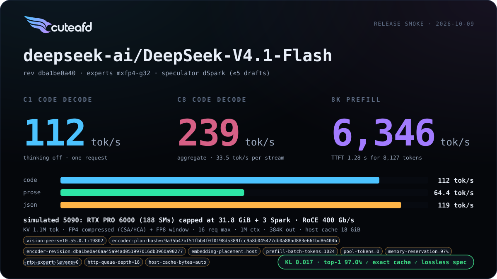</a><br><sub>simulated 5090: RTX PRO 6000 (188 SMs) capped at 31.8 GiB + 3 Spark</sub><br><sub>Starts from rc3 (rc2: startup ring-budget failure).</sub></td>
<td width="27%" valign="top"><a href="benchmarks/deepseek_v41/2026-10-09-smoke-deepseek-v4-1-flash-1rtx-3spark-v41-flash-min-rc3/card.svg">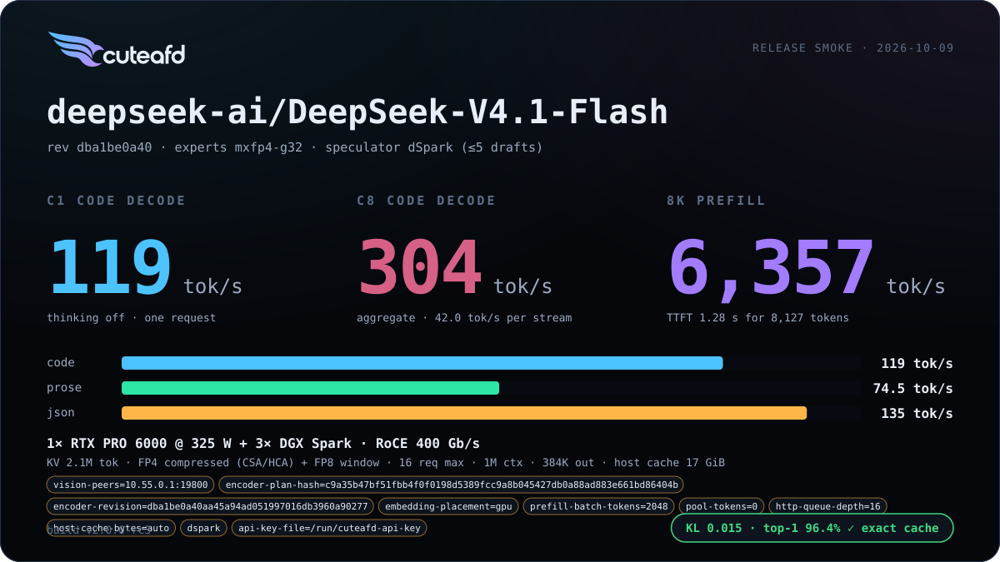</a><br><sub>1× RTX + 3× Spark</sub></td>
<td width="27%" valign="top"><a href="benchmarks/deepseek_v41/2026-10-09-smoke-deepseek-v4-1-flash-2rtx-4spark-v41-flash-max-rc3/card.svg">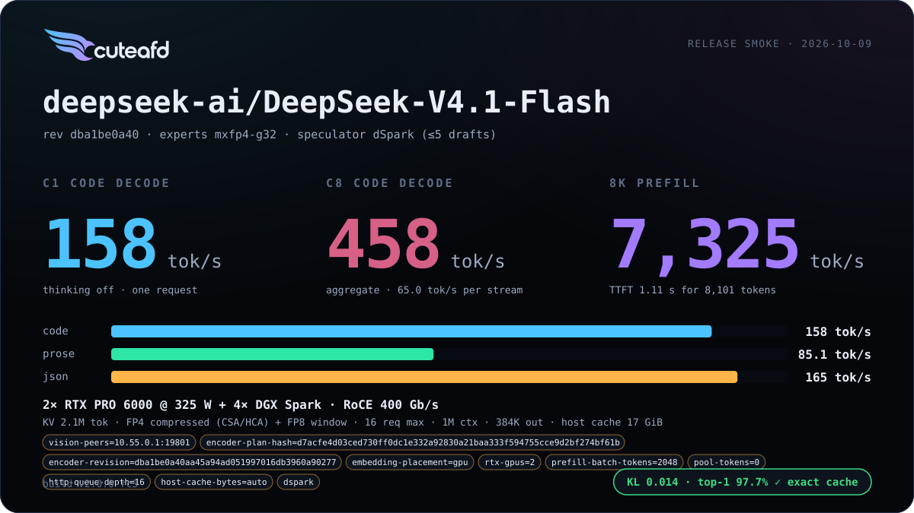</a><br><sub>2× RTX + 4× Spark</sub></td>
</tr>
<tr>
<td width="19%" valign="top"><a href="docs/models/deepseek_v41.md"><b>DeepSeek V4.1</b></a><br><sub>nvidia/DeepSeek-V4.1-Flash-NVFP4</sub><br><sub>nvfp4-g16</sub></td>
<td width="27%" valign="top"><a href="benchmarks/deepseek_v41/2026-10-09-smoke-deepseek-v4-1-flash-nvfp4-1rtx-4spark-v41-flash-nvfp4-rc3-sim5090/card.svg">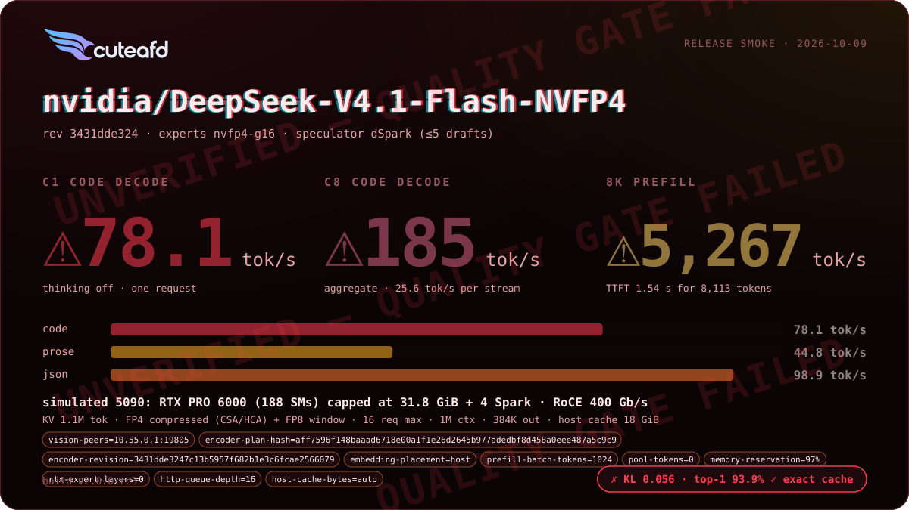</a><br><sub>simulated 5090: RTX PRO 6000 (188 SMs) capped at 31.8 GiB + 4 Spark</sub><br><sub><b>FAIL: not recommended.</b> Fails the calibrated confident-top-1 fidelity check (96.5% vs 98%). Use the official MXFP4 checkpoint (deepseek-ai/DeepSeek-V4.1-Flash), which passes every check. Uses 4 Sparks: TP3 fits by memory, but the launcher supports NVFP4 only at TP4.</sub></td>
<td width="27%" valign="top"><a href="benchmarks/deepseek_v41/2026-10-09-smoke-deepseek-v4-1-flash-nvfp4-1rtx-4spark-v41-flash-nvfp4-min-rc3/card.svg">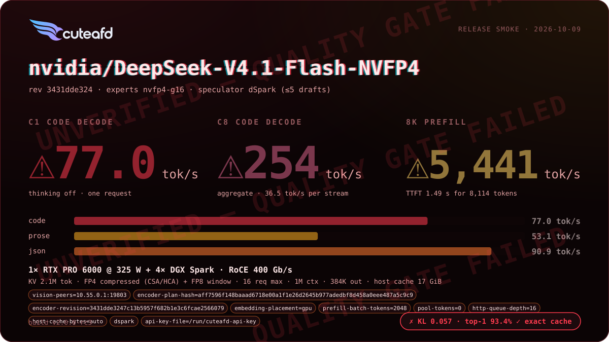</a><br><sub>1× RTX + 4× Spark</sub><br><sub><b>FAIL: not recommended.</b> Fails the calibrated confident-top-1 fidelity check (96.7% vs 98%). Use the official MXFP4 checkpoint (deepseek-ai/DeepSeek-V4.1-Flash), which passes every check. Uses 4 Sparks: TP3 fits by memory, but the launcher supports NVFP4 only at TP4.</sub></td>
<td width="27%" valign="top"><a href="benchmarks/deepseek_v41/2026-10-09-smoke-deepseek-v4-1-flash-nvfp4-2rtx-4spark-v41-flash-nvfp4-max-rc3/card.svg">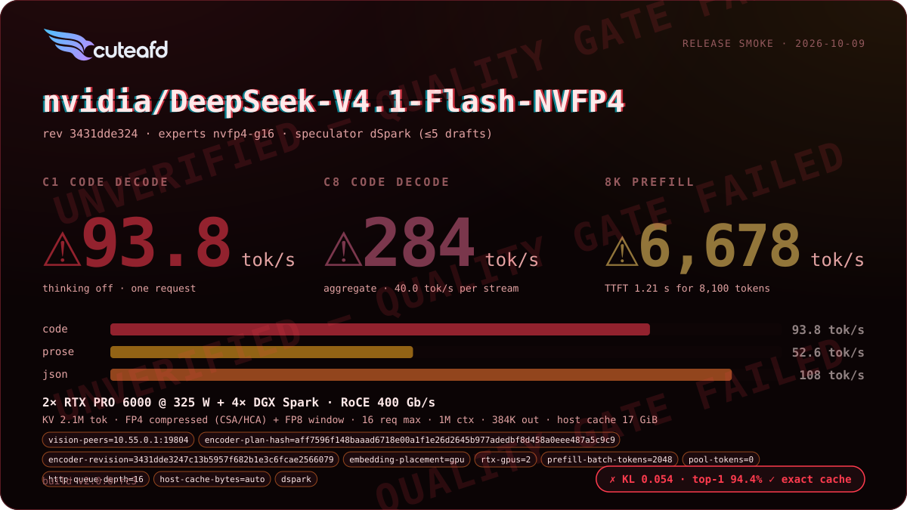</a><br><sub>2× RTX + 4× Spark</sub><br><sub><b>FAIL: not recommended.</b> Fails the calibrated confident-top-1 fidelity check (97.1% vs 98%). Use the official MXFP4 checkpoint (deepseek-ai/DeepSeek-V4.1-Flash), which passes every check.</sub></td>
</tr>
<tr>
<td width="19%" valign="top"><a href="docs/models/deepseek_v4.md"><b>DeepSeek V4</b></a><br><sub>deepseek-ai/DeepSeek-V4-Flash-0731</sub><br><sub>mxfp4-g32</sub></td>
<td width="27%" valign="top"><a href="benchmarks/deepseek_v4/2026-10-09-smoke-deepseek-v4-flash-0731-1rtx-2spark-v4-flash-rc3-sim5090/card.svg">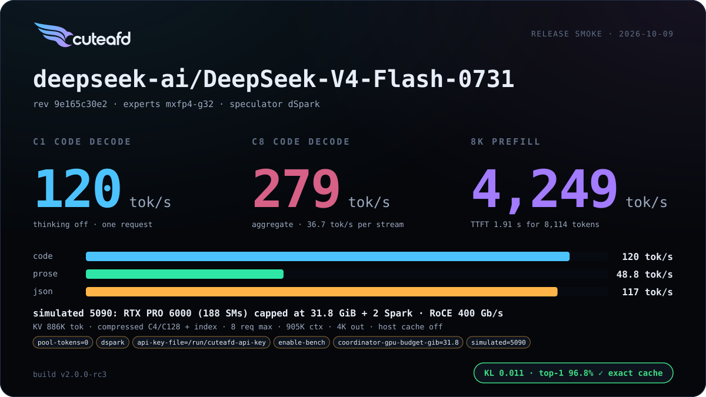</a><br><sub>simulated 5090: RTX PRO 6000 (188 SMs) capped at 31.8 GiB + 2 Spark</sub><br><sub>Fits a 32 GB card from rc3 (rc2: planner-only no-fit).</sub></td>
<td width="27%" valign="top"><a href="benchmarks/deepseek_v4/2026-10-09-smoke-deepseek-v4-flash-0731-1rtx-2spark-v4-flash-min-rc3/card.svg">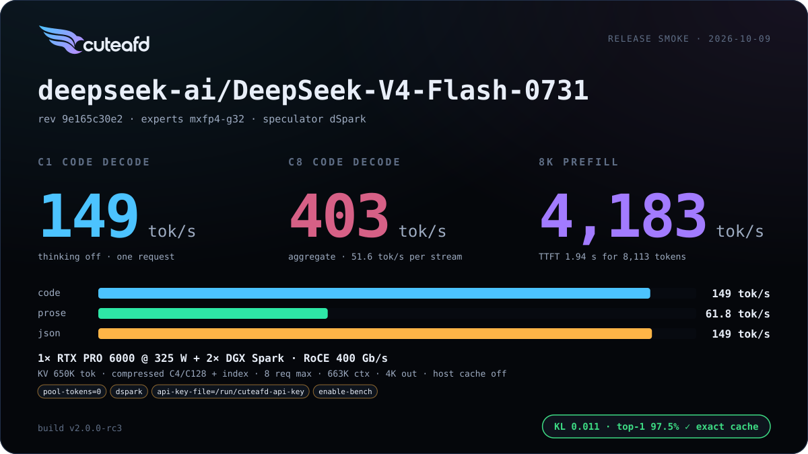</a><br><sub>1× RTX + 2× Spark</sub></td>
<td width="27%" valign="top"><a href="benchmarks/deepseek_v4/2026-10-09-smoke-deepseek-v4-flash-0731-2rtx-4spark-v4-flash-max-rc3/card.svg">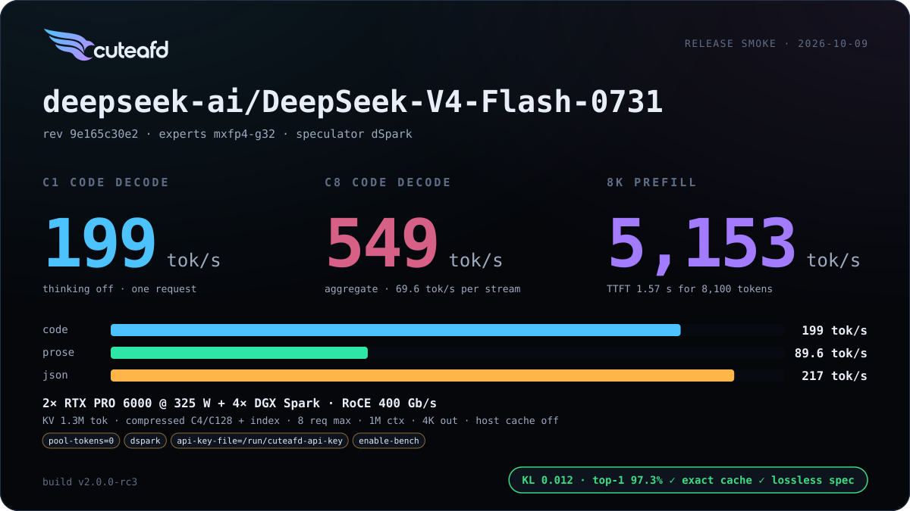</a><br><sub>2× RTX + 4× Spark</sub></td>
</tr>
<tr>
<td width="19%" valign="top"><a href="docs/models/deepseek_v4.md"><b>DeepSeek V4</b></a><br><sub>wrldsuksgo2mars/DeepSeek-V4-Pro-0813-EXL3-K2-calibrated-v1</sub><br><sub>exl3-k2</sub></td>
<td width="27%" valign="top"><a href="benchmarks/deepseek_v4/2026-10-09-smoke-v4-pro-exl3-no-fit-rc3-sim5090/report.json">doesn't fit 1× 5090 (32 GB) + 6 Sparks</a><br><sub>coordinator weights need 46.0 GiB, over the 32 GiB coordinator budget; rtx0 full memory layout needs 62369870091 bytes, budget 31031138713 bytes, shortfall 31338731378 bytes</sub><br><sub>Memory rejection with all six Sparks (rc3 planner); no server launched, no performance.</sub></td>
<td width="27%" valign="top"><a href="benchmarks/deepseek_v4/2026-10-09-smoke-deepseek-v4-pro-0813-exl3-k2-calibrated-v1-1rtx-4spark-v4-pro-exl3-min-rc3/card.svg">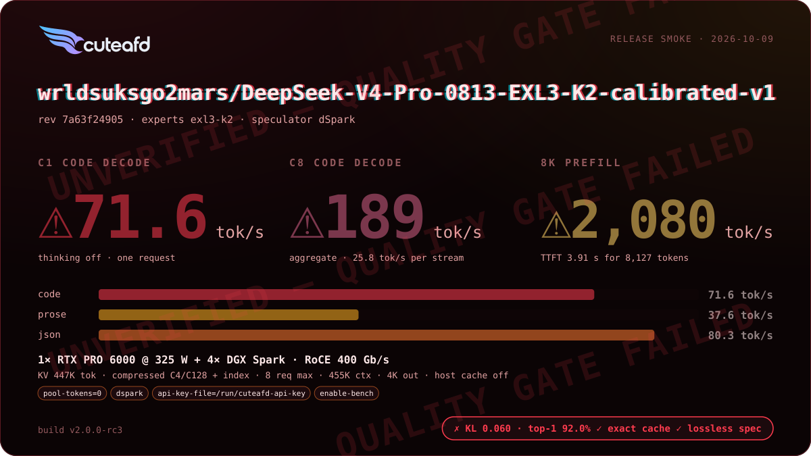</a><br><sub>1× RTX + 4× Spark</sub><br><sub>Fidelity FAIL: KL 0.0605 &gt; 0.06 (top-1 92.0%); threshold-straddling since rc1, gate unchanged.</sub></td>
<td width="27%" valign="top"><a href="benchmarks/deepseek_v4/2026-10-09-smoke-deepseek-v4-pro-0813-exl3-k2-calibrated-v1-2rtx-6spark-v4-pro-exl3-max-rc3/card.svg">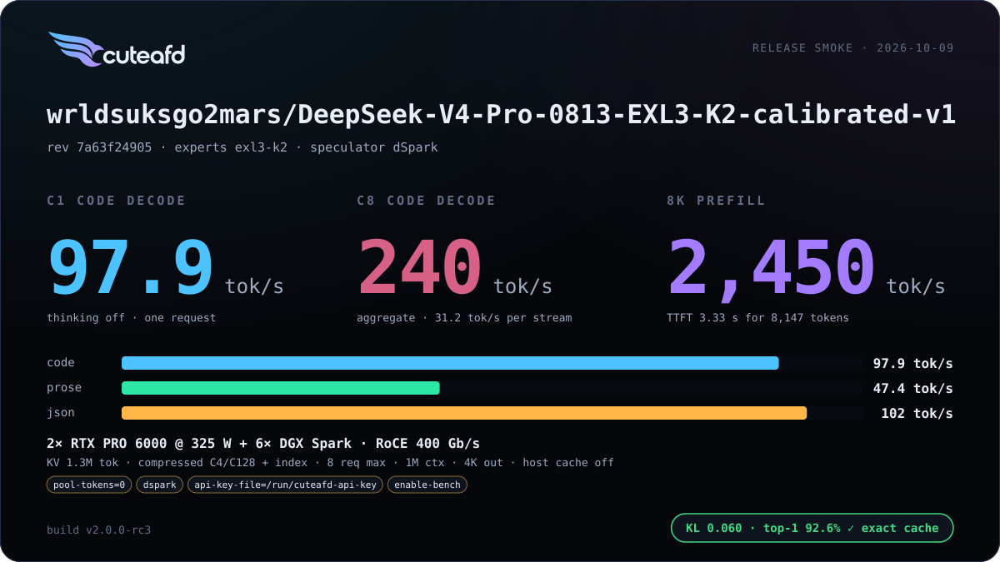</a><br><sub>2× RTX + 6× Spark</sub></td>
</tr>
<tr>
<td width="19%" valign="top"><a href="docs/models/glm5.md"><b>GLM 5.3</b></a><br><sub>wrldsuksgo2mars/GLM-5.3-EXL3-K4-v1</sub><br><sub>exl3-k4</sub></td>
<td width="27%" valign="top"><a href="benchmarks/glm5/2026-10-09-smoke-glm53-exl3-no-fit-rc3-sim5090/report.json">doesn't fit 1× 5090 (32 GB) + 6 Sparks</a><br><sub>rtx0 full memory layout needs 38219720132 bytes, budget 31997506355 bytes, shortfall 6222213777 bytes</sub><br><sub>Memory rejection with all six Sparks (rc3 planner); no server launched, no performance.</sub></td>
<td width="27%" valign="top"><a href="benchmarks/glm5/2026-10-09-smoke-glm-5-3-exl3-k4-v1-1rtx-4spark-glm53-exl3-min-rc3/card.svg">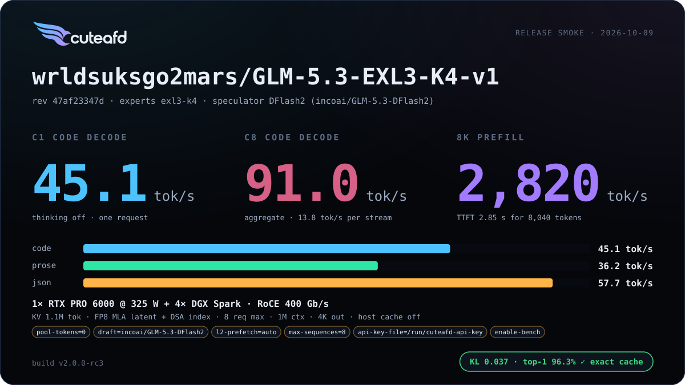</a><br><sub>1× RTX + 4× Spark</sub></td>
<td width="27%" valign="top"><a href="benchmarks/glm5/2026-10-09-smoke-glm-5-3-exl3-k4-v1-2rtx-6spark-glm53-exl3-max-rc3/card.svg">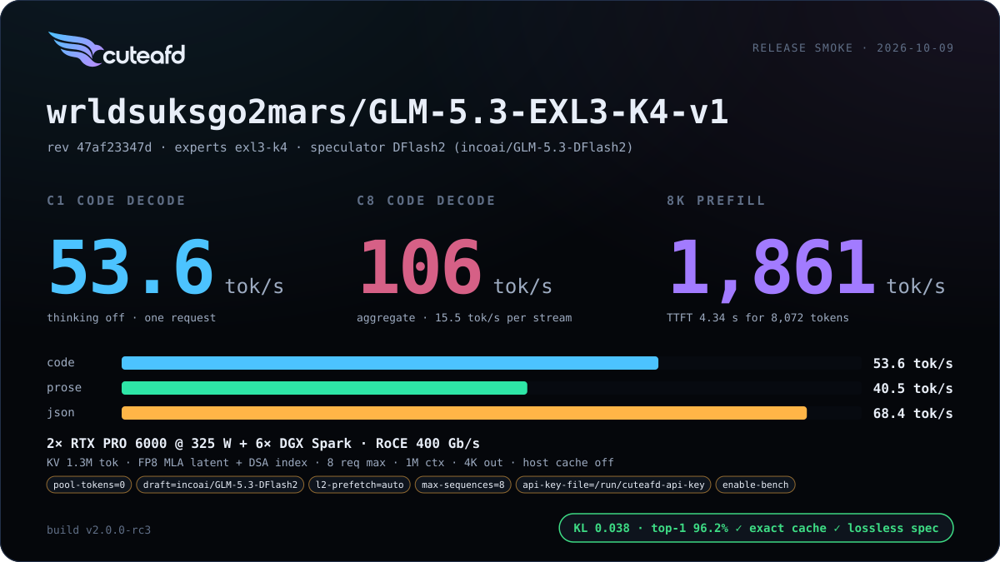</a><br><sub>2× RTX + 6× Spark</sub></td>
</tr>
<tr>
<td width="19%" valign="top"><a href="docs/models/glm5.md"><b>GLM 5.3</b></a><br><sub>nvidia/GLM-5.3-NVFP4</sub><br><sub>nvfp4-g16</sub></td>
<td width="27%" valign="top"><a href="benchmarks/glm5/2026-10-09-smoke-glm53-nvfp4-no-fit-rc3-sim5090/report.json">doesn't fit 1× 5090 (32 GB) + 6 Sparks</a><br><sub>coordinator weights need 52.6 GiB, over the 32 GiB coordinator budget; rtx0 full memory layout needs 54111029708 bytes, budget 31997506355 bytes, shortfall 22113523353 bytes</sub><br><sub>Memory rejection with all six Sparks (rc3 planner); no server launched, no performance.</sub></td>
<td width="27%" valign="top"><a href="benchmarks/glm5/2026-10-09-smoke-glm-5-3-nvfp4-1rtx-4spark-glm53-nvfp4-min-rc3/card.svg">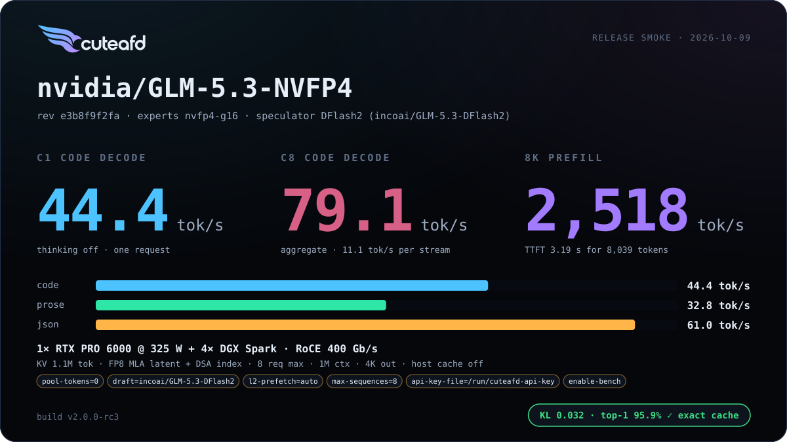</a><br><sub>1× RTX + 4× Spark</sub></td>
<td width="27%" valign="top"><a href="benchmarks/glm5/2026-10-09-smoke-glm-5-3-nvfp4-2rtx-6spark-glm53-nvfp4-max-rc3/card.svg">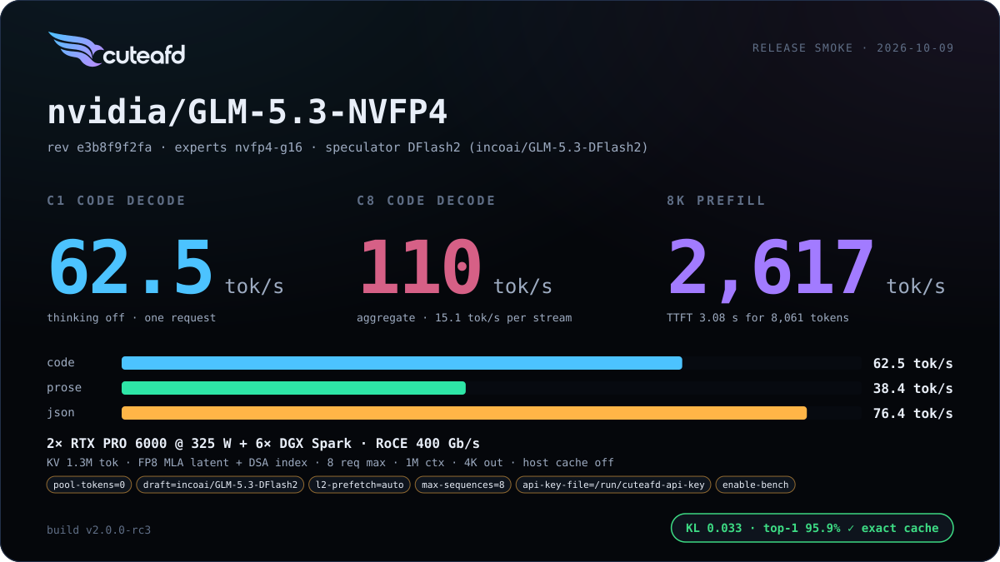</a><br><sub>2× RTX + 6× Spark</sub></td>
</tr>
<tr>
<td width="19%" valign="top"><a href="docs/models/glm5_flash.md"><b>GLM 5.3 Flash</b></a><br><sub>zai-org/GLM-5.3-Flash</sub><br><sub>fp8-block128x128/f32</sub></td>
<td width="27%" valign="top"><a href="benchmarks/glm5_flash/2026-10-09-smoke-glm-5-3-flash-1rtx-4spark-glm53f-fp8-rc3-sim5090/card.svg">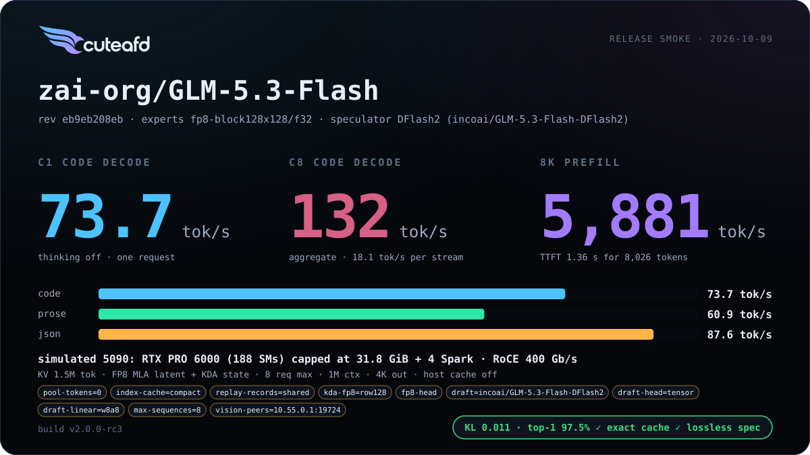</a><br><sub>simulated 5090: RTX PRO 6000 (188 SMs) capped at 31.8 GiB + 4 Spark</sub></td>
<td width="27%" valign="top"><a href="benchmarks/glm5_flash/2026-10-09-smoke-glm-5-3-flash-1rtx-4spark-glm53f-fp8-min-rc3/card.svg">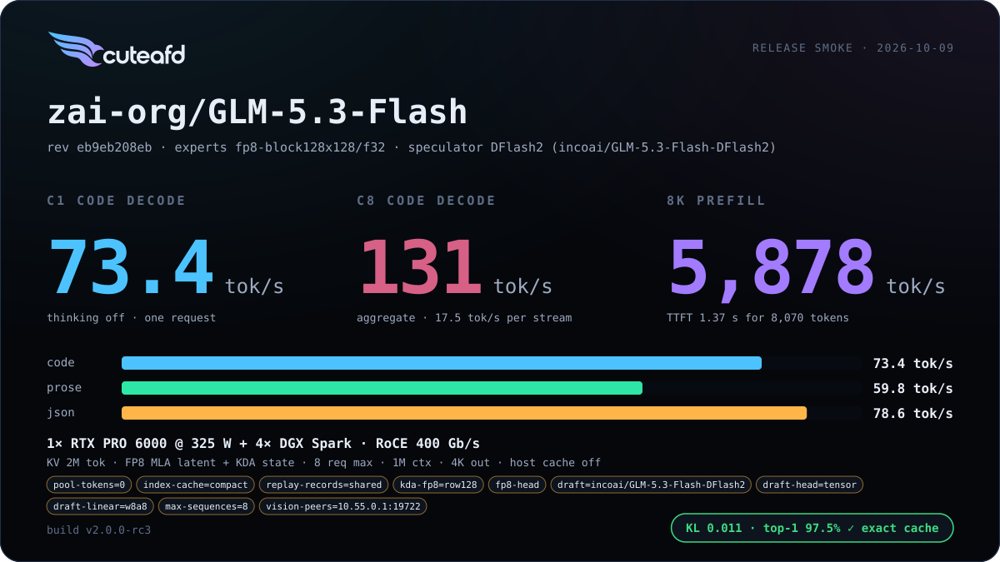</a><br><sub>1× RTX + 4× Spark</sub></td>
<td width="27%" valign="top"><a href="benchmarks/glm5_flash/2026-10-09-smoke-glm-5-3-flash-2rtx-4spark-glm53f-fp8-max-rc3/card.svg">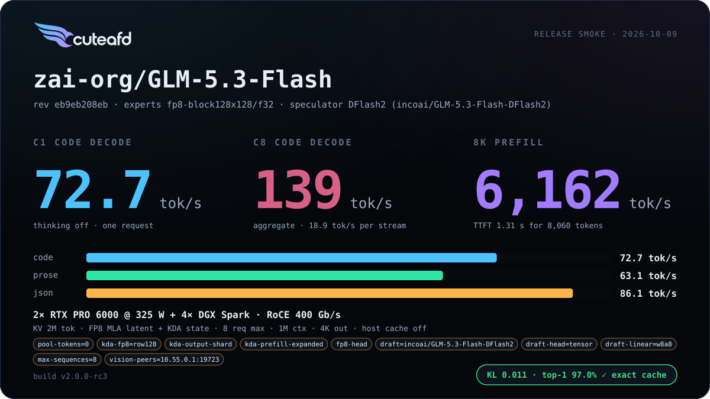</a><br><sub>2× RTX + 4× Spark</sub></td>
</tr>
<tr>
<td width="19%" valign="top"><a href="docs/models/glm5_flash.md"><b>GLM 5.3 Flash</b></a><br><sub>wrldsuksgo2mars/GLM-5.3-Flash-EXL3-K3.25-v1</sub><br><sub>exl3-k3+exl3-k4</sub></td>
<td width="27%" valign="top"><a href="benchmarks/glm5_flash/2026-10-09-smoke-glm-5-3-flash-exl3-k3-25-v1-1rtx-2spark-glm53f-exl3-rc3-sim5090/card.svg">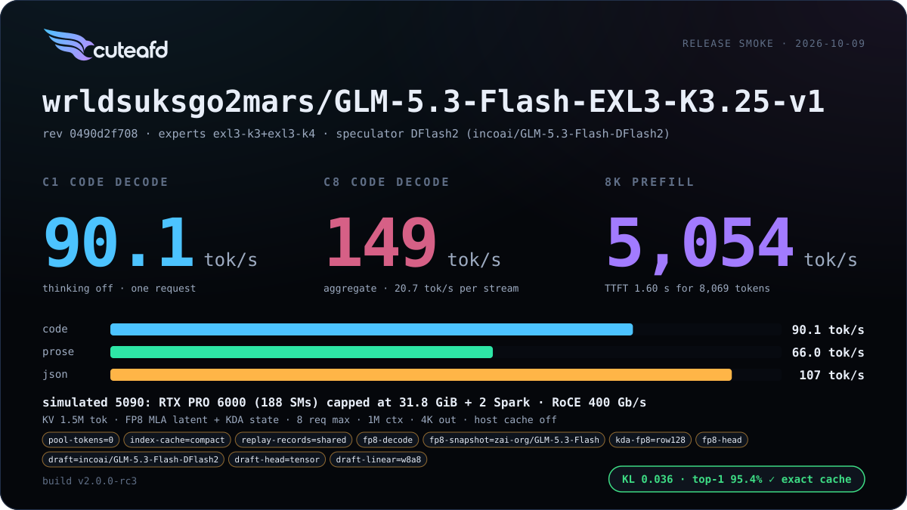</a><br><sub>simulated 5090: RTX PRO 6000 (188 SMs) capped at 31.8 GiB + 2 Spark</sub></td>
<td width="27%" valign="top"><a href="benchmarks/glm5_flash/2026-10-09-smoke-glm-5-3-flash-exl3-k3-25-v1-1rtx-2spark-glm53f-exl3-min-rc3/card.svg">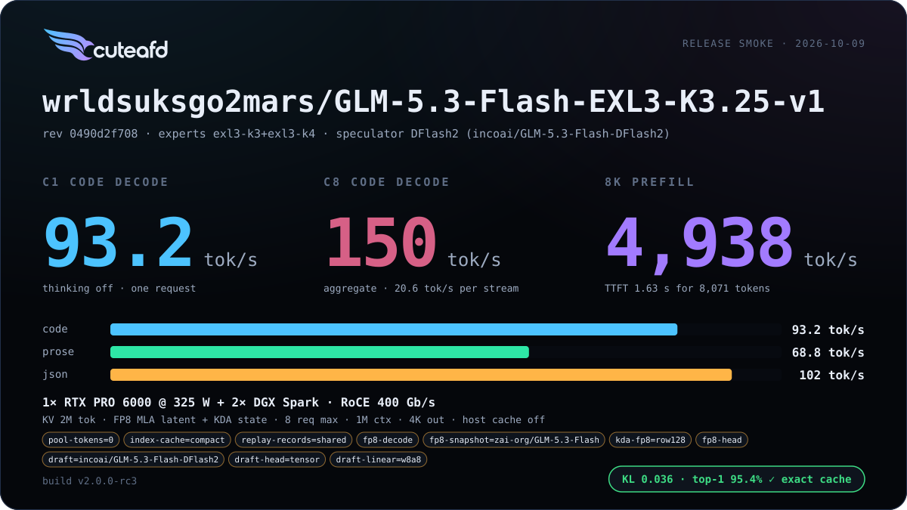</a><br><sub>1× RTX + 2× Spark</sub></td>
<td width="27%" valign="top"><a href="benchmarks/glm5_flash/2026-10-09-smoke-glm-5-3-flash-exl3-k3-25-v1-2rtx-4spark-glm53f-exl3-max-rc3/card.svg">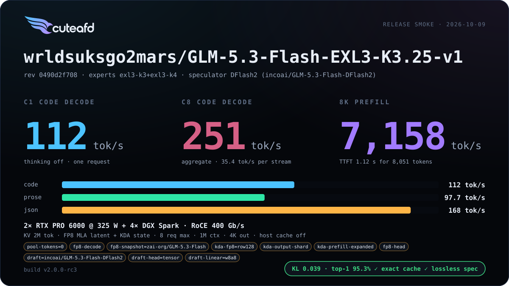</a><br><sub>2× RTX + 4× Spark</sub></td>
</tr>
<tr>
<td width="19%" valign="top"><a href="docs/models/glm5_flash.md"><b>GLM 5.3 Flash</b></a><br><sub>nvidia/GLM-5.3-Flash-NVFP4</sub><br><sub>nvfp4-g16</sub></td>
<td width="27%" valign="top"><a href="benchmarks/glm5_flash/2026-10-09-smoke-glm-5-3-flash-nvfp4-1rtx-2spark-glm53f-nvfp4-rc3-sim5090/card.svg">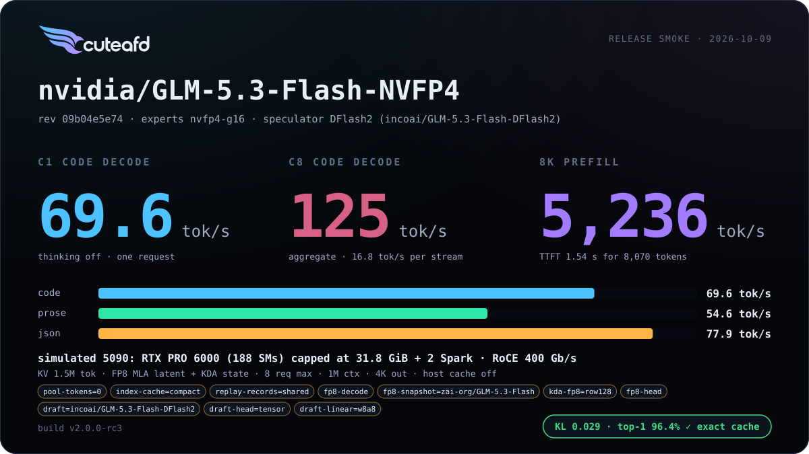</a><br><sub>simulated 5090: RTX PRO 6000 (188 SMs) capped at 31.8 GiB + 2 Spark</sub></td>
<td width="27%" valign="top"><a href="benchmarks/glm5_flash/2026-10-09-smoke-glm-5-3-flash-nvfp4-1rtx-2spark-glm53f-nvfp4-min-rc3/card.svg">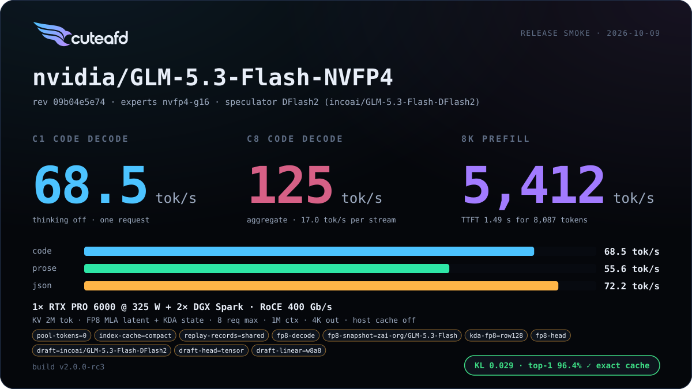</a><br><sub>1× RTX + 2× Spark</sub></td>
<td width="27%" valign="top"><a href="benchmarks/glm5_flash/2026-10-09-smoke-glm-5-3-flash-nvfp4-2rtx-4spark-glm53f-nvfp4-max-rc3/card.svg">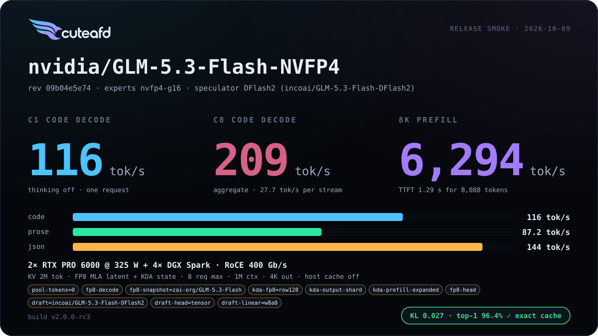</a><br><sub>2× RTX + 4× Spark</sub></td>
</tr>
<tr>
<td width="19%" valign="top"><a href="docs/models/glm5_flash.md"><b>GLM 5.3 Flash</b></a><br><sub>brandonmusic/GLM-5.3-Flash-tr3-4bpw</sub><br><sub>exl3-k4</sub></td>
<td width="27%" valign="top"><a href="benchmarks/glm5_flash/2026-10-09-smoke-glm-5-3-flash-tr3-4bpw-1rtx-2spark-glm53f-tr3-rc3-sim5090/card.svg">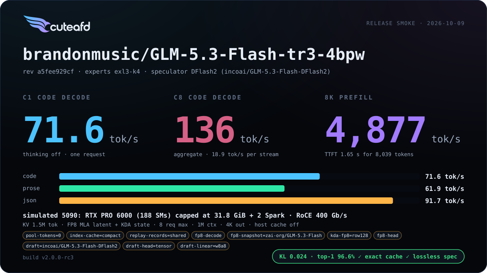</a><br><sub>simulated 5090: RTX PRO 6000 (188 SMs) capped at 31.8 GiB + 2 Spark</sub></td>
<td width="27%" valign="top"><a href="benchmarks/glm5_flash/2026-10-09-smoke-glm-5-3-flash-tr3-4bpw-1rtx-2spark-glm53f-tr3-min-rc3/card.svg">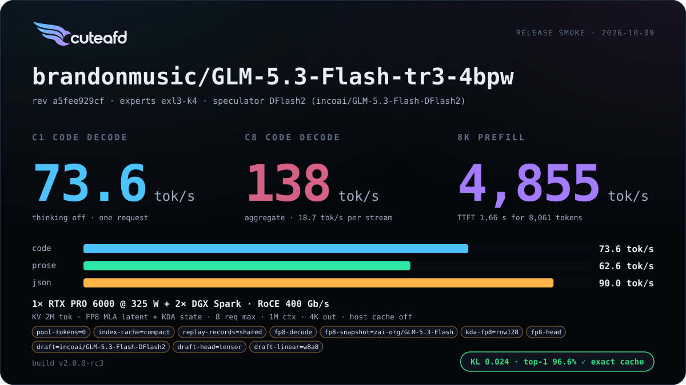</a><br><sub>1× RTX + 2× Spark</sub></td>
<td width="27%" valign="top"><a href="benchmarks/glm5_flash/2026-10-09-smoke-glm-5-3-flash-tr3-4bpw-2rtx-4spark-glm53f-tr3-max-rc3/card.svg">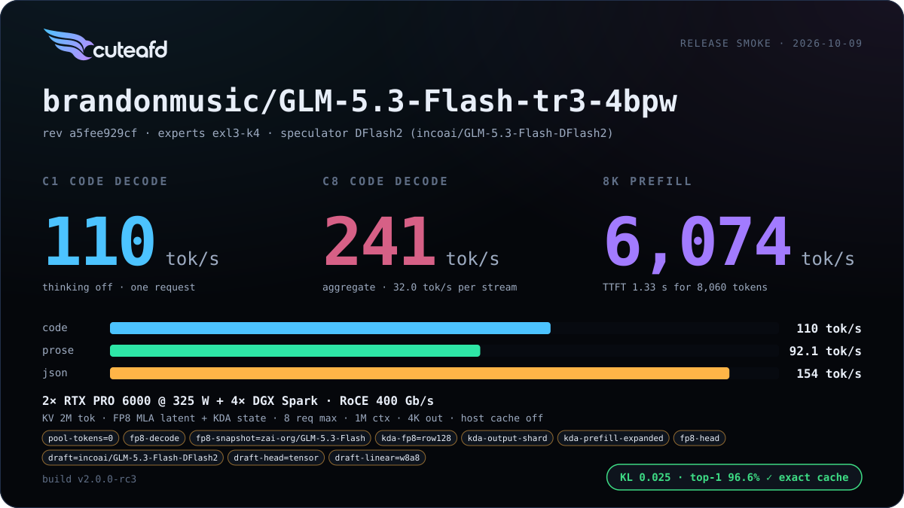</a><br><sub>2× RTX + 4× Spark</sub></td>
</tr>
<tr>
<td width="19%" valign="top"><a href="docs/models/mimo_v2.md"><b>MiMo V2</b></a><br><sub>XiaomiMiMo/MiMo-V2.6-Flash-MOPD</sub><br><sub>mxfp4-g32</sub></td>
<td width="27%" valign="top"><a href="benchmarks/mimo_v2/2026-10-09-smoke-mimo-v2-6-flash-mopd-1rtx-2spark-mimo26-flash-rc3-sim5090/card.svg">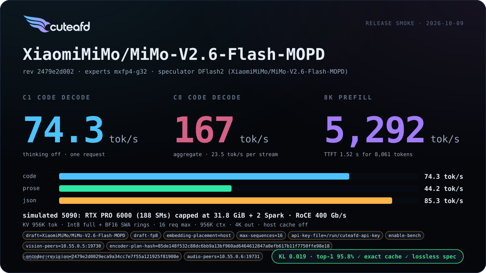</a><br><sub>simulated 5090: RTX PRO 6000 (188 SMs) capped at 31.8 GiB + 2 Spark</sub></td>
<td width="27%" valign="top"><a href="benchmarks/mimo_v2/2026-10-09-smoke-mimo-v2-6-flash-mopd-1rtx-2spark-mimo26-flash-min-rc3/card.svg">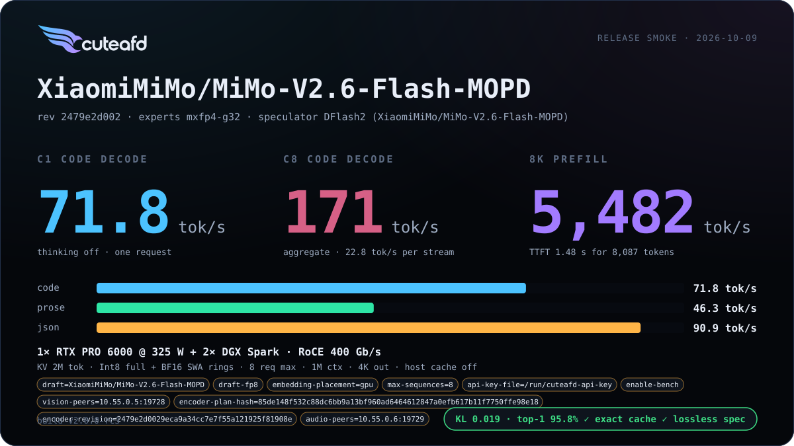</a><br><sub>1× RTX + 2× Spark</sub></td>
<td width="27%" valign="top"><a href="benchmarks/mimo_v2/2026-10-09-smoke-mimo-v2-6-flash-mopd-2rtx-4spark-mimo26-flash-max-rc3/card.svg">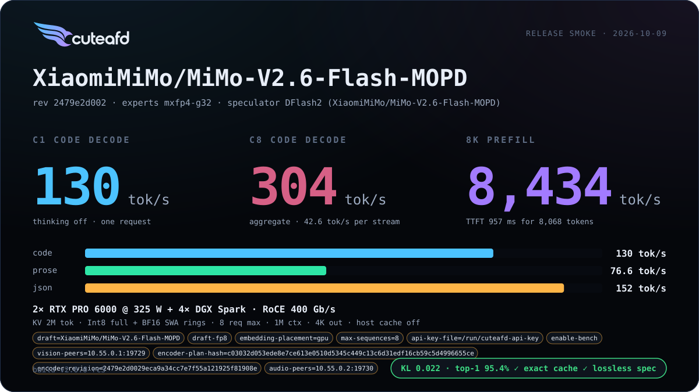</a><br><sub>2× RTX + 4× Spark</sub></td>
</tr>
<tr>
<td width="19%" valign="top"><a href="docs/models/mimo_v2.md"><b>MiMo V2</b></a><br><sub>XiaomiMiMo/MiMo-V2.6-Pro-MOPD</sub><br><sub>mxfp4-g32</sub></td>
<td width="27%" valign="top"><a href="benchmarks/mimo_v2/2026-10-09-smoke-mimo-pro-no-fit-rc3-sim5090/report.json">doesn't fit 1× 5090 (32 GB) + 6 Sparks</a><br><sub>rtx0 full memory layout needs 33511016304 bytes, budget 31031138713 bytes, shortfall 2479877591 bytes</sub><br><sub>Memory rejection with all six Sparks (rc3 planner); no server launched, no performance.</sub></td>
<td width="27%" valign="top"><a href="benchmarks/mimo_v2/2026-10-09-smoke-mimo-v2-6-pro-mopd-1rtx-6spark-mimo-pro-min-rc3/card.svg">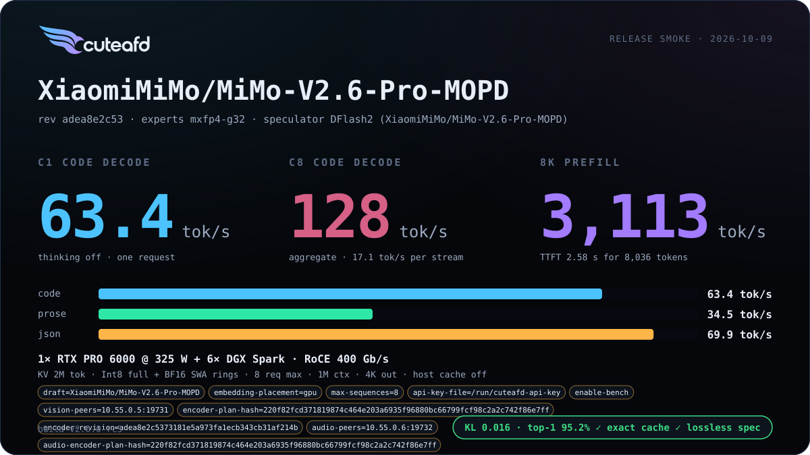</a><br><sub>1× RTX + 6× Spark</sub></td>
<td width="27%" valign="top"><a href="benchmarks/mimo_v2/2026-10-09-smoke-mimo-v2-6-pro-mopd-2rtx-6spark-mimo-pro-max-rc3/card.svg">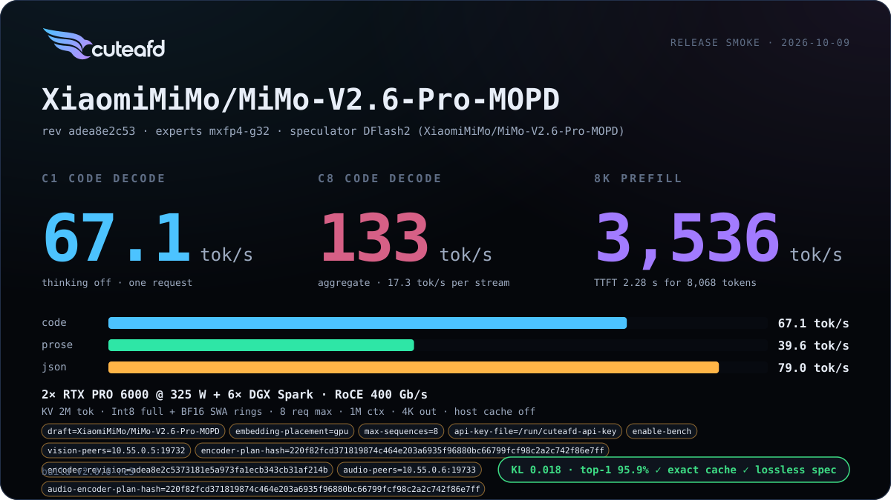</a><br><sub>2× RTX + 6× Spark</sub></td>
</tr>
<tr>
<td width="19%" valign="top"><a href="docs/models/qwen4.md"><b>Qwen 3.8</b></a><br><sub>wrldsuksgo2mars/Qwen3.8-Flash-Next-EXL3-K4.25-PLE-FP8-v1</sub><br><sub>exl3-k4+exl3-k5</sub></td>
<td width="27%" valign="top"><a href="benchmarks/qwen4/2026-10-09-smoke-qwen3-8-flash-next-exl3-k4-25-ple-fp8-v1-1rtx-1spark-qwen38-exl3-rc3-sim5090/card.svg">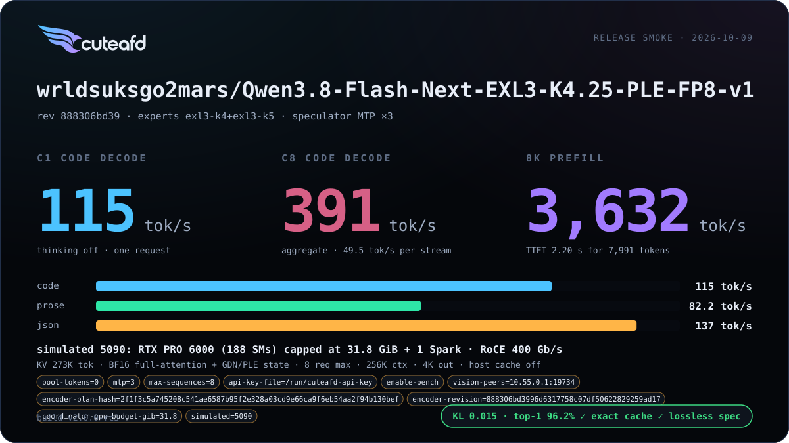</a><br><sub>simulated 5090: RTX PRO 6000 (188 SMs) capped at 31.8 GiB + 1 Spark</sub></td>
<td width="27%" valign="top"><a href="benchmarks/qwen4/2026-10-09-smoke-qwen3-8-flash-next-exl3-k4-25-ple-fp8-v1-1rtx-qwen38-exl3-min-rc3/card.svg">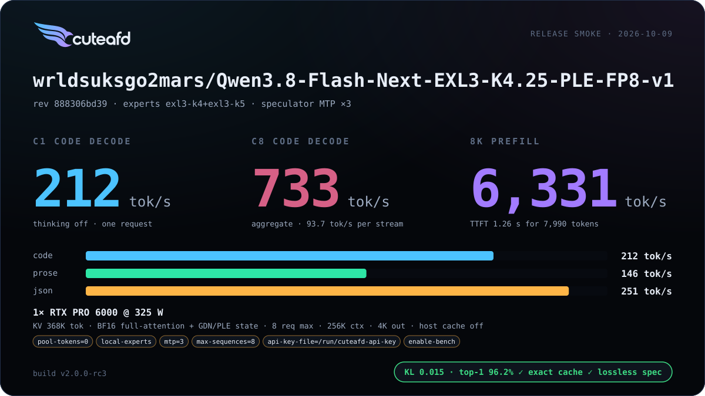</a><br><sub>1× RTX</sub><br><sub>Text only: automatic admission keeps the 2M KV target and turns the vision tower off. With vision: <a href="benchmarks/qwen4/2026-10-09-smoke-qwen3-8-flash-next-exl3-k4-25-ple-fp8-v1-1rtx-qwen38-exl3-nospark-vision-rc3/report.svg">1× RTX, no Sparks (local experts), vision on RTX0, fixed 262,144 pool</a>.</sub></td>
<td width="27%" align="center">n/a: fits one RTX (no two-GPU split for Qwen)</td>
</tr>
<tr>
<td width="19%" valign="top"><a href="docs/models/qwen4.md"><b>Qwen 3.8</b></a><br><sub>nvidia/Qwen3.8-Flash-Next-NVFP4</sub><br><sub>nvfp4-g16</sub></td>
<td width="27%" valign="top"><a href="benchmarks/qwen4/2026-10-09-smoke-qwen3-8-flash-next-nvfp4-1rtx-2spark-qwen38-nvfp4-rc3-sim5090/card.svg">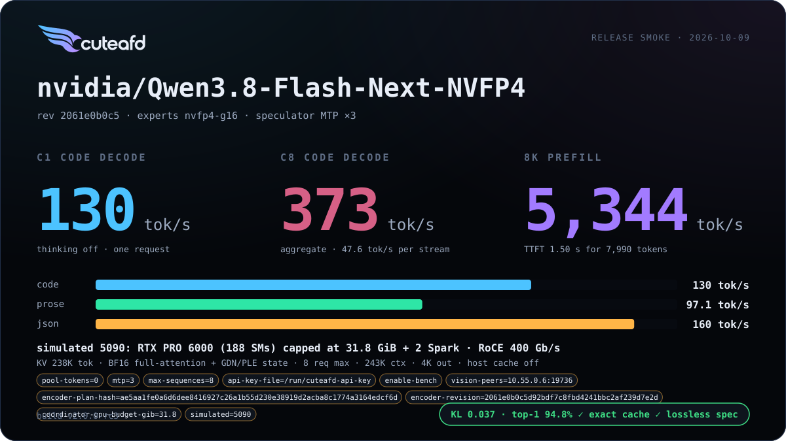</a><br><sub>simulated 5090: RTX PRO 6000 (188 SMs) capped at 31.8 GiB + 2 Spark</sub><br><sub>Effective context 243,456, below the 262,144-token agentic floor (automatic pool).</sub></td>
<td width="27%" valign="top"><a href="benchmarks/qwen4/2026-10-09-smoke-qwen3-8-flash-next-nvfp4-1rtx-qwen38-nvfp4-min-rc3/card.svg">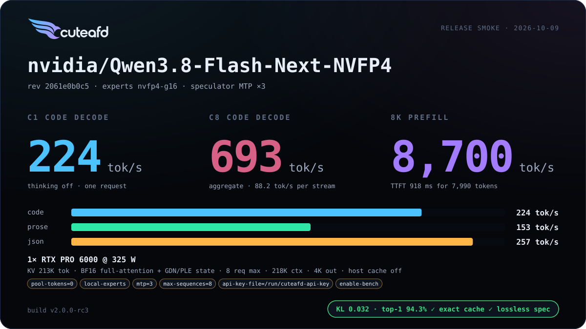</a><br><sub>1× RTX</sub><br><sub>Effective context 217,856, below the 262,144-token agentic floor (automatic pool). Text only: automatic admission keeps the 2M KV target and turns the vision tower off.</sub></td>
<td width="27%" align="center">n/a: fits one RTX (no two-GPU split for Qwen)</td>
</tr>
</table>

| Family | Checkpoint | Hardware | KV / req | C1 code | Concurrent code (aggregate) | prose | JSON | 8K prefill | TTFT | Quality | Report |
| --- | --- | --- | --- | ---: | ---: | ---: | ---: | ---: | ---: | --- | --- |
| [DeepSeek V4.1](docs/models/deepseek_v41.md) | DeepSeek-V4.1-Flash (mxfp4-g32) | simulated 5090: RTX PRO 6000 (188 SMs) capped at 31.8 GiB + 3 Spark (5090) | 1.1M tok / 16 req | 112 | C8: 239 | 64.4 | 119 | 6,346 | 1.28 s | ✓ KL 0.017 · top-1 97.0% ✓ exact cache ✓ lossless spec | [2026-10-09 · v2.0.0-rc3](benchmarks/deepseek_v41/2026-10-09-smoke-deepseek-v4-1-flash-1rtx-3spark-v41-flash-rc3-sim5090/report.svg) |
| [DeepSeek V4.1](docs/models/deepseek_v41.md) | DeepSeek-V4.1-Flash (mxfp4-g32) | 1× RTX + 3× Spark (1× RTX) | 2.1M tok / 16 req | 119 | C8: 304 | 74.5 | 135 | 6,357 | 1.28 s | ✓ KL 0.015 · top-1 96.4% ✓ exact cache | [2026-10-09 · v2.0.0-rc3](benchmarks/deepseek_v41/2026-10-09-smoke-deepseek-v4-1-flash-1rtx-3spark-v41-flash-min-rc3/report.svg) |
| [DeepSeek V4.1](docs/models/deepseek_v41.md) | DeepSeek-V4.1-Flash (mxfp4-g32) | 2× RTX + 4× Spark (2× RTX) | 2.1M tok / 16 req | 158 | C8: 458 | 85.1 | 165 | 7,325 | 1.11 s | ✓ KL 0.014 · top-1 97.7% ✓ exact cache | [2026-10-09 · v2.0.0-rc3](benchmarks/deepseek_v41/2026-10-09-smoke-deepseek-v4-1-flash-2rtx-4spark-v41-flash-max-rc3/report.svg) |
| [DeepSeek V4.1](docs/models/deepseek_v41.md) | DeepSeek-V4.1-Flash-NVFP4 (nvfp4-g16) | simulated 5090: RTX PRO 6000 (188 SMs) capped at 31.8 GiB + 4 Spark (5090) | 1.1M tok / 16 req | 78.1 | C8: 185 | 44.8 | 98.9 | 5,267 | 1.54 s | ⚠ **FAILED** failed: Logit fidelity | [2026-10-09 · v2.0.0-rc3](benchmarks/deepseek_v41/2026-10-09-smoke-deepseek-v4-1-flash-nvfp4-1rtx-4spark-v41-flash-nvfp4-rc3-sim5090/report.svg) |
| [DeepSeek V4.1](docs/models/deepseek_v41.md) | DeepSeek-V4.1-Flash-NVFP4 (nvfp4-g16) | 1× RTX + 4× Spark (1× RTX) | 2.1M tok / 16 req | 77.0 | C8: 254 | 53.1 | 90.9 | 5,441 | 1.49 s | ⚠ **FAILED** failed: Logit fidelity | [2026-10-09 · v2.0.0-rc3](benchmarks/deepseek_v41/2026-10-09-smoke-deepseek-v4-1-flash-nvfp4-1rtx-4spark-v41-flash-nvfp4-min-rc3/report.svg) |
| [DeepSeek V4.1](docs/models/deepseek_v41.md) | DeepSeek-V4.1-Flash-NVFP4 (nvfp4-g16) | 2× RTX + 4× Spark (2× RTX) | 2.1M tok / 16 req | 93.8 | C8: 284 | 52.6 | 108 | 6,678 | 1.21 s | ⚠ **FAILED** failed: Logit fidelity | [2026-10-09 · v2.0.0-rc3](benchmarks/deepseek_v41/2026-10-09-smoke-deepseek-v4-1-flash-nvfp4-2rtx-4spark-v41-flash-nvfp4-max-rc3/report.svg) |
| [DeepSeek V4](docs/models/deepseek_v4.md) | DeepSeek-V4-Flash-0731 (mxfp4-g32) | simulated 5090: RTX PRO 6000 (188 SMs) capped at 31.8 GiB + 2 Spark (5090) | 886K tok / 8 req | 120 | C8: 279 | 48.8 | 117 | 4,249 | 1.91 s | ✓ KL 0.011 · top-1 96.8% ✓ exact cache | [2026-10-09 · v2.0.0-rc3](benchmarks/deepseek_v4/2026-10-09-smoke-deepseek-v4-flash-0731-1rtx-2spark-v4-flash-rc3-sim5090/report.svg) |
| [DeepSeek V4](docs/models/deepseek_v4.md) | DeepSeek-V4-Flash-0731 (mxfp4-g32) | 1× RTX + 2× Spark (1× RTX) | 650K tok / 8 req | 149 | C8: 403 | 61.8 | 149 | 4,183 | 1.94 s | ✓ KL 0.011 · top-1 97.5% ✓ exact cache | [2026-10-09 · v2.0.0-rc3](benchmarks/deepseek_v4/2026-10-09-smoke-deepseek-v4-flash-0731-1rtx-2spark-v4-flash-min-rc3/report.svg) |
| [DeepSeek V4](docs/models/deepseek_v4.md) | DeepSeek-V4-Flash-0731 (mxfp4-g32) | 2× RTX + 4× Spark (2× RTX) | 1.3M tok / 8 req | 199 | C8: 549 | 89.6 | 217 | 5,153 | 1.57 s | ✓ KL 0.012 · top-1 97.3% ✓ exact cache ✓ lossless spec | [2026-10-09 · v2.0.0-rc3](benchmarks/deepseek_v4/2026-10-09-smoke-deepseek-v4-flash-0731-2rtx-4spark-v4-flash-max-rc3/report.svg) |
| [DeepSeek V4](docs/models/deepseek_v4.md) | DeepSeek-V4-Pro-0813-EXL3-K2-calibrated-v1 (exl3-k2) | simulated 5090: RTX PRO 6000 (188 SMs) capped at 31.8 GiB + 6 Spark (5090) | — | — | — | — | — | — | — | doesn't fit: coordinator weights need 46.0 GiB, over the 32 GiB coordinator budget; rtx0 full memory layout needs 62369870091 bytes, budget 31031138713 bytes, shortfall 31338731378 bytes | [planner report](benchmarks/deepseek_v4/2026-10-09-smoke-v4-pro-exl3-no-fit-rc3-sim5090/report.json) |
| [DeepSeek V4](docs/models/deepseek_v4.md) | DeepSeek-V4-Pro-0813-EXL3-K2-calibrated-v1 (exl3-k2) | 1× RTX + 4× Spark (1× RTX) | 447K tok / 8 req | 71.6 | C8: 189 | 37.6 | 80.3 | 2,080 | 3.91 s | ⚠ **FAILED** failed: Logit fidelity | [2026-10-09 · v2.0.0-rc3](benchmarks/deepseek_v4/2026-10-09-smoke-deepseek-v4-pro-0813-exl3-k2-calibrated-v1-1rtx-4spark-v4-pro-exl3-min-rc3/report.svg) |
| [DeepSeek V4](docs/models/deepseek_v4.md) | DeepSeek-V4-Pro-0813-EXL3-K2-calibrated-v1 (exl3-k2) | 2× RTX + 6× Spark (2× RTX) | 1.3M tok / 8 req | 97.9 | C8: 240 | 47.4 | 102 | 2,450 | 3.33 s | ✓ KL 0.060 · top-1 92.6% ✓ exact cache | [2026-10-09 · v2.0.0-rc3](benchmarks/deepseek_v4/2026-10-09-smoke-deepseek-v4-pro-0813-exl3-k2-calibrated-v1-2rtx-6spark-v4-pro-exl3-max-rc3/report.svg) |
| [GLM 5.3](docs/models/glm5.md) | GLM-5.3-EXL3-K4-v1 (exl3-k4) | simulated 5090: RTX PRO 6000 (188 SMs) capped at 31.8 GiB + 6 Spark (5090) | — | — | — | — | — | — | — | doesn't fit: rtx0 full memory layout needs 38219720132 bytes, budget 31997506355 bytes, shortfall 6222213777 bytes | [planner report](benchmarks/glm5/2026-10-09-smoke-glm53-exl3-no-fit-rc3-sim5090/report.json) |
| [GLM 5.3](docs/models/glm5.md) | GLM-5.3-EXL3-K4-v1 (exl3-k4) | 1× RTX + 4× Spark (1× RTX) | 1.1M tok / 8 req | 45.1 | C8: 91.0 | 36.2 | 57.7 | 2,820 | 2.85 s | ✓ KL 0.037 · top-1 96.3% ✓ exact cache | [2026-10-09 · v2.0.0-rc3](benchmarks/glm5/2026-10-09-smoke-glm-5-3-exl3-k4-v1-1rtx-4spark-glm53-exl3-min-rc3/report.svg) |
| [GLM 5.3](docs/models/glm5.md) | GLM-5.3-EXL3-K4-v1 (exl3-k4) | 2× RTX + 6× Spark (2× RTX) | 1.3M tok / 8 req | 53.6 | C8: 106 | 40.5 | 68.4 | 1,861 | 4.34 s | ✓ KL 0.038 · top-1 96.2% ✓ exact cache ✓ lossless spec | [2026-10-09 · v2.0.0-rc3](benchmarks/glm5/2026-10-09-smoke-glm-5-3-exl3-k4-v1-2rtx-6spark-glm53-exl3-max-rc3/report.svg) |
| [GLM 5.3](docs/models/glm5.md) | GLM-5.3-NVFP4 (nvfp4-g16) | simulated 5090: RTX PRO 6000 (188 SMs) capped at 31.8 GiB + 6 Spark (5090) | — | — | — | — | — | — | — | doesn't fit: coordinator weights need 52.6 GiB, over the 32 GiB coordinator budget; rtx0 full memory layout needs 54111029708 bytes, budget 31997506355 bytes, shortfall 22113523353 bytes | [planner report](benchmarks/glm5/2026-10-09-smoke-glm53-nvfp4-no-fit-rc3-sim5090/report.json) |
| [GLM 5.3](docs/models/glm5.md) | GLM-5.3-NVFP4 (nvfp4-g16) | 1× RTX + 4× Spark (1× RTX) | 1.1M tok / 8 req | 44.4 | C8: 79.1 | 32.8 | 61.0 | 2,518 | 3.19 s | ✓ KL 0.032 · top-1 95.9% ✓ exact cache | [2026-10-09 · v2.0.0-rc3](benchmarks/glm5/2026-10-09-smoke-glm-5-3-nvfp4-1rtx-4spark-glm53-nvfp4-min-rc3/report.svg) |
| [GLM 5.3](docs/models/glm5.md) | GLM-5.3-NVFP4 (nvfp4-g16) | 2× RTX + 6× Spark (2× RTX) | 1.3M tok / 8 req | 62.5 | C8: 110 | 38.4 | 76.4 | 2,617 | 3.08 s | ✓ KL 0.033 · top-1 95.9% ✓ exact cache | [2026-10-09 · v2.0.0-rc3](benchmarks/glm5/2026-10-09-smoke-glm-5-3-nvfp4-2rtx-6spark-glm53-nvfp4-max-rc3/report.svg) |
| [GLM 5.3 Flash](docs/models/glm5_flash.md) | GLM-5.3-Flash (fp8-block128x128/f32) | simulated 5090: RTX PRO 6000 (188 SMs) capped at 31.8 GiB + 4 Spark (5090) | 1.5M tok / 8 req | 73.7 | C8: 132 | 60.9 | 87.6 | 5,881 | 1.36 s | ✓ KL 0.011 · top-1 97.5% ✓ exact cache ✓ lossless spec | [2026-10-09 · v2.0.0-rc3](benchmarks/glm5_flash/2026-10-09-smoke-glm-5-3-flash-1rtx-4spark-glm53f-fp8-rc3-sim5090/report.svg) |
| [GLM 5.3 Flash](docs/models/glm5_flash.md) | GLM-5.3-Flash (fp8-block128x128/f32) | 1× RTX + 4× Spark (1× RTX) | 2M tok / 8 req | 73.4 | C8: 131 | 59.8 | 78.6 | 5,878 | 1.37 s | ✓ KL 0.011 · top-1 97.5% ✓ exact cache | [2026-10-09 · v2.0.0-rc3](benchmarks/glm5_flash/2026-10-09-smoke-glm-5-3-flash-1rtx-4spark-glm53f-fp8-min-rc3/report.svg) |
| [GLM 5.3 Flash](docs/models/glm5_flash.md) | GLM-5.3-Flash (fp8-block128x128/f32) | 2× RTX + 4× Spark (2× RTX) | 2M tok / 8 req | 72.7 | C8: 139 | 63.1 | 86.1 | 6,162 | 1.31 s | ✓ KL 0.011 · top-1 97.0% ✓ exact cache | [2026-10-09 · v2.0.0-rc3](benchmarks/glm5_flash/2026-10-09-smoke-glm-5-3-flash-2rtx-4spark-glm53f-fp8-max-rc3/report.svg) |
| [GLM 5.3 Flash](docs/models/glm5_flash.md) | GLM-5.3-Flash-EXL3-K3.25-v1 (exl3-k3+exl3-k4) | simulated 5090: RTX PRO 6000 (188 SMs) capped at 31.8 GiB + 2 Spark (5090) | 1.5M tok / 8 req | 90.1 | C8: 149 | 66.0 | 107 | 5,054 | 1.60 s | ✓ KL 0.036 · top-1 95.4% ✓ exact cache | [2026-10-09 · v2.0.0-rc3](benchmarks/glm5_flash/2026-10-09-smoke-glm-5-3-flash-exl3-k3-25-v1-1rtx-2spark-glm53f-exl3-rc3-sim5090/report.svg) |
| [GLM 5.3 Flash](docs/models/glm5_flash.md) | GLM-5.3-Flash-EXL3-K3.25-v1 (exl3-k3+exl3-k4) | 1× RTX + 2× Spark (1× RTX) | 2M tok / 8 req | 93.2 | C8: 150 | 68.8 | 102 | 4,938 | 1.63 s | ✓ KL 0.036 · top-1 95.4% ✓ exact cache | [2026-10-09 · v2.0.0-rc3](benchmarks/glm5_flash/2026-10-09-smoke-glm-5-3-flash-exl3-k3-25-v1-1rtx-2spark-glm53f-exl3-min-rc3/report.svg) |
| [GLM 5.3 Flash](docs/models/glm5_flash.md) | GLM-5.3-Flash-EXL3-K3.25-v1 (exl3-k3+exl3-k4) | 2× RTX + 4× Spark (2× RTX) | 2M tok / 8 req | 112 | C8: 251 | 97.7 | 168 | 7,158 | 1.12 s | ✓ KL 0.039 · top-1 95.3% ✓ exact cache ✓ lossless spec | [2026-10-09 · v2.0.0-rc3](benchmarks/glm5_flash/2026-10-09-smoke-glm-5-3-flash-exl3-k3-25-v1-2rtx-4spark-glm53f-exl3-max-rc3/report.svg) |
| [GLM 5.3 Flash](docs/models/glm5_flash.md) | GLM-5.3-Flash-NVFP4 (nvfp4-g16) | simulated 5090: RTX PRO 6000 (188 SMs) capped at 31.8 GiB + 2 Spark (5090) | 1.5M tok / 8 req | 69.6 | C8: 125 | 54.6 | 77.9 | 5,236 | 1.54 s | ✓ KL 0.029 · top-1 96.4% ✓ exact cache | [2026-10-09 · v2.0.0-rc3](benchmarks/glm5_flash/2026-10-09-smoke-glm-5-3-flash-nvfp4-1rtx-2spark-glm53f-nvfp4-rc3-sim5090/report.svg) |
| [GLM 5.3 Flash](docs/models/glm5_flash.md) | GLM-5.3-Flash-NVFP4 (nvfp4-g16) | 1× RTX + 2× Spark (1× RTX) | 2M tok / 8 req | 68.5 | C8: 125 | 55.6 | 72.2 | 5,412 | 1.49 s | ✓ KL 0.029 · top-1 96.4% ✓ exact cache | [2026-10-09 · v2.0.0-rc3](benchmarks/glm5_flash/2026-10-09-smoke-glm-5-3-flash-nvfp4-1rtx-2spark-glm53f-nvfp4-min-rc3/report.svg) |
| [GLM 5.3 Flash](docs/models/glm5_flash.md) | GLM-5.3-Flash-NVFP4 (nvfp4-g16) | 2× RTX + 4× Spark (2× RTX) | 2M tok / 8 req | 116 | C8: 209 | 87.2 | 144 | 6,294 | 1.29 s | ✓ KL 0.027 · top-1 96.4% ✓ exact cache | [2026-10-09 · v2.0.0-rc3](benchmarks/glm5_flash/2026-10-09-smoke-glm-5-3-flash-nvfp4-2rtx-4spark-glm53f-nvfp4-max-rc3/report.svg) |
| [GLM 5.3 Flash](docs/models/glm5_flash.md) | GLM-5.3-Flash-tr3-4bpw (exl3-k4) | simulated 5090: RTX PRO 6000 (188 SMs) capped at 31.8 GiB + 2 Spark (5090) | 1.5M tok / 8 req | 71.6 | C8: 136 | 61.9 | 91.7 | 4,877 | 1.65 s | ✓ KL 0.024 · top-1 96.6% ✓ exact cache ✓ lossless spec | [2026-10-09 · v2.0.0-rc3](benchmarks/glm5_flash/2026-10-09-smoke-glm-5-3-flash-tr3-4bpw-1rtx-2spark-glm53f-tr3-rc3-sim5090/report.svg) |
| [GLM 5.3 Flash](docs/models/glm5_flash.md) | GLM-5.3-Flash-tr3-4bpw (exl3-k4) | 1× RTX + 2× Spark (1× RTX) | 2M tok / 8 req | 73.6 | C8: 138 | 62.6 | 90.0 | 4,855 | 1.66 s | ✓ KL 0.024 · top-1 96.6% ✓ exact cache | [2026-10-09 · v2.0.0-rc3](benchmarks/glm5_flash/2026-10-09-smoke-glm-5-3-flash-tr3-4bpw-1rtx-2spark-glm53f-tr3-min-rc3/report.svg) |
| [GLM 5.3 Flash](docs/models/glm5_flash.md) | GLM-5.3-Flash-tr3-4bpw (exl3-k4) | 2× RTX + 4× Spark (2× RTX) | 2M tok / 8 req | 110 | C8: 241 | 92.1 | 154 | 6,074 | 1.33 s | ✓ KL 0.025 · top-1 96.6% ✓ exact cache | [2026-10-09 · v2.0.0-rc3](benchmarks/glm5_flash/2026-10-09-smoke-glm-5-3-flash-tr3-4bpw-2rtx-4spark-glm53f-tr3-max-rc3/report.svg) |
| [MiMo V2](docs/models/mimo_v2.md) | MiMo-V2.6-Flash-MOPD (mxfp4-g32) | simulated 5090: RTX PRO 6000 (188 SMs) capped at 31.8 GiB + 2 Spark (5090) | 956K tok / 16 req | 74.3 | C8: 167 | 44.2 | 85.3 | 5,292 | 1.52 s | ✓ KL 0.019 · top-1 95.8% ✓ exact cache ✓ lossless spec | [2026-10-09 · v2.0.0-rc3](benchmarks/mimo_v2/2026-10-09-smoke-mimo-v2-6-flash-mopd-1rtx-2spark-mimo26-flash-rc3-sim5090/report.svg) |
| [MiMo V2](docs/models/mimo_v2.md) | MiMo-V2.6-Flash-MOPD (mxfp4-g32) | 1× RTX + 2× Spark (1× RTX) | 2M tok / 8 req | 71.8 | C8: 171 | 46.3 | 90.9 | 5,482 | 1.48 s | ✓ KL 0.019 · top-1 95.8% ✓ exact cache ✓ lossless spec | [2026-10-09 · v2.0.0-rc3](benchmarks/mimo_v2/2026-10-09-smoke-mimo-v2-6-flash-mopd-1rtx-2spark-mimo26-flash-min-rc3/report.svg) |
| [MiMo V2](docs/models/mimo_v2.md) | MiMo-V2.6-Flash-MOPD (mxfp4-g32) | 2× RTX + 4× Spark (2× RTX) | 2M tok / 8 req | 130 | C8: 304 | 76.6 | 152 | 8,434 | 957 ms | ✓ KL 0.022 · top-1 95.4% ✓ exact cache ✓ lossless spec | [2026-10-09 · v2.0.0-rc3](benchmarks/mimo_v2/2026-10-09-smoke-mimo-v2-6-flash-mopd-2rtx-4spark-mimo26-flash-max-rc3/report.svg) |
| [MiMo V2](docs/models/mimo_v2.md) | MiMo-V2.6-Pro-MOPD (mxfp4-g32) | simulated 5090: RTX PRO 6000 (188 SMs) capped at 31.8 GiB + 6 Spark (5090) | — | — | — | — | — | — | — | doesn't fit: rtx0 full memory layout needs 33511016304 bytes, budget 31031138713 bytes, shortfall 2479877591 bytes | [planner report](benchmarks/mimo_v2/2026-10-09-smoke-mimo-pro-no-fit-rc3-sim5090/report.json) |
| [MiMo V2](docs/models/mimo_v2.md) | MiMo-V2.6-Pro-MOPD (mxfp4-g32) | 1× RTX + 6× Spark (1× RTX) | 2M tok / 8 req | 63.4 | C8: 128 | 34.5 | 69.9 | 3,113 | 2.58 s | ✓ KL 0.016 · top-1 95.2% ✓ exact cache ✓ lossless spec | [2026-10-09 · v2.0.0-rc3](benchmarks/mimo_v2/2026-10-09-smoke-mimo-v2-6-pro-mopd-1rtx-6spark-mimo-pro-min-rc3/report.svg) |
| [MiMo V2](docs/models/mimo_v2.md) | MiMo-V2.6-Pro-MOPD (mxfp4-g32) | 2× RTX + 6× Spark (2× RTX) | 2M tok / 8 req | 67.1 | C8: 133 | 39.6 | 79.0 | 3,536 | 2.28 s | ✓ KL 0.018 · top-1 95.9% ✓ exact cache ✓ lossless spec | [2026-10-09 · v2.0.0-rc3](benchmarks/mimo_v2/2026-10-09-smoke-mimo-v2-6-pro-mopd-2rtx-6spark-mimo-pro-max-rc3/report.svg) |
| [Qwen 3.8](docs/models/qwen4.md) | Qwen3.8-Flash-Next-EXL3-K4.25-PLE-FP8-v1 (exl3-k4+exl3-k5) | simulated 5090: RTX PRO 6000 (188 SMs) capped at 31.8 GiB + 1 Spark (5090) | 273K tok / 8 req | 115 | C8: 391 | 82.2 | 137 | 3,632 | 2.20 s | ✓ KL 0.015 · top-1 96.2% ✓ exact cache ✓ lossless spec | [2026-10-09 · v2.0.0-rc3](benchmarks/qwen4/2026-10-09-smoke-qwen3-8-flash-next-exl3-k4-25-ple-fp8-v1-1rtx-1spark-qwen38-exl3-rc3-sim5090/report.svg) |
| [Qwen 3.8](docs/models/qwen4.md) | Qwen3.8-Flash-Next-EXL3-K4.25-PLE-FP8-v1 (exl3-k4+exl3-k5) | 1× RTX (1× RTX) | 368K tok / 8 req | 212 | C8: 733 | 146 | 251 | 6,331 | 1.26 s | ✓ KL 0.015 · top-1 96.2% ✓ exact cache ✓ lossless spec | [2026-10-09 · v2.0.0-rc3](benchmarks/qwen4/2026-10-09-smoke-qwen3-8-flash-next-exl3-k4-25-ple-fp8-v1-1rtx-qwen38-exl3-min-rc3/report.svg) |
| [Qwen 3.8](docs/models/qwen4.md) | Qwen3.8-Flash-Next-EXL3-K4.25-PLE-FP8-v1 (exl3-k4+exl3-k5) | 1× RTX, no Sparks (local experts), vision on RTX0, fixed 262,144 pool (1× RTX) | 256K tok / 8 req | 229 | C8: 718 | 150 | 245 | 6,393 | 1.25 s | ✓ KL 0.015 · top-1 96.2% ✓ exact cache ✓ lossless spec | [2026-10-09 · v2.0.0-rc3](benchmarks/qwen4/2026-10-09-smoke-qwen3-8-flash-next-exl3-k4-25-ple-fp8-v1-1rtx-qwen38-exl3-nospark-vision-rc3/report.svg) |
| [Qwen 3.8](docs/models/qwen4.md) | Qwen3.8-Flash-Next-NVFP4 (nvfp4-g16) | simulated 5090: RTX PRO 6000 (188 SMs) capped at 31.8 GiB + 2 Spark (5090) | 238K tok / 8 req | 130 | C8: 373 | 97.1 | 160 | 5,344 | 1.50 s | ✓ KL 0.037 · top-1 94.8% ✓ exact cache ✓ lossless spec | [2026-10-09 · v2.0.0-rc3](benchmarks/qwen4/2026-10-09-smoke-qwen3-8-flash-next-nvfp4-1rtx-2spark-qwen38-nvfp4-rc3-sim5090/report.svg) |
| [Qwen 3.8](docs/models/qwen4.md) | Qwen3.8-Flash-Next-NVFP4 (nvfp4-g16) | 1× RTX (1× RTX) | 213K tok / 8 req | 224 | C8: 693 | 153 | 257 | 8,700 | 918 ms | ✓ KL 0.032 · top-1 94.3% ✓ exact cache ✓ lossless spec | [2026-10-09 · v2.0.0-rc3](benchmarks/qwen4/2026-10-09-smoke-qwen3-8-flash-next-nvfp4-1rtx-qwen38-nvfp4-min-rc3/report.svg) |

tok/s; C1 decode and concurrent code aggregate with thinking off (up to C8, clamped to server admission), 8K prefill cold. Quality: logit fidelity against the family golden reference, prefix-cache restore exactness, lossless speculation. Simulated 5090 reports cap RTX PRO 6000 memory only; SM count (188 vs 170), L2, clocks and power are not emulated. Their speed is indicative and likely optimistic.

<!-- results:end -->

Each family's page ([`docs/models/`](docs/models/)) has its supported
checkpoints and quants, engineering summary and known limits:
[DeepSeek V4.1 Flash](docs/models/deepseek_v41.md),
[DeepSeek V4 Flash/Pro](docs/models/deepseek_v4.md),
[GLM 5.3](docs/models/glm5.md), [GLM 5.3 Flash](docs/models/glm5_flash.md),
[MiMo V2 Flash / V2.6 Pro](docs/models/mimo_v2.md),
[Qwen 3.8 Flash Next](docs/models/qwen4.md).

## Storage

The checkpoints and quants behind these numbers were served from
[SparkNest](https://github.com/tpurtell/sparknest), a distributed model store
across the cluster: hosts that already hold a sealed local copy of a shard
read it at NVMe speed, hosts without one stream it over RoCE at roughly
5 GB/s. SparkNest is what made the quoted load times possible; it is a
separate project, not required to run CuteAFD, and any standard Hugging Face
cache layout works.

## Quick start

1. `cuteafd plan MODEL` (any Hugging Face model id or local snapshot
   directory) reports what the checkpoint needs — tensors, formats, shapes,
   and which kernels are missing — before you touch a GPU. Add `--layout
   --rtx 1|2 --pool-tokens 0` for per-device weights, cache admission,
   workspaces and Spark ranks. `--coordinator-gpu-budget-gib 31.8` sets the
   logical per-GPU ceiling for plan, serve and golden (plan defaults to 95.5
   GiB). Plan's separate `--coordinator-weight-budget-gib` caps only weights
   (default 80 GiB). The old `--rtx-budget-gib`, `--rtx-gib` and
   `--coordinator-budget-gib` spellings remain deprecated aliases.
   V4 Flash/Pro workspace formulas use the
   matching image manifest (`--workspace-manifest PROGRAMS.json`). The
   image also supplies EXL3 allocation manifests; when exporting metadata,
   keep their `exl3/` tree alongside `PROGRAMS.json`.
   V4 Flash native TP2, V4.1 native TP4 and Qwen local EXL3 K4.25 layouts are
   calibrated on one RTX PRO 6000 after 8K prefill and C4; unmeasured layouts
   stay estimates. Offline auto can differ slightly from runtime admission,
   which samples concrete CUDA owners before allocating the pool.
2. Pick or adapt a config under [`examples/configs/`](examples/configs/) or
   edit `cuteafd.config` for your own topology (coordinator GPUs, Spark
   ranks, TP/EP layout). `POOL_TOKENS=auto` selects planner admission for
   V4, V4.1 and Qwen; the engine spelling is `--pool-tokens 0`. V4.1 keeps
   its existing pool policy when this option is omitted.
3. `./run.sh` launches the release images named in the config,
   `ghcr.io/tpurtell/cuteafd-coordinator:v1.0.0` on the RTX host and
   `ghcr.io/tpurtell/cuteafd-spark-expert:v1.0.0` on each Spark; `docker pull`
   them on those hosts first (`./run.sh` does not pull). `./wip.sh --slot S --role both`
   plus `./run.sh --wip S --restart` is the faster loop while iterating.

V4.1 defaults to `CUTEAFD_V41_FP8_HEAD=all`: one E4M3 vocabulary head
(or one shard per GPU) shared by target and dSpark, with BF16 released after
packing. `off` selects BF16; experimental `draft` retains BF16 for the target
and adds FP8 for dSpark. The accepted target-head quality gate and matched RC2
controls support the release default.

### Try the release candidate

`latest` and the shipped `cuteafd.config` / `examples/configs/*.config` still name the
v1.0.0 images until v2.0.0 is released. To run v2.0.0-rc3, set these in your
`cuteafd.config` and `docker pull` them on the RTX host and each Spark first:

```
COORDINATOR_DOCKER_INFERENCE=ghcr.io/tpurtell/cuteafd-coordinator:v2.0.0-rc3
SPARK_EXPERT_DOCKER_INFERENCE=ghcr.io/tpurtell/cuteafd-spark-expert:v2.0.0-rc3
```

## Working on it

[`AGENTS.md`](AGENTS.md) is the standing guide for agents and collaborators
working on CuteAFD. [`PLAN.md`](PLAN.md) is the roadmap.

## Building from source

Initialize the pinned submodules with `git submodule update --init --recursive`.
The shared toolchain image is published as `ghcr.io/tpurtell/cuteafd-dev` for
amd64 and arm64: choose an immutable `tc-<hash>` tag (or digest) for repeatable
builds; `latest` follows dev toolchain updates. Set `COORDINATOR_DOCKER_DEV` and
`SPARK_EXPERT_DOCKER_DEV` in your config to that reference. WIP and release builds
pull registry references when absent; local image names remain the default.

The image contains no SparkInfer: consumers verify the checkout's tree lock
and import its mounted submodule. A kernel pin change does not require rebuilding
the toolchain. Rebuild with `scripts/build/build-dev-images.sh --dry-run` first,
then without `--dry-run`; `--publish --spark-hosts rhea` publishes only the dev
package and preserves existing local campaign tags. Serialize actual builds
with `~/.cache/cuteafd/build.lock` and the Spark build host's lock.

Compiler caches are off by default. `CUTEAFD_KACHE=1` uses the image's kache for
C/C++ and Rust; `CUTEAFD_KACHE_SPARK=1` enables it on Spark builds.
`CUTEAFD_SCCACHE_CUDA=1` independently selects sccache for CUDA. Cache directories
are host NVMe bind mounts under `~/.cache/cuteafd/builds/compiler-cache`, not
image layers. Read-only source/JIT smoke: run
`scripts/build/smoke-b12x-readonly.py --source /source --jit` inside a matching
architecture's dev container with `/source:ro`, writable `HOME` and cache roots,
and NVIDIA driver libraries (no GPU device is needed).
