<p align="center">
  <picture>
    <source media="(prefers-color-scheme: dark)" srcset="assets/brand/cuteafd-logo-color-dark.svg">
    
  </picture>
</p>

CuteAFD brings frontier-scale open-weights models into the home lab at
data-center speed. It disaggregates attention from the routed experts: one or
two consumer-Blackwell RTX PRO 6000 cards run attention, the dense
backbone, routing and sampling, while a pool of DGX Sparks (GB10, SM121) holds
the routed experts and answers over RoCE. The same engine loads a model's
standard Hugging Face checkpoint directly — no side files, no repacking — and
runs it on the formats it actually ships in: official FP8 and MXFP4,
NVIDIA ModelOpt NVFP4, and EXL3, with native kernels that honor each
checkpoint's own numerics instead of converting everything to one internal
format.

- Attention/FFN disaggregation (AFD): RTX cards own the backbone, Sparks own
  the experts, exchanging activations over RoCE with GPU-direct landing.
- Robust quant support: official FP8/MXFP4, NVIDIA ModelOpt NVFP4, and EXL3,
  loaded from the checkpoint's own `config.json` and tensor headers.
- Sliced HF snapshots need no annotation: MiMo, GLM Flash and Qwen coordinators
  need only their role's shards; official V4.1 Spark workers need only expert shards.
  `cuteafd plan MODEL --files --role coordinator --spark-ranks 4` emits an rsync
  file list; add `--fetch --destination /path/to/snapshot --dry-run` to preview a
  role-only copy (omit `--dry-run` to copy). Transfers materialize HF blob symlinks
  as plain snapshot files; matching sizes are skipped and nothing is deleted.
  For host unions, `--file-layout layout.json --host worker` accepts a JSON host-to-role
  map such as `{"worker":["spark0","vision"]}`; omit `--host` with `--json` to list all
  hosts. `--host worker --fetch` copies via SSH; add `--source peer:/snapshot` to
  pull from a peer (MODEL supplies the local index/config). Remote size checks are
  batched into one SSH session before and after copying. `--forward-agent` opts into
  `ssh -A` for peer-to-target copies (default off). `--source auto` reports whether
  sparknest serves a sealed local copy or streams; without it, the local snapshot
  is used. Omit `--host` with `--file-layout --fetch` to copy the whole layout,
  capped by `--fetch-parallel` (default 2). Add `--drafter-snapshot`, `--vision-snapshot`
  or `--audio-snapshot` with `--json` to include separate repos for the selected
  host's enabled roles; fetch those snapshot roots individually.
- Exact prefix caching for agentic work: the deepest cached snapshot that
  prefixes a request is restored byte-identical, not approximated.
- Own your intelligence: your weights, your hardware, your rate limits (none),
  agentic coding at full speed on a machine you control, not a shared tenant.

## v2.0.0 changes since v1.0.0

- Bundled image input across shipped vision-capable families, V4.1 vision on Spark rank 0, and qualified MiMo audio enabled by default with its tower included in release images.
- One SM120 image for RTX PRO 6000 and RTX 5090; runtime SM/grid sizing, GPU/RDMA probing and 32 GB memory admission. The automatic KV target is 2M tokens on PRO cards and 1M on small cards, subject to family admission.
- Hugh Madden's GLM Flash ports #14-#29: pooled prefix marks and pinned host tier, lane/workspace and graph accounting, compact-index/BF16-state/GB10 schedules, opt-in 128-row decode/verify and drafter modes, Spark transport warm-up, prefix-mark count correction and warm-up stream RAII. Opt-in paths retain their own qualification limits.
- MiMo V2.6 Flash MOPD, bounded serving graphs, fidelity tiers (quick/standard/full) and published family goldens.
- Release-smoke cards add C8 aggregate code throughput alongside C1 and cold ~8K prefill. The grid is 5090 | 1x RTX | 2x RTX; Qwen's unsupported two-GPU split is n/a.
- Concurrent coordinator/Spark release builds, a published pinned toolchain-only dev image, and persistent architecture-specific Cargo/JIT/compiler caches.

The 5090 column is memory-only simulation unless explicitly marked real:
**simulated 5090: RTX PRO 6000 (188 SMs) capped at 31.8 GiB**.
SM count (170 vs 188), L2, clocks and power are not emulated; speed is indicative
and likely optimistic. Real 5090 cards replace current cells; simulations remain
in history. Planner-only no-fit cells link the reason and contain no performance.
Release smoke is not a full multimodal or full-context qualification. Family
Known limits retain unresolved numerical, stall and historical heap caveats.
Memory fit and executable kernel support are separate: V4.1 NVFP4 fits TP3 by
memory but requires the launcher's TP4 path (TP3 packages are native-only);
GLM/GLM Flash and V4 checkpoints support 1,048,576 context tokens; rc2 compiles
the index extent at 1,048,576. Qwen's exported extent is checkpoint-clamped to
262,144. Memory fit, compiled extent and the admitted pool are distinct: a pool
may reduce effective context, which cards report honestly. Values below the
262,144-token agentic floor are per-cell findings, not silently enlarged pools.
Each family's Known limits and affected current-cell captions label the distinction.

The v2.0.0 target is rc2, frozen at `8de2f56a`. It includes the full-checkpoint
context default and MiMo startup-probe reserve, unified logical budget flag,
V4 compiled C128 stride correction, WIP bind-owner fix, Hugh's #25-#29 and the
1M compiled extent with coarse GLM long-context buckets. The rc2 matrix uses
default context and automatic pools; a compile-time extent alone does not
qualify a full-length prompt or multimodal operation.

**rc1 is superseded.** Its frozen source `29bc9e04`, public pre-release tags and
historical cards remain available. rc1's generic 8K default, 131,072 compiled
index extent and MiMo Pro automatic-pool probe shortfall are historical findings;
rc2 contains their source fixes, validated by its release-smoke matrix. No rc1
simulated-5090 performance runs were made.

### Remaining Limits

- V4 Flash has an rc2 regression vs rc1 on 32 GB: the 1M extent adds ~200 MB of C128 metadata and scratch. At the unchanged 31.8 GiB cap with automatic pools, TP2/3/4/6 all exceed the fixed-cost budget by 199,716,958 B before any KV records. Its simulated-5090 result is planner-only no-fit with six Sparks; small-card metadata sizing is targeted for the next RC, not shipped in rc2.
- V4.1 on a 32 GB coordinator has a startup expert-session reconnect failure: overlapping the old endpoint requests 419,495,936 B of Spark RDMA rings against a 302,120,960 B limit. `v41-flash-sim5090` has no measured baseline. Vision uses plain TCP, not the third ring; a separate vision-off diagnostic is not a qualified replacement. The session-lifetime fix is targeted for rc3, not shipped in rc2.
- `qwen38-nvfp4-min` admits 217,856 effective context tokens and `qwen38-nvfp4-sim5090` admits 243,456 with unchanged automatic pools, below the 262,144-token agentic floor. Quick fidelity/cache pass (and the required main spot passes); these remain explicitly reported capacity findings.
- V4 placement still assigns resident experts before sizing the pool and leaves GPU1 underused. rc1 measured 581K-1.39M pool tokens and 13-24 GiB used on GPU1; these are runtime capacities, not planner estimates or a universal context cap. Pool-first admission and TP2 expert placement across both RTX cards are v3 work, not included in rc2.

The GLM Flash tr3 template needs an explicit vendor-template override for vision;
the official V4.1 Flash fidelity reference applies to NVFP4 too, but rc2's bench
client did not map the NVFP4 checkpoint ID to it. These cards are not
fidelity-qualified; the client lookup fix is targeted for the next RC, not
shipped in rc2, with rate and cache
results unchanged. Superseded rc1 V4 Pro EXL3 K2 straddled the 0.06 KL gate: minimum
0.0605 failed, maximum 0.0596 passed. Its minimum card stays FAIL and the
threshold is unchanged. Rc2 reproduces the minimum FAIL at KL 0.0604968 /
top-1 92.02%, while maximum passes at KL 0.0595704 / top-1 92.64%; cache passes
and native logs are clean. These findings are recorded in family
Known limits, separately from measured performance and the final-release blockers.

## v1.0.0 changes since v0.1.0

- MiMo Pro uses the MOPD checkpoint. Single-copy FP8 defaults cover the V4.1
  vocabulary head, MiMo head/o_proj/drafter, GLM drafters, GLM Flash per-layout
  projections and Qwen head.
- Qwen gains local experts and MTP3, including mixed NVFP4 backbone / FP8 MTP.
  GLM Flash gains a two-RTX head split and DFlash2 on every layout.
- MiMo Pro prefill gains lanes under head split, A8 down projection and exact
  Spark slices; GLM 5.3 gains FP8 MLA prefill and faster Spark kernels.
- Tool-call grammar fixes, automatic KV pools and planner core, a live console
  for every family, and the benchmark dashboard. Device-driven exchange ships
  opt-in. MXFP4 32-row tails and V4.1 exact slices move to v1.x.

## WIP Hardware Cards

Use `scripts/bench/wip-cards.py` instead of copying an RC kit driver. It reads
`cfg/*.config` and `matrix-*.json` from the kit (default: release-v2-rc2), writes
private one-card matrices and a 0600 API key, and runs `cuteafd bench smoke`
under `setsid` with numeric exit files. Smoke alone owns serving locks. Use a
current CLI containing the opt-in observer/precheck hooks for probes.

```sh
python3 scripts/bench/wip-cards.py --interleave --repeats 3 \
  --cards v41-flash-min --arm baseline=my-base:slot --arm candidate=my-new:slot \
  --task v41-ab --probe v41-flash-min:image,memory,console \
  --expect-pool v41-flash-min=2097152 --dry-run
python3 scripts/bench/wip-cards.py --matrix --parallel 2 \
  --cards v41-flash-sim5090 glm53f-exl3-sim5090 \
  --arm left=my-left:slot --arm right=my-right:slot \
  --card-arm v41-flash-sim5090=left --card-arm glm53f-exl3-sim5090=right --dry-run
```

Remove `--dry-run` to execute. `--set CARD:KEY=VALUE` overrides serving keys.
Parallel mode accepts only simulated or explicitly correctness-only cards
(`kind`: `sim-5090`, `fidelity`, `cache`, `image`, `no-fit`, `packed-check`),
refuses shared GPUs/Sparks/ports/instances and published/compared cards, and
withholds incidental performance numbers. Shared-arm parallel cards use one
smoke scheduler; separately bound arms use independent smoke processes with
disjoint lock sets. Simulated timings never enter
medians or paired deltas. Results include JSON, a markdown table, hook logs,
raw/corrected CUDA 50ms peaks (NVML sampler-context subtraction), worker ring
ledger peaks and authenticated console stage events. Explicit probes fail
rather than silently claim missing evidence. Pool admission and red-square
image checks run after readiness, before the benchmark. Explicit `panels:`
selections are validated before launch and checked against the finished report.
Serving instance names use a short hash suffix to stay within run.sh's 41-byte
limit; WIP arm identities remain unchanged. `--interleave --matched-prompts`
replays the same `CUTEAFD_BENCH_NONCE_SEED` sequence across fresh arm servers,
with a new recorded seed per pair. Basic/decode-content requests remain greedy
with their fixed token limits. Authenticated console rounds report per-request
emitted tok/s (first-token-to-retirement decode time), tokens/step and ms/step
(round service time); round-service tok/s is reported separately. Missing or different first-request token hashes fail the pair. This
requires arm images with opt-in prompt-hash telemetry; release cards without
the flag keep their existing prompts.

Optional `--build baseline=REV --build candidate=REV` freezes separate source
worktrees, uses identical family scopes, stages sealed slots to the union of
selected Spark hosts, and checks every card's local/remote seals before launch.
Builds use `build.lock`, nice 19 and 16 CPU jobs. Sources with opt-in export
locking take the specifically mounted raptor GPU lock only during native/AOT
work. Legacy frozen sources hold that lock for the full build instead; the
mode is logged and recorded per arm. No scripts are overlaid into frozen arms.
A busy Spark seed is
refused using a raptor-side lock check (not an atomic reservation; operators
must still keep the seed idle throughout export). `--cleanup` verifies and
removes only task-owned build roots/containers, overlays and registrations on
raptor and all six Sparks; existing arms without this task's ownership marker
are deliberately refused, never adopted. Keep the same `--task`, `--state`
and arms for cleanup. Source worktrees are retained for inspection.

## Models

Basic benchmark profile per family on its natural-minimum (1× RTX + fewest
Sparks) and maximum (2× RTX + 4 or 6 Sparks) hardware. Other reports:
[`benchmarks/`](benchmarks/README.md).

The rc2 Release-smoke matrix covers 26 natural-minimum/maximum cells: 23
independently qualified, two V4.1 NVFP4 fidelity-unqualified (client lookup),
and one documented V4 Pro minimum fidelity FAIL. All three required spots and
the full GLM draft-kernel selftest on SM120/SM121 pass. The simulated 5090 column
has seven qualified measurements, one NVFP4 fidelity-unqualified measurement,
one documented V4.1 startup failure and five planner-only no-fit cells.
Measurements cover C1, warmed C8 aggregate and cold ~8K plus quick fidelity and
exact-cache gates, not C16, full-context or multimodal qualification. Startup-failed
and planner-only cells contain no performance; the separate vision-off diagnostic
also reproduces the V4.1 ring failure and is not counted as qualified.

Superseded rc1 measured 26 natural-minimum/maximum cards: 23 independently
qualified, two V4.1 NVFP4 fidelity-unsupported and one V4 Pro EXL3 K2 minimum
KL failure (0.0605 against 0.06). Its three required publication spots passed;
configured context/template/pool corrections did not qualify its broken defaults.

MiMo V2.6 Flash MOPD replaces the legacy Flash current rows. Its historical
[text-only bring-up qualification](docs/models/mimo_v2.md#flash-mopd-qualification-2026-10-05)
is separate from release-smoke measurements and retains its original conditions.
See the [v2 release scope](PLAN.md#release-v2-scope-decided-2026-10-05) and family Known limits.

<!-- results:begin -->
<table>
<tr><th>Model · quant</th><th>5090</th><th>1× RTX</th><th>2× RTX</th></tr>
<tr>
<td width="19%" valign="top"><a href="docs/models/deepseek_v41.md"><b>DeepSeek V4.1</b></a><br><sub>deepseek-ai/DeepSeek-V4.1-Flash</sub><br><sub>mxfp4-g32</sub></td>
<td width="27%" valign="top"><a href="benchmarks/deepseek_v41/2026-10-09-smoke-v41-flash-rc2-sim5090/report.json">Startup FAIL: expert-session reconnect exceeds Spark ring budget</a><br><sub>simulated 5090: RTX PRO 6000 (188 SMs) capped at 31.8 GiB + 3 Sparks. Requested 419,495,936 B; limit 302,120,960 B. No baseline or performance. Fix targeted rc3, not shipped in rc2.</sub><br><sub><a href="benchmarks/deepseek_v41/2026-10-09-smoke-v41-flash-rc2-sim5090/diagnostic-vision-off.json">Diagnostic: vision off</a> reproduces the same ring failure; no performance and not a qualified replacement. Vision is plain TCP.</sub></td>
<td width="27%" valign="top"><a href="benchmarks/deepseek_v41/2026-10-09-smoke-deepseek-v4-1-flash-1rtx-3spark-v41-flash-min-rc2/card.svg">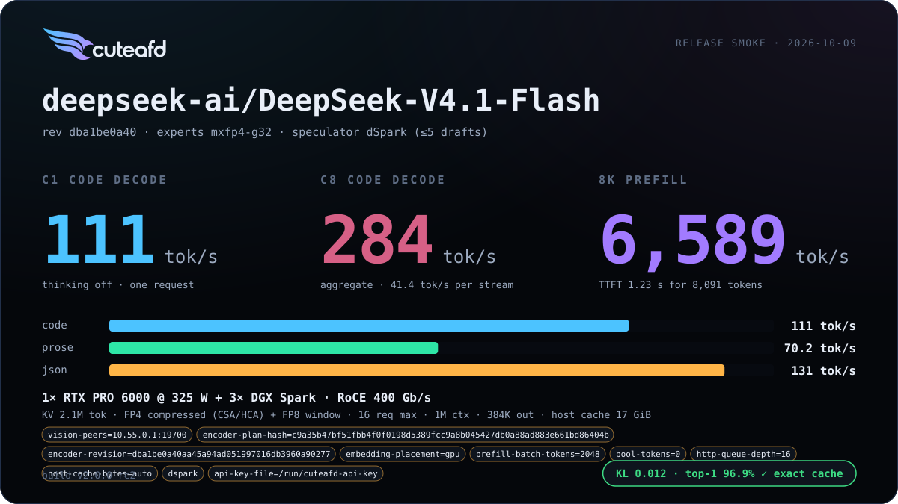</a><br><sub>1× RTX + 3× Spark</sub></td>
<td width="27%" valign="top"><a href="benchmarks/deepseek_v41/2026-10-09-smoke-deepseek-v4-1-flash-2rtx-4spark-v41-flash-max-rc2/card.svg">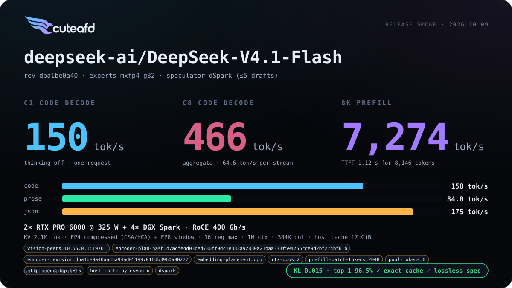</a><br><sub>2× RTX + 4× Spark</sub></td>
</tr>
<tr>
<td width="19%" valign="top"><a href="docs/models/deepseek_v41.md"><b>DeepSeek V4.1</b></a><br><sub>nvidia/DeepSeek-V4.1-Flash-NVFP4</sub><br><sub>nvfp4-g16</sub></td>
<td width="27%" valign="top"><a href="benchmarks/deepseek_v41/2026-10-09-smoke-deepseek-v4-1-flash-nvfp4-1rtx-4spark-v41-flash-nvfp4-rc2-sim5090/card.svg">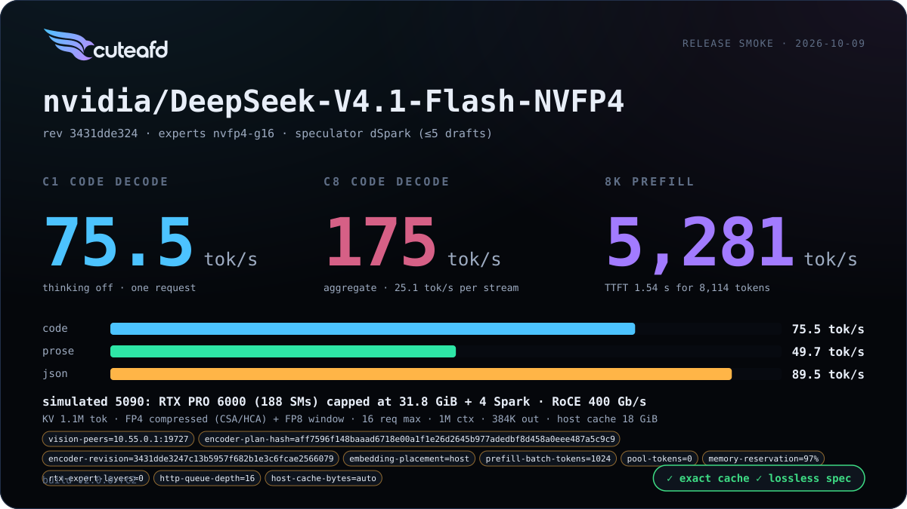</a><br><sub>simulated 5090: RTX PRO 6000 (188 SMs) capped at 31.8 GiB + 4 Spark</sub><br><sub>Fidelity unqualified: official V4.1 Flash reference applies, but rc2 bench client misses the NVFP4 ID mapping; fixed in the next RC. Planner TP3 memory fit is distinct from executable support: NVFP4 launcher requires TP4; TP3 package is native-only.</sub></td>
<td width="27%" valign="top"><a href="benchmarks/deepseek_v41/2026-10-09-smoke-deepseek-v4-1-flash-nvfp4-1rtx-4spark-v41-flash-nvfp4-min-rc2/card.svg">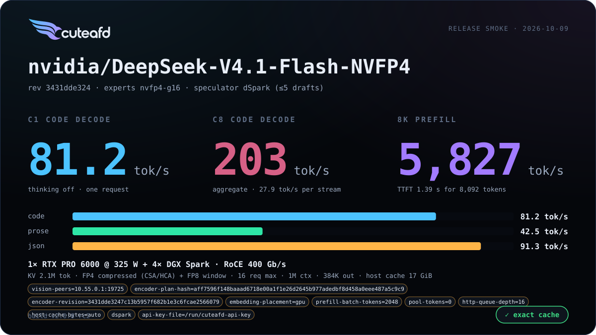</a><br><sub>1× RTX + 4× Spark</sub><br><sub>Fidelity unqualified: official V4.1 Flash reference applies, but rc2 bench client misses the NVFP4 ID mapping; fixed in the next RC. Planner TP3 memory fit is distinct from executable support: NVFP4 launcher requires TP4; TP3 package is native-only.</sub></td>
<td width="27%" valign="top"><a href="benchmarks/deepseek_v41/2026-10-09-smoke-deepseek-v4-1-flash-nvfp4-2rtx-4spark-v41-flash-nvfp4-max-rc2/card.svg">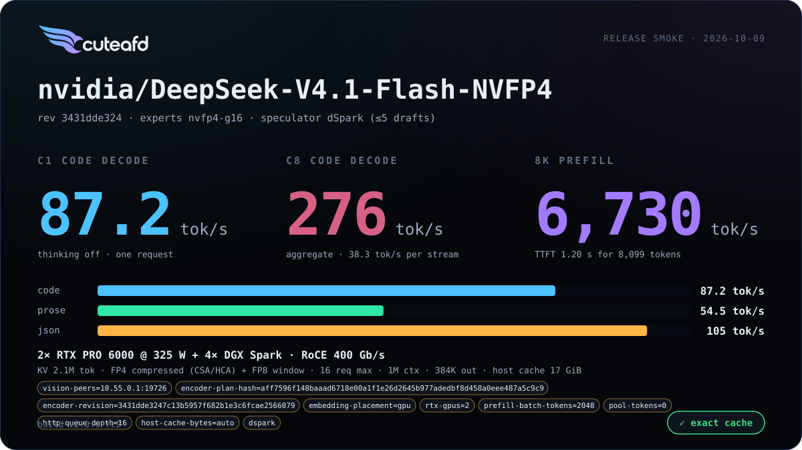</a><br><sub>2× RTX + 4× Spark</sub><br><sub>Fidelity unqualified: official V4.1 Flash reference applies, but rc2 bench client misses the NVFP4 ID mapping; fixed in the next RC.</sub></td>
</tr>
<tr>
<td width="19%" valign="top"><a href="docs/models/deepseek_v4.md"><b>DeepSeek V4</b></a><br><sub>deepseek-ai/DeepSeek-V4-Flash-0731</sub><br><sub>mxfp4-g32</sub></td>
<td width="27%" valign="top"><a href="benchmarks/deepseek_v4/2026-10-09-smoke-v4-flash-no-fit-rc2-sim5090/report.json">doesn't fit 1× 5090 (32 GB) + 6 Sparks</a><br><sub>rtx0 full memory layout needs 28801731495 bytes, budget 28602014537 bytes, shortfall 199716958 bytes</sub><br><sub>Memory vs. kernel support: Memory rejection with all six Sparks; actual rc2 planner evidence, no server/performance. Not a missing TP kernel.</sub></td>
<td width="27%" valign="top"><a href="benchmarks/deepseek_v4/2026-10-09-smoke-deepseek-v4-flash-0731-1rtx-2spark-v4-flash-min-rc2/card.svg">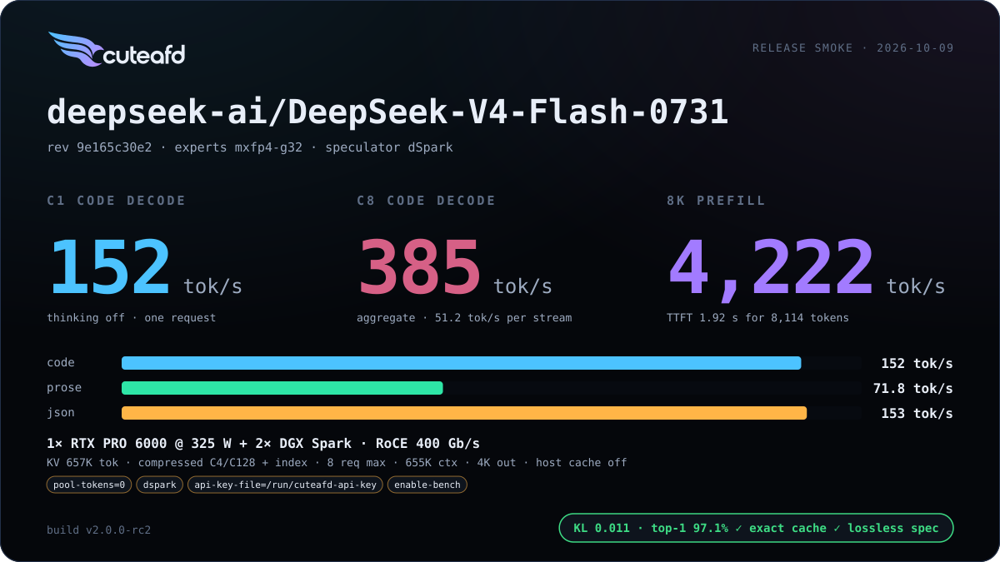</a><br><sub>1× RTX + 2× Spark</sub><br><sub>Memory vs. kernel support: compiled index extent 1,048,576; default admitted effective context 654,848. Extent does not qualify a full-length prompt. Expert-first placement/GPU1 underuse remains v3 work; compiled C128 stride is independent of admitted context.</sub></td>
<td width="27%" valign="top"><a href="benchmarks/deepseek_v4/2026-10-09-smoke-deepseek-v4-flash-0731-2rtx-4spark-v4-flash-max-rc2/card.svg">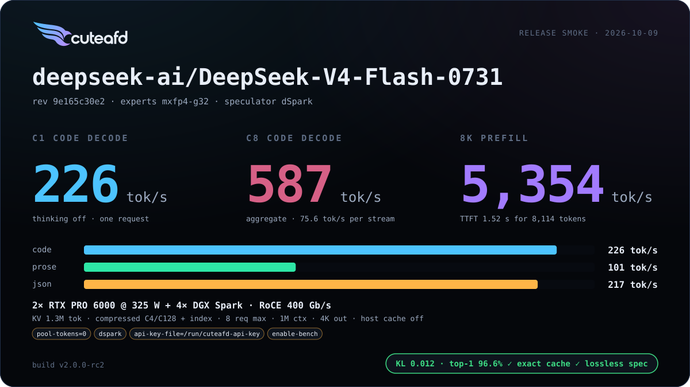</a><br><sub>2× RTX + 4× Spark</sub><br><sub>Memory vs. kernel support: compiled index extent 1,048,576; default admitted effective context 1,048,576. Extent does not qualify a full-length prompt. Expert-first placement/GPU1 underuse remains v3 work; compiled C128 stride is independent of admitted context.</sub></td>
</tr>
<tr>
<td width="19%" valign="top"><a href="docs/models/deepseek_v4.md"><b>DeepSeek V4</b></a><br><sub>wrldsuksgo2mars/DeepSeek-V4-Pro-0813-EXL3-K2-calibrated-v1</sub><br><sub>exl3-k2</sub></td>
<td width="27%" valign="top"><a href="benchmarks/deepseek_v4/2026-10-09-smoke-v4-pro-exl3-no-fit-rc2-sim5090/report.json">doesn't fit 1× 5090 (32 GB) + 6 Sparks</a><br><sub>coordinator weights need 46.0 GiB, over the 32 GiB coordinator budget; rtx0 full memory layout needs 62952874251 bytes, budget 30095094601 bytes, shortfall 32857779650 bytes</sub><br><sub>Memory vs. kernel support: Memory rejection with all six Sparks; actual rc2 planner evidence, no server/performance. Not a missing TP kernel.</sub></td>
<td width="27%" valign="top"><a href="benchmarks/deepseek_v4/2026-10-09-smoke-deepseek-v4-pro-0813-exl3-k2-calibrated-v1-1rtx-4spark-v4-pro-exl3-min-rc2/card.svg">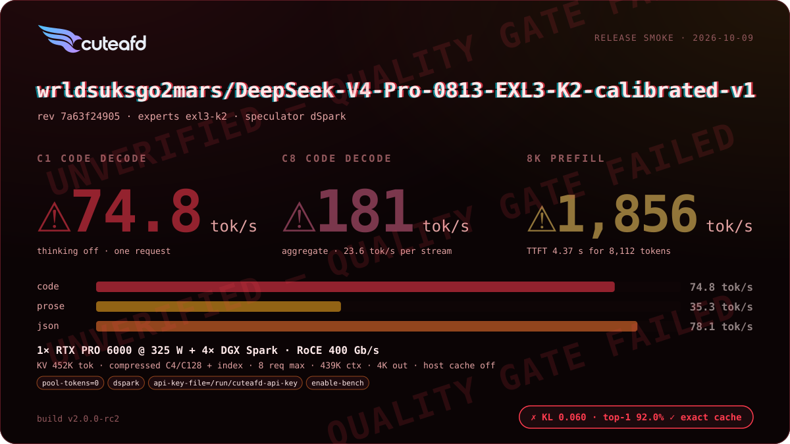</a><br><sub>1× RTX + 4× Spark</sub><br><sub>Memory vs. kernel support: compiled index extent 1,048,576; default admitted effective context 449,536. Extent does not qualify a full-length prompt. Expert-first placement/GPU1 underuse remains v3 work; compiled C128 stride is independent of admitted context. Fidelity FAIL: KL 0.060497 exceeds unchanged 0.06 gate; top-1 92.02%. Documented minimum finding, not a pass.</sub></td>
<td width="27%" valign="top"><a href="benchmarks/deepseek_v4/2026-10-09-smoke-deepseek-v4-pro-0813-exl3-k2-calibrated-v1-2rtx-6spark-v4-pro-exl3-max-rc2/card.svg">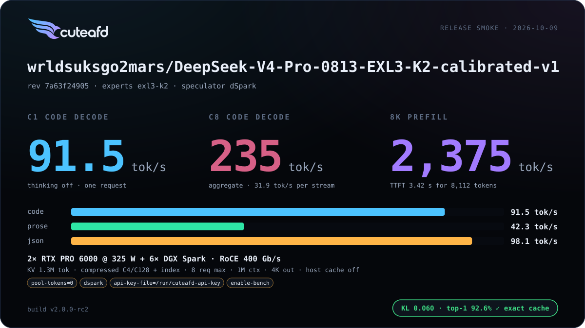</a><br><sub>2× RTX + 6× Spark</sub><br><sub>Memory vs. kernel support: compiled index extent 1,048,576; default admitted effective context 1,048,576. Extent does not qualify a full-length prompt. Expert-first placement/GPU1 underuse remains v3 work; compiled C128 stride is independent of admitted context.</sub></td>
</tr>
<tr>
<td width="19%" valign="top"><a href="docs/models/glm5.md"><b>GLM 5.3</b></a><br><sub>wrldsuksgo2mars/GLM-5.3-EXL3-K4-v1</sub><br><sub>exl3-k4</sub></td>
<td width="27%" valign="top"><a href="benchmarks/glm5/2026-10-09-smoke-glm53-exl3-no-fit-rc2-sim5090/report.json">doesn't fit 1× 5090 (32 GB) + 6 Sparks</a><br><sub>rtx0 full memory layout needs 38219720132 bytes, budget 31997506355 bytes, shortfall 6222213777 bytes</sub><br><sub>Memory vs. kernel support: Memory rejection with all six Sparks; actual rc2 planner evidence, no server/performance. Not a missing TP kernel. Compiled 1,048,576 index extent is a separate limit.</sub></td>
<td width="27%" valign="top"><a href="benchmarks/glm5/2026-10-09-smoke-glm-5-3-exl3-k4-v1-1rtx-4spark-glm53-exl3-min-rc2/card.svg">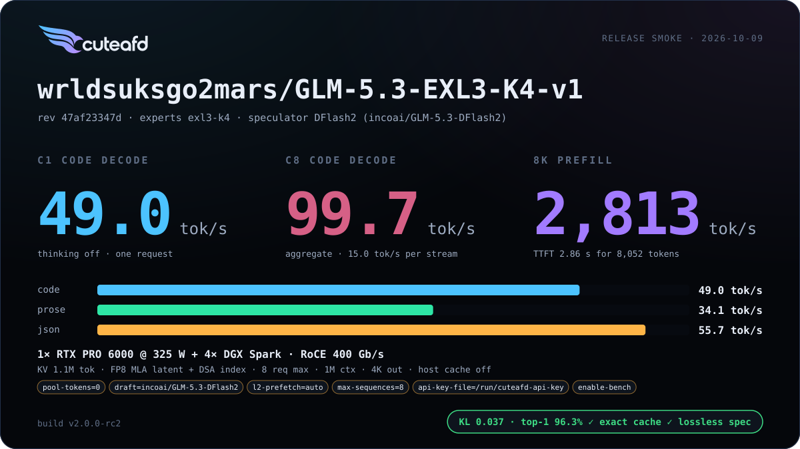</a><br><sub>1× RTX + 4× Spark</sub><br><sub>Memory vs. kernel support: compiled index extent 1,048,576; default admitted effective context 1,048,576. Extent does not qualify a full-length prompt.</sub></td>
<td width="27%" valign="top"><a href="benchmarks/glm5/2026-10-09-smoke-glm-5-3-exl3-k4-v1-2rtx-6spark-glm53-exl3-max-rc2/card.svg">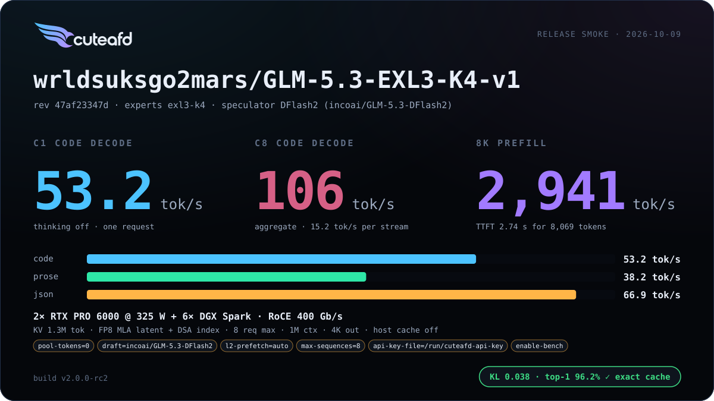</a><br><sub>2× RTX + 6× Spark</sub><br><sub>Memory vs. kernel support: compiled index extent 1,048,576; default admitted effective context 1,048,576. Extent does not qualify a full-length prompt.</sub></td>
</tr>
<tr>
<td width="19%" valign="top"><a href="docs/models/glm5.md"><b>GLM 5.3</b></a><br><sub>nvidia/GLM-5.3-NVFP4</sub><br><sub>nvfp4-g16</sub></td>
<td width="27%" valign="top"><a href="benchmarks/glm5/2026-10-09-smoke-glm53-nvfp4-no-fit-rc2-sim5090/report.json">doesn't fit 1× 5090 (32 GB) + 6 Sparks</a><br><sub>coordinator weights need 52.6 GiB, over the 32 GiB coordinator budget; rtx0 full memory layout needs 54111029708 bytes, budget 31997506355 bytes, shortfall 22113523353 bytes</sub><br><sub>Memory vs. kernel support: Memory rejection with all six Sparks; actual rc2 planner evidence, no server/performance. Not a missing TP kernel. Compiled 1,048,576 index extent is a separate limit.</sub></td>
<td width="27%" valign="top"><a href="benchmarks/glm5/2026-10-09-smoke-glm-5-3-nvfp4-1rtx-4spark-glm53-nvfp4-min-rc2/card.svg">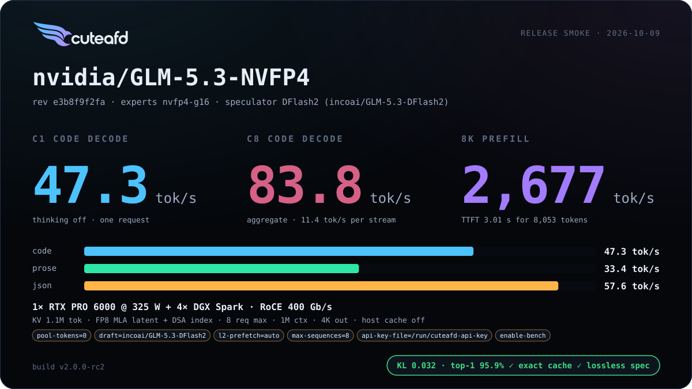</a><br><sub>1× RTX + 4× Spark</sub><br><sub>Memory vs. kernel support: compiled index extent 1,048,576; default admitted effective context 1,048,576. Extent does not qualify a full-length prompt.</sub></td>
<td width="27%" valign="top"><a href="benchmarks/glm5/2026-10-09-smoke-glm-5-3-nvfp4-2rtx-6spark-glm53-nvfp4-max-rc2/card.svg">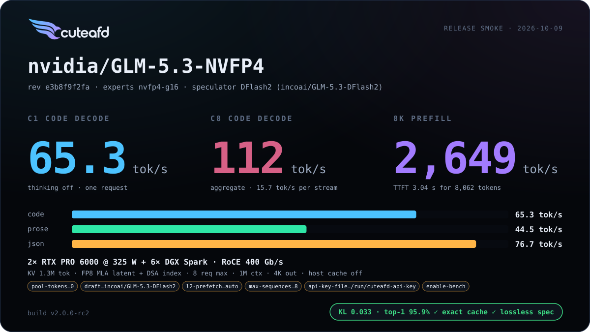</a><br><sub>2× RTX + 6× Spark</sub><br><sub>Memory vs. kernel support: compiled index extent 1,048,576; default admitted effective context 1,048,576. Extent does not qualify a full-length prompt.</sub></td>
</tr>
<tr>
<td width="19%" valign="top"><a href="docs/models/glm5_flash.md"><b>GLM 5.3 Flash</b></a><br><sub>zai-org/GLM-5.3-Flash</sub><br><sub>fp8-block128x128/f32</sub></td>
<td width="27%" valign="top"><a href="benchmarks/glm5_flash/2026-10-09-smoke-glm-5-3-flash-1rtx-4spark-glm53f-fp8-rc2-sim5090/card.svg"></a><br><sub>simulated 5090: RTX PRO 6000 (188 SMs) capped at 31.8 GiB + 4 Spark</sub><br><sub>Memory vs. kernel support: compiled index extent 1,048,576; default admitted effective context 768,256. Extent does not qualify a full-length prompt.</sub></td>
<td width="27%" valign="top"><a href="benchmarks/glm5_flash/2026-10-09-smoke-glm-5-3-flash-1rtx-4spark-glm53f-fp8-min-rc2/card.svg"></a><br><sub>1× RTX + 4× Spark</sub><br><sub>Memory vs. kernel support: compiled index extent 1,048,576; default admitted effective context 1,048,576. Extent does not qualify a full-length prompt.</sub></td>
<td width="27%" valign="top"><a href="benchmarks/glm5_flash/2026-10-09-smoke-glm-5-3-flash-2rtx-4spark-glm53f-fp8-max-rc2/card.svg"></a><br><sub>2× RTX + 4× Spark</sub><br><sub>Memory vs. kernel support: compiled index extent 1,048,576; default admitted effective context 1,048,576. Extent does not qualify a full-length prompt.</sub></td>
</tr>
<tr>
<td width="19%" valign="top"><a href="docs/models/glm5_flash.md"><b>GLM 5.3 Flash</b></a><br><sub>wrldsuksgo2mars/GLM-5.3-Flash-EXL3-K3.25-v1</sub><br><sub>exl3-k3+exl3-k4</sub></td>
<td width="27%" valign="top"><a href="benchmarks/glm5_flash/2026-10-09-smoke-glm-5-3-flash-exl3-k3-25-v1-1rtx-2spark-glm53f-exl3-rc2-sim5090/card.svg"></a><br><sub>simulated 5090: RTX PRO 6000 (188 SMs) capped at 31.8 GiB + 2 Spark</sub><br><sub>Memory vs. kernel support: compiled index extent 1,048,576; default admitted effective context 779,264. Extent does not qualify a full-length prompt.</sub></td>
<td width="27%" valign="top"><a href="benchmarks/glm5_flash/2026-10-09-smoke-glm-5-3-flash-exl3-k3-25-v1-1rtx-2spark-glm53f-exl3-min-rc2/card.svg"></a><br><sub>1× RTX + 2× Spark</sub><br><sub>Memory vs. kernel support: compiled index extent 1,048,576; default admitted effective context 1,048,576. Extent does not qualify a full-length prompt.</sub></td>
<td width="27%" valign="top"><a href="benchmarks/glm5_flash/2026-10-09-smoke-glm-5-3-flash-exl3-k3-25-v1-2rtx-4spark-glm53f-exl3-max-rc2/card.svg"></a><br><sub>2× RTX + 4× Spark</sub><br><sub>Memory vs. kernel support: compiled index extent 1,048,576; default admitted effective context 1,048,576. Extent does not qualify a full-length prompt.</sub></td>
</tr>
<tr>
<td width="19%" valign="top"><a href="docs/models/glm5_flash.md"><b>GLM 5.3 Flash</b></a><br><sub>nvidia/GLM-5.3-Flash-NVFP4</sub><br><sub>nvfp4-g16</sub></td>
<td width="27%" valign="top"><a href="benchmarks/glm5_flash/2026-10-09-smoke-glm-5-3-flash-nvfp4-1rtx-2spark-glm53f-nvfp4-rc2-sim5090/card.svg"></a><br><sub>simulated 5090: RTX PRO 6000 (188 SMs) capped at 31.8 GiB + 2 Spark</sub><br><sub>Memory vs. kernel support: compiled index extent 1,048,576; default admitted effective context 766,720. Extent does not qualify a full-length prompt.</sub></td>
<td width="27%" valign="top"><a href="benchmarks/glm5_flash/2026-10-09-smoke-glm-5-3-flash-nvfp4-1rtx-2spark-glm53f-nvfp4-min-rc2/card.svg"></a><br><sub>1× RTX + 2× Spark</sub><br><sub>Memory vs. kernel support: compiled index extent 1,048,576; default admitted effective context 1,048,576. Extent does not qualify a full-length prompt.</sub></td>
<td width="27%" valign="top"><a href="benchmarks/glm5_flash/2026-10-09-smoke-glm-5-3-flash-nvfp4-2rtx-4spark-glm53f-nvfp4-max-rc2/card.svg"></a><br><sub>2× RTX + 4× Spark</sub><br><sub>Memory vs. kernel support: compiled index extent 1,048,576; default admitted effective context 1,048,576. Extent does not qualify a full-length prompt.</sub></td>
</tr>
<tr>
<td width="19%" valign="top"><a href="docs/models/glm5_flash.md"><b>GLM 5.3 Flash</b></a><br><sub>brandonmusic/GLM-5.3-Flash-tr3-4bpw</sub><br><sub>exl3-k4</sub></td>
<td width="27%" valign="top"><a href="benchmarks/glm5_flash/2026-10-09-smoke-glm-5-3-flash-tr3-4bpw-1rtx-2spark-glm53f-tr3-rc2-sim5090/card.svg"></a><br><sub>simulated 5090: RTX PRO 6000 (188 SMs) capped at 31.8 GiB + 2 Spark</sub><br><sub>Memory vs. kernel support: compiled index extent 1,048,576; default admitted effective context 779,264. Extent does not qualify a full-length prompt.</sub></td>
<td width="27%" valign="top"><a href="benchmarks/glm5_flash/2026-10-09-smoke-glm-5-3-flash-tr3-4bpw-1rtx-2spark-glm53f-tr3-min-rc2/card.svg"></a><br><sub>1× RTX + 2× Spark</sub><br><sub>Memory vs. kernel support: compiled index extent 1,048,576; default admitted effective context 1,048,576. Extent does not qualify a full-length prompt.</sub></td>
<td width="27%" valign="top"><a href="benchmarks/glm5_flash/2026-10-09-smoke-glm-5-3-flash-tr3-4bpw-2rtx-4spark-glm53f-tr3-max-rc2/card.svg"></a><br><sub>2× RTX + 4× Spark</sub><br><sub>Memory vs. kernel support: compiled index extent 1,048,576; default admitted effective context 1,048,576. Extent does not qualify a full-length prompt.</sub></td>
</tr>
<tr>
<td width="19%" valign="top"><a href="docs/models/mimo_v2.md"><b>MiMo V2</b></a><br><sub>XiaomiMiMo/MiMo-V2.6-Flash-MOPD</sub><br><sub>mxfp4-g32</sub></td>
<td width="27%" valign="top"><a href="benchmarks/mimo_v2/2026-10-09-smoke-mimo-v2-6-flash-mopd-1rtx-2spark-mimo26-flash-rc2-sim5090/card.svg">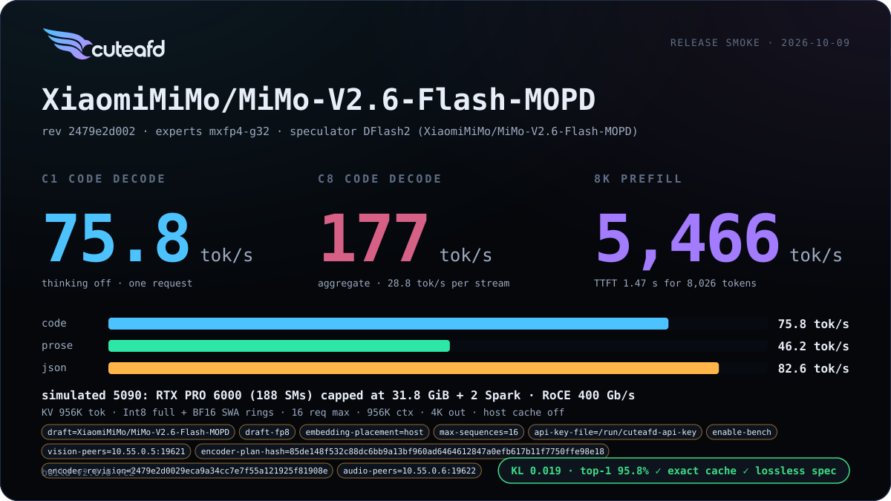</a><br><sub>simulated 5090: RTX PRO 6000 (188 SMs) capped at 31.8 GiB + 2 Spark</sub></td>
<td width="27%" valign="top"><a href="benchmarks/mimo_v2/2026-10-09-smoke-mimo-v2-6-flash-mopd-1rtx-2spark-mimo26-flash-min-rc2/card.svg">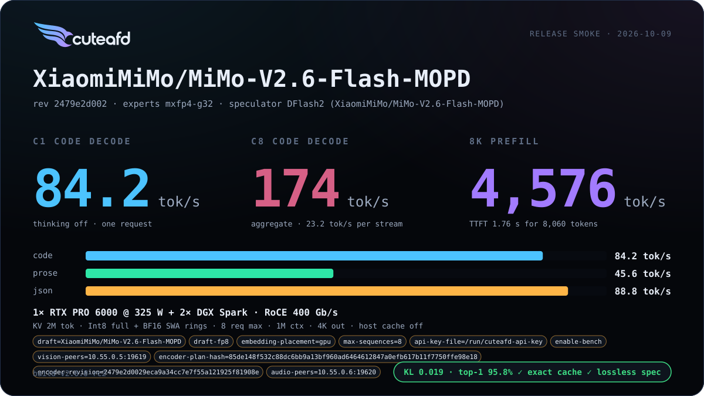</a><br><sub>1× RTX + 2× Spark</sub></td>
<td width="27%" valign="top"><a href="benchmarks/mimo_v2/2026-10-09-smoke-mimo-v2-6-flash-mopd-2rtx-4spark-mimo26-flash-max-rc2/card.svg">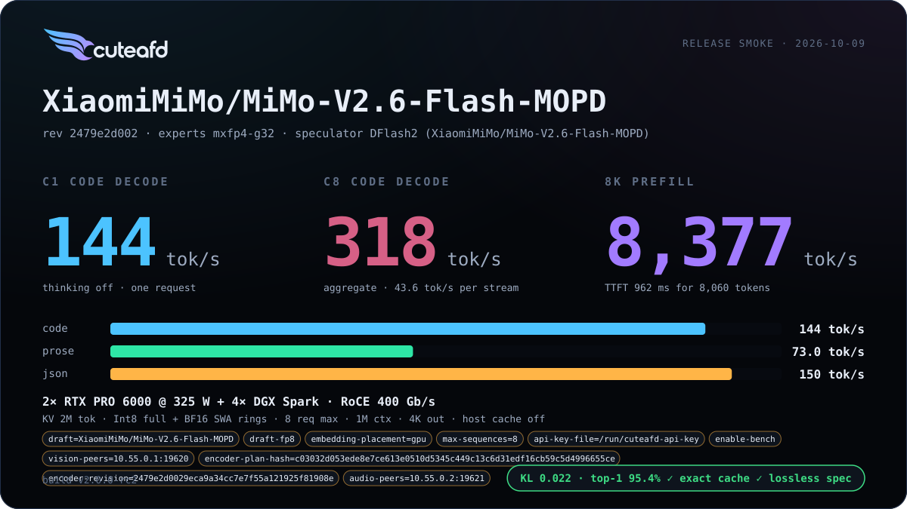</a><br><sub>2× RTX + 4× Spark</sub></td>
</tr>
<tr>
<td width="19%" valign="top"><a href="docs/models/mimo_v2.md"><b>MiMo V2</b></a><br><sub>XiaomiMiMo/MiMo-V2.6-Pro-MOPD</sub><br><sub>mxfp4-g32</sub></td>
<td width="27%" valign="top"><a href="benchmarks/mimo_v2/2026-10-09-smoke-mimo-pro-no-fit-rc2-sim5090/report.json">doesn't fit 1× 5090 (32 GB) + 6 Sparks</a><br><sub>rtx0 full memory layout needs 33511016304 bytes, budget 31031138713 bytes, shortfall 2479877591 bytes</sub><br><sub>Memory vs. kernel support: Memory rejection with all six Sparks; actual rc2 planner evidence, no server/performance. Not a missing TP kernel.</sub></td>
<td width="27%" valign="top"><a href="benchmarks/mimo_v2/2026-10-09-smoke-mimo-v2-6-pro-mopd-1rtx-6spark-mimo-pro-min-rc2/card.svg">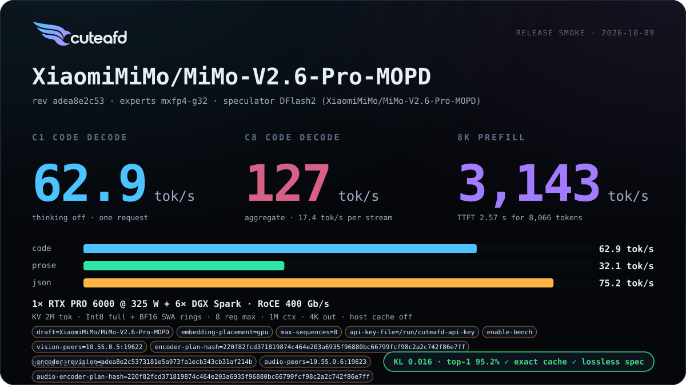</a><br><sub>1× RTX + 6× Spark</sub></td>
<td width="27%" valign="top"><a href="benchmarks/mimo_v2/2026-10-09-smoke-mimo-v2-6-pro-mopd-2rtx-6spark-mimo-pro-max-rc2/card.svg">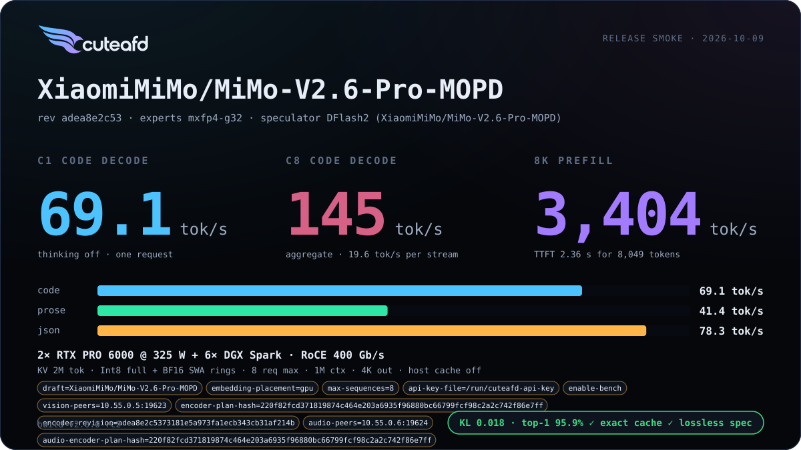</a><br><sub>2× RTX + 6× Spark</sub></td>
</tr>
<tr>
<td width="19%" valign="top"><a href="docs/models/qwen4.md"><b>Qwen 3.8</b></a><br><sub>wrldsuksgo2mars/Qwen3.8-Flash-Next-EXL3-K4.25-PLE-FP8-v1</sub><br><sub>exl3-k4+exl3-k5</sub></td>
<td width="27%" valign="top"><a href="benchmarks/qwen4/2026-10-09-smoke-qwen3-8-flash-next-exl3-k4-25-ple-fp8-v1-1rtx-1spark-qwen38-exl3-rc2-sim5090/card.svg">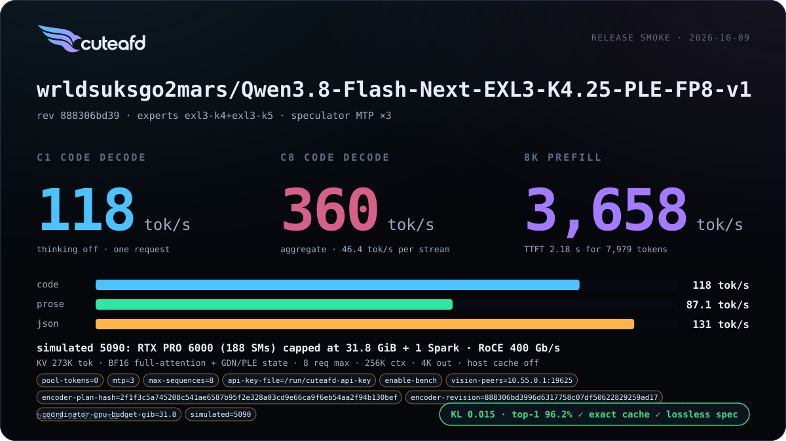</a><br><sub>simulated 5090: RTX PRO 6000 (188 SMs) capped at 31.8 GiB + 1 Spark</sub><br><sub>Memory vs. kernel support: compiled index extent 262,144; default admitted effective context 262,144. Extent does not qualify a full-length prompt.</sub></td>
<td width="27%" valign="top"><a href="benchmarks/qwen4/2026-10-09-smoke-qwen3-8-flash-next-exl3-k4-25-ple-fp8-v1-1rtx-qwen38-exl3-min-rc2/card.svg">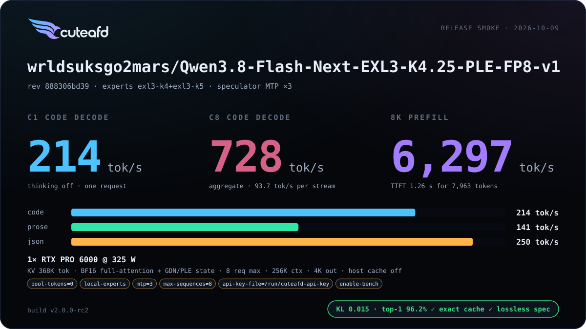</a><br><sub>1× RTX</sub><br><sub>Memory vs. kernel support: compiled index extent 262,144; default admitted effective context 262,144. Extent does not qualify a full-length prompt.</sub></td>
<td width="27%" align="center">n/a: fits one RTX (no two-GPU split for Qwen)</td>
</tr>
<tr>
<td width="19%" valign="top"><a href="docs/models/qwen4.md"><b>Qwen 3.8</b></a><br><sub>nvidia/Qwen3.8-Flash-Next-NVFP4</sub><br><sub>nvfp4-g16</sub></td>
<td width="27%" valign="top"><a href="benchmarks/qwen4/2026-10-09-smoke-qwen3-8-flash-next-nvfp4-1rtx-2spark-qwen38-nvfp4-rc2-sim5090/card.svg">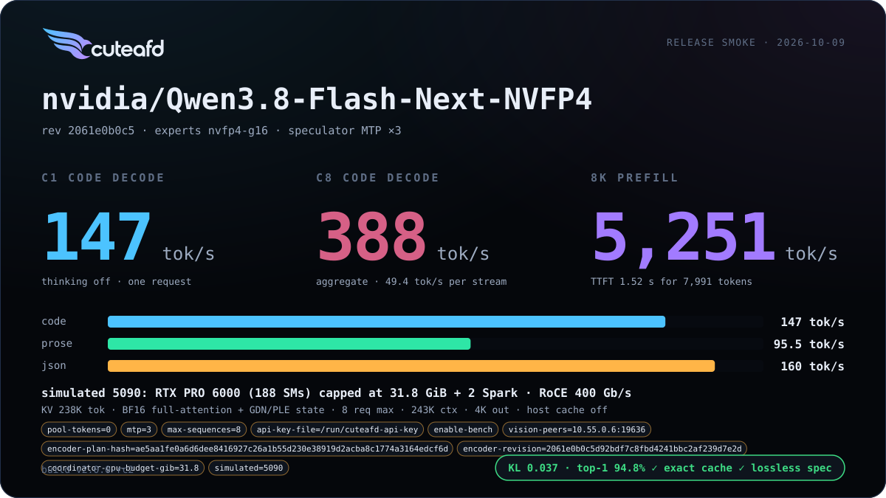</a><br><sub>simulated 5090: RTX PRO 6000 (188 SMs) capped at 31.8 GiB + 2 Spark</sub><br><sub>Memory vs. kernel support: compiled index extent 262,144; default admitted effective context 243,456. Extent does not qualify a full-length prompt. Agentic-floor finding: effective context 243,456, below 262,144; automatic pool unchanged.</sub></td>
<td width="27%" valign="top"><a href="benchmarks/qwen4/2026-10-09-smoke-qwen3-8-flash-next-nvfp4-1rtx-qwen38-nvfp4-min-rc2/card.svg">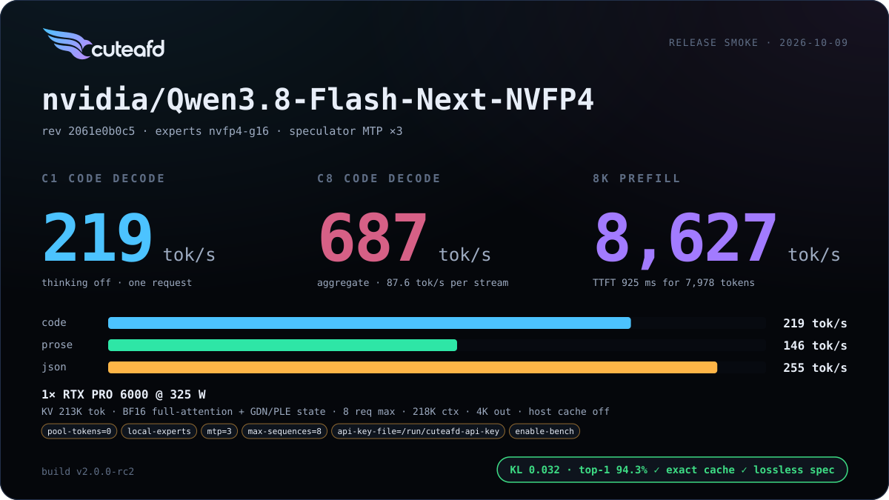</a><br><sub>1× RTX</sub><br><sub>Memory vs. kernel support: compiled index extent 262,144; default admitted effective context 217,856. Extent does not qualify a full-length prompt. Agentic-floor finding: effective context 217,856, below 262,144; automatic pool unchanged.</sub></td>
<td width="27%" align="center">n/a: fits one RTX (no two-GPU split for Qwen)</td>
</tr>
</table>

| Family | Checkpoint | Hardware | KV / req | C1 code | Concurrent code (aggregate) | prose | JSON | 8K prefill | TTFT | Quality | Report |
| --- | --- | --- | --- | ---: | ---: | ---: | ---: | ---: | ---: | --- | --- |
| [DeepSeek V4.1](docs/models/deepseek_v41.md) | DeepSeek-V4.1-Flash (mxfp4-g32) | 1× RTX + 3× Spark (1× RTX) | 2.1M tok / 16 req | 111 | C8: 284 | 70.2 | 131 | 6,589 | 1.23 s | ✓ KL 0.012 · top-1 96.9% ✓ exact cache | [2026-10-09 · v2.0.0-rc2](benchmarks/deepseek_v41/2026-10-09-smoke-deepseek-v4-1-flash-1rtx-3spark-v41-flash-min-rc2/report.svg) |
| [DeepSeek V4.1](docs/models/deepseek_v41.md) | DeepSeek-V4.1-Flash (mxfp4-g32) | 2× RTX + 4× Spark (2× RTX) | 2.1M tok / 16 req | 150 | C8: 466 | 84.0 | 175 | 7,274 | 1.12 s | ✓ KL 0.015 · top-1 96.5% ✓ exact cache ✓ lossless spec | [2026-10-09 · v2.0.0-rc2](benchmarks/deepseek_v41/2026-10-09-smoke-deepseek-v4-1-flash-2rtx-4spark-v41-flash-max-rc2/report.svg) |
| [DeepSeek V4.1](docs/models/deepseek_v41.md) | DeepSeek-V4.1-Flash-NVFP4 (nvfp4-g16) | simulated 5090: RTX PRO 6000 (188 SMs) capped at 31.8 GiB + 4 Spark (5090) | 1.1M tok / 16 req | 75.5 | C8: 175 | 49.7 | 89.5 | 5,281 | 1.54 s | ✓ ✓ exact cache ✓ lossless spec | [2026-10-09 · v2.0.0-rc2](benchmarks/deepseek_v41/2026-10-09-smoke-deepseek-v4-1-flash-nvfp4-1rtx-4spark-v41-flash-nvfp4-rc2-sim5090/report.svg) |
| [DeepSeek V4.1](docs/models/deepseek_v41.md) | DeepSeek-V4.1-Flash-NVFP4 (nvfp4-g16) | 1× RTX + 4× Spark (1× RTX) | 2.1M tok / 16 req | 81.2 | C8: 203 | 42.5 | 91.3 | 5,827 | 1.39 s | ✓ ✓ exact cache | [2026-10-09 · v2.0.0-rc2](benchmarks/deepseek_v41/2026-10-09-smoke-deepseek-v4-1-flash-nvfp4-1rtx-4spark-v41-flash-nvfp4-min-rc2/report.svg) |
| [DeepSeek V4.1](docs/models/deepseek_v41.md) | DeepSeek-V4.1-Flash-NVFP4 (nvfp4-g16) | 2× RTX + 4× Spark (2× RTX) | 2.1M tok / 16 req | 87.2 | C8: 276 | 54.5 | 105 | 6,730 | 1.20 s | ✓ ✓ exact cache | [2026-10-09 · v2.0.0-rc2](benchmarks/deepseek_v41/2026-10-09-smoke-deepseek-v4-1-flash-nvfp4-2rtx-4spark-v41-flash-nvfp4-max-rc2/report.svg) |
| [DeepSeek V4](docs/models/deepseek_v4.md) | DeepSeek-V4-Flash-0731 (mxfp4-g32) | simulated 5090: RTX PRO 6000 (188 SMs) capped at 31.8 GiB + 6 Spark (5090) | — | — | — | — | — | — | — | doesn't fit: rtx0 full memory layout needs 28801731495 bytes, budget 28602014537 bytes, shortfall 199716958 bytes | [planner report](benchmarks/deepseek_v4/2026-10-09-smoke-v4-flash-no-fit-rc2-sim5090/report.json) |
| [DeepSeek V4](docs/models/deepseek_v4.md) | DeepSeek-V4-Flash-0731 (mxfp4-g32) | 1× RTX + 2× Spark (1× RTX) | 657K tok / 8 req | 152 | C8: 385 | 71.8 | 153 | 4,222 | 1.92 s | ✓ KL 0.011 · top-1 97.1% ✓ exact cache ✓ lossless spec | [2026-10-09 · v2.0.0-rc2](benchmarks/deepseek_v4/2026-10-09-smoke-deepseek-v4-flash-0731-1rtx-2spark-v4-flash-min-rc2/report.svg) |
| [DeepSeek V4](docs/models/deepseek_v4.md) | DeepSeek-V4-Flash-0731 (mxfp4-g32) | 2× RTX + 4× Spark (2× RTX) | 1.3M tok / 8 req | 226 | C8: 587 | 101 | 217 | 5,354 | 1.52 s | ✓ KL 0.012 · top-1 96.6% ✓ exact cache ✓ lossless spec | [2026-10-09 · v2.0.0-rc2](benchmarks/deepseek_v4/2026-10-09-smoke-deepseek-v4-flash-0731-2rtx-4spark-v4-flash-max-rc2/report.svg) |
| [DeepSeek V4](docs/models/deepseek_v4.md) | DeepSeek-V4-Pro-0813-EXL3-K2-calibrated-v1 (exl3-k2) | simulated 5090: RTX PRO 6000 (188 SMs) capped at 31.8 GiB + 6 Spark (5090) | — | — | — | — | — | — | — | doesn't fit: coordinator weights need 46.0 GiB, over the 32 GiB coordinator budget; rtx0 full memory layout needs 62952874251 bytes, budget 30095094601 bytes, shortfall 32857779650 bytes | [planner report](benchmarks/deepseek_v4/2026-10-09-smoke-v4-pro-exl3-no-fit-rc2-sim5090/report.json) |
| [DeepSeek V4](docs/models/deepseek_v4.md) | DeepSeek-V4-Pro-0813-EXL3-K2-calibrated-v1 (exl3-k2) | 1× RTX + 4× Spark (1× RTX) | 452K tok / 8 req | 74.8 | C8: 181 | 35.3 | 78.1 | 1,856 | 4.37 s | ⚠ **FAILED** failed: Logit fidelity | [2026-10-09 · v2.0.0-rc2](benchmarks/deepseek_v4/2026-10-09-smoke-deepseek-v4-pro-0813-exl3-k2-calibrated-v1-1rtx-4spark-v4-pro-exl3-min-rc2/report.svg) |
| [DeepSeek V4](docs/models/deepseek_v4.md) | DeepSeek-V4-Pro-0813-EXL3-K2-calibrated-v1 (exl3-k2) | 2× RTX + 6× Spark (2× RTX) | 1.3M tok / 8 req | 91.5 | C8: 235 | 42.3 | 98.1 | 2,375 | 3.42 s | ✓ KL 0.060 · top-1 92.6% ✓ exact cache | [2026-10-09 · v2.0.0-rc2](benchmarks/deepseek_v4/2026-10-09-smoke-deepseek-v4-pro-0813-exl3-k2-calibrated-v1-2rtx-6spark-v4-pro-exl3-max-rc2/report.svg) |
| [GLM 5.3](docs/models/glm5.md) | GLM-5.3-EXL3-K4-v1 (exl3-k4) | simulated 5090: RTX PRO 6000 (188 SMs) capped at 31.8 GiB + 6 Spark (5090) | — | — | — | — | — | — | — | doesn't fit: rtx0 full memory layout needs 38219720132 bytes, budget 31997506355 bytes, shortfall 6222213777 bytes | [planner report](benchmarks/glm5/2026-10-09-smoke-glm53-exl3-no-fit-rc2-sim5090/report.json) |
| [GLM 5.3](docs/models/glm5.md) | GLM-5.3-EXL3-K4-v1 (exl3-k4) | 1× RTX + 4× Spark (1× RTX) | 1.1M tok / 8 req | 49.0 | C8: 99.7 | 34.1 | 55.7 | 2,813 | 2.86 s | ✓ KL 0.037 · top-1 96.3% ✓ exact cache ✓ lossless spec | [2026-10-09 · v2.0.0-rc2](benchmarks/glm5/2026-10-09-smoke-glm-5-3-exl3-k4-v1-1rtx-4spark-glm53-exl3-min-rc2/report.svg) |
| [GLM 5.3](docs/models/glm5.md) | GLM-5.3-EXL3-K4-v1 (exl3-k4) | 2× RTX + 6× Spark (2× RTX) | 1.3M tok / 8 req | 53.2 | C8: 106 | 38.2 | 66.9 | 2,941 | 2.74 s | ✓ KL 0.038 · top-1 96.2% ✓ exact cache | [2026-10-09 · v2.0.0-rc2](benchmarks/glm5/2026-10-09-smoke-glm-5-3-exl3-k4-v1-2rtx-6spark-glm53-exl3-max-rc2/report.svg) |
| [GLM 5.3](docs/models/glm5.md) | GLM-5.3-NVFP4 (nvfp4-g16) | simulated 5090: RTX PRO 6000 (188 SMs) capped at 31.8 GiB + 6 Spark (5090) | — | — | — | — | — | — | — | doesn't fit: coordinator weights need 52.6 GiB, over the 32 GiB coordinator budget; rtx0 full memory layout needs 54111029708 bytes, budget 31997506355 bytes, shortfall 22113523353 bytes | [planner report](benchmarks/glm5/2026-10-09-smoke-glm53-nvfp4-no-fit-rc2-sim5090/report.json) |
| [GLM 5.3](docs/models/glm5.md) | GLM-5.3-NVFP4 (nvfp4-g16) | 1× RTX + 4× Spark (1× RTX) | 1.1M tok / 8 req | 47.3 | C8: 83.8 | 33.4 | 57.6 | 2,677 | 3.01 s | ✓ KL 0.032 · top-1 95.9% ✓ exact cache ✓ lossless spec | [2026-10-09 · v2.0.0-rc2](benchmarks/glm5/2026-10-09-smoke-glm-5-3-nvfp4-1rtx-4spark-glm53-nvfp4-min-rc2/report.svg) |
| [GLM 5.3](docs/models/glm5.md) | GLM-5.3-NVFP4 (nvfp4-g16) | 2× RTX + 6× Spark (2× RTX) | 1.3M tok / 8 req | 65.3 | C8: 112 | 44.5 | 76.7 | 2,649 | 3.04 s | ✓ KL 0.033 · top-1 95.9% ✓ exact cache ✓ lossless spec | [2026-10-09 · v2.0.0-rc2](benchmarks/glm5/2026-10-09-smoke-glm-5-3-nvfp4-2rtx-6spark-glm53-nvfp4-max-rc2/report.svg) |
| [GLM 5.3 Flash](docs/models/glm5_flash.md) | GLM-5.3-Flash (fp8-block128x128/f32) | simulated 5090: RTX PRO 6000 (188 SMs) capped at 31.8 GiB + 4 Spark (5090) | 769K tok / 8 req | 74.5 | C8: 130 | 61.8 | 82.1 | 5,803 | 1.39 s | ✓ KL 0.011 · top-1 97.5% ✓ exact cache | [2026-10-09 · v2.0.0-rc2](benchmarks/glm5_flash/2026-10-09-smoke-glm-5-3-flash-1rtx-4spark-glm53f-fp8-rc2-sim5090/report.svg) |
| [GLM 5.3 Flash](docs/models/glm5_flash.md) | GLM-5.3-Flash (fp8-block128x128/f32) | 1× RTX + 4× Spark (1× RTX) | 2M tok / 8 req | 73.3 | C8: 130 | 57.2 | 82.5 | 5,858 | 1.37 s | ✓ KL 0.011 · top-1 97.5% ✓ exact cache | [2026-10-09 · v2.0.0-rc2](benchmarks/glm5_flash/2026-10-09-smoke-glm-5-3-flash-1rtx-4spark-glm53f-fp8-min-rc2/report.svg) |
| [GLM 5.3 Flash](docs/models/glm5_flash.md) | GLM-5.3-Flash (fp8-block128x128/f32) | 2× RTX + 4× Spark (2× RTX) | 2M tok / 8 req | 71.0 | C8: 143 | 63.7 | 82.0 | 6,348 | 1.27 s | ✓ KL 0.011 · top-1 97.0% ✓ exact cache | [2026-10-09 · v2.0.0-rc2](benchmarks/glm5_flash/2026-10-09-smoke-glm-5-3-flash-2rtx-4spark-glm53f-fp8-max-rc2/report.svg) |
| [GLM 5.3 Flash](docs/models/glm5_flash.md) | GLM-5.3-Flash-EXL3-K3.25-v1 (exl3-k3+exl3-k4) | simulated 5090: RTX PRO 6000 (188 SMs) capped at 31.8 GiB + 2 Spark (5090) | 780K tok / 8 req | 85.0 | C8: 152 | 70.9 | 98.1 | 5,076 | 1.59 s | ✓ KL 0.036 · top-1 95.4% ✓ exact cache | [2026-10-09 · v2.0.0-rc2](benchmarks/glm5_flash/2026-10-09-smoke-glm-5-3-flash-exl3-k3-25-v1-1rtx-2spark-glm53f-exl3-rc2-sim5090/report.svg) |
| [GLM 5.3 Flash](docs/models/glm5_flash.md) | GLM-5.3-Flash-EXL3-K3.25-v1 (exl3-k3+exl3-k4) | 1× RTX + 2× Spark (1× RTX) | 2M tok / 8 req | 87.8 | C8: 148 | 69.9 | 106 | 4,992 | 1.61 s | ✓ KL 0.036 · top-1 95.4% ✓ exact cache | [2026-10-09 · v2.0.0-rc2](benchmarks/glm5_flash/2026-10-09-smoke-glm-5-3-flash-exl3-k3-25-v1-1rtx-2spark-glm53f-exl3-min-rc2/report.svg) |
| [GLM 5.3 Flash](docs/models/glm5_flash.md) | GLM-5.3-Flash-EXL3-K3.25-v1 (exl3-k3+exl3-k4) | 2× RTX + 4× Spark (2× RTX) | 2M tok / 8 req | 110 | C8: 251 | 100.0 | 159 | 7,192 | 1.12 s | ✓ KL 0.039 · top-1 95.3% ✓ exact cache ✓ lossless spec | [2026-10-09 · v2.0.0-rc2](benchmarks/glm5_flash/2026-10-09-smoke-glm-5-3-flash-exl3-k3-25-v1-2rtx-4spark-glm53f-exl3-max-rc2/report.svg) |
| [GLM 5.3 Flash](docs/models/glm5_flash.md) | GLM-5.3-Flash-NVFP4 (nvfp4-g16) | simulated 5090: RTX PRO 6000 (188 SMs) capped at 31.8 GiB + 2 Spark (5090) | 749K tok / 8 req | 67.5 | C8: 115 | 56.8 | 79.6 | 5,404 | 1.49 s | ✓ KL 0.029 · top-1 96.4% ✓ exact cache | [2026-10-09 · v2.0.0-rc2](benchmarks/glm5_flash/2026-10-09-smoke-glm-5-3-flash-nvfp4-1rtx-2spark-glm53f-nvfp4-rc2-sim5090/report.svg) |
| [GLM 5.3 Flash](docs/models/glm5_flash.md) | GLM-5.3-Flash-NVFP4 (nvfp4-g16) | 1× RTX + 2× Spark (1× RTX) | 2M tok / 8 req | 68.5 | C8: 123 | 59.3 | 78.2 | 5,291 | 1.53 s | ✓ KL 0.029 · top-1 96.4% ✓ exact cache | [2026-10-09 · v2.0.0-rc2](benchmarks/glm5_flash/2026-10-09-smoke-glm-5-3-flash-nvfp4-1rtx-2spark-glm53f-nvfp4-min-rc2/report.svg) |
| [GLM 5.3 Flash](docs/models/glm5_flash.md) | GLM-5.3-Flash-NVFP4 (nvfp4-g16) | 2× RTX + 4× Spark (2× RTX) | 2M tok / 8 req | 112 | C8: 210 | 85.3 | 144 | 6,105 | 1.32 s | ✓ KL 0.027 · top-1 96.4% ✓ exact cache | [2026-10-09 · v2.0.0-rc2](benchmarks/glm5_flash/2026-10-09-smoke-glm-5-3-flash-nvfp4-2rtx-4spark-glm53f-nvfp4-max-rc2/report.svg) |
| [GLM 5.3 Flash](docs/models/glm5_flash.md) | GLM-5.3-Flash-tr3-4bpw (exl3-k4) | simulated 5090: RTX PRO 6000 (188 SMs) capped at 31.8 GiB + 2 Spark (5090) | 780K tok / 8 req | 73.6 | C8: 134 | 58.8 | 89.7 | 4,752 | 1.70 s | ✓ KL 0.024 · top-1 96.6% ✓ exact cache | [2026-10-09 · v2.0.0-rc2](benchmarks/glm5_flash/2026-10-09-smoke-glm-5-3-flash-tr3-4bpw-1rtx-2spark-glm53f-tr3-rc2-sim5090/report.svg) |
| [GLM 5.3 Flash](docs/models/glm5_flash.md) | GLM-5.3-Flash-tr3-4bpw (exl3-k4) | 1× RTX + 2× Spark (1× RTX) | 2M tok / 8 req | 74.7 | C8: 137 | 60.4 | 89.4 | 4,853 | 1.66 s | ✓ KL 0.024 · top-1 96.6% ✓ exact cache | [2026-10-09 · v2.0.0-rc2](benchmarks/glm5_flash/2026-10-09-smoke-glm-5-3-flash-tr3-4bpw-1rtx-2spark-glm53f-tr3-min-rc2/report.svg) |
| [GLM 5.3 Flash](docs/models/glm5_flash.md) | GLM-5.3-Flash-tr3-4bpw (exl3-k4) | 2× RTX + 4× Spark (2× RTX) | 2M tok / 8 req | 123 | C8: 235 | 94.2 | 139 | 7,075 | 1.14 s | ✓ KL 0.025 · top-1 96.6% ✓ exact cache ✓ lossless spec | [2026-10-09 · v2.0.0-rc2](benchmarks/glm5_flash/2026-10-09-smoke-glm-5-3-flash-tr3-4bpw-2rtx-4spark-glm53f-tr3-max-rc2/report.svg) |
| [MiMo V2](docs/models/mimo_v2.md) | MiMo-V2.6-Flash-MOPD (mxfp4-g32) | simulated 5090: RTX PRO 6000 (188 SMs) capped at 31.8 GiB + 2 Spark (5090) | 956K tok / 16 req | 75.8 | C8: 177 | 46.2 | 82.6 | 5,466 | 1.47 s | ✓ KL 0.019 · top-1 95.8% ✓ exact cache ✓ lossless spec | [2026-10-09 · v2.0.0-rc2](benchmarks/mimo_v2/2026-10-09-smoke-mimo-v2-6-flash-mopd-1rtx-2spark-mimo26-flash-rc2-sim5090/report.svg) |
| [MiMo V2](docs/models/mimo_v2.md) | MiMo-V2.6-Flash-MOPD (mxfp4-g32) | 1× RTX + 2× Spark (1× RTX) | 2M tok / 8 req | 84.2 | C8: 174 | 45.6 | 88.8 | 4,576 | 1.76 s | ✓ KL 0.019 · top-1 95.8% ✓ exact cache ✓ lossless spec | [2026-10-09 · v2.0.0-rc2](benchmarks/mimo_v2/2026-10-09-smoke-mimo-v2-6-flash-mopd-1rtx-2spark-mimo26-flash-min-rc2/report.svg) |
| [MiMo V2](docs/models/mimo_v2.md) | MiMo-V2.6-Flash-MOPD (mxfp4-g32) | 2× RTX + 4× Spark (2× RTX) | 2M tok / 8 req | 144 | C8: 318 | 73.0 | 150 | 8,377 | 962 ms | ✓ KL 0.022 · top-1 95.4% ✓ exact cache ✓ lossless spec | [2026-10-09 · v2.0.0-rc2](benchmarks/mimo_v2/2026-10-09-smoke-mimo-v2-6-flash-mopd-2rtx-4spark-mimo26-flash-max-rc2/report.svg) |
| [MiMo V2](docs/models/mimo_v2.md) | MiMo-V2.6-Pro-MOPD (mxfp4-g32) | simulated 5090: RTX PRO 6000 (188 SMs) capped at 31.8 GiB + 6 Spark (5090) | — | — | — | — | — | — | — | doesn't fit: rtx0 full memory layout needs 33511016304 bytes, budget 31031138713 bytes, shortfall 2479877591 bytes | [planner report](benchmarks/mimo_v2/2026-10-09-smoke-mimo-pro-no-fit-rc2-sim5090/report.json) |
| [MiMo V2](docs/models/mimo_v2.md) | MiMo-V2.6-Pro-MOPD (mxfp4-g32) | 1× RTX + 6× Spark (1× RTX) | 2M tok / 8 req | 62.9 | C8: 127 | 32.1 | 75.2 | 3,143 | 2.57 s | ✓ KL 0.016 · top-1 95.2% ✓ exact cache ✓ lossless spec | [2026-10-09 · v2.0.0-rc2](benchmarks/mimo_v2/2026-10-09-smoke-mimo-v2-6-pro-mopd-1rtx-6spark-mimo-pro-min-rc2/report.svg) |
| [MiMo V2](docs/models/mimo_v2.md) | MiMo-V2.6-Pro-MOPD (mxfp4-g32) | 2× RTX + 6× Spark (2× RTX) | 2M tok / 8 req | 69.1 | C8: 145 | 41.4 | 78.3 | 3,404 | 2.36 s | ✓ KL 0.018 · top-1 95.9% ✓ exact cache ✓ lossless spec | [2026-10-09 · v2.0.0-rc2](benchmarks/mimo_v2/2026-10-09-smoke-mimo-v2-6-pro-mopd-2rtx-6spark-mimo-pro-max-rc2/report.svg) |
| [Qwen 3.8](docs/models/qwen4.md) | Qwen3.8-Flash-Next-EXL3-K4.25-PLE-FP8-v1 (exl3-k4+exl3-k5) | simulated 5090: RTX PRO 6000 (188 SMs) capped at 31.8 GiB + 1 Spark (5090) | 273K tok / 8 req | 118 | C8: 360 | 87.1 | 131 | 3,658 | 2.18 s | ✓ KL 0.015 · top-1 96.2% ✓ exact cache ✓ lossless spec | [2026-10-09 · v2.0.0-rc2](benchmarks/qwen4/2026-10-09-smoke-qwen3-8-flash-next-exl3-k4-25-ple-fp8-v1-1rtx-1spark-qwen38-exl3-rc2-sim5090/report.svg) |
| [Qwen 3.8](docs/models/qwen4.md) | Qwen3.8-Flash-Next-EXL3-K4.25-PLE-FP8-v1 (exl3-k4+exl3-k5) | 1× RTX (1× RTX) | 368K tok / 8 req | 214 | C8: 728 | 141 | 250 | 6,297 | 1.26 s | ✓ KL 0.015 · top-1 96.2% ✓ exact cache ✓ lossless spec | [2026-10-09 · v2.0.0-rc2](benchmarks/qwen4/2026-10-09-smoke-qwen3-8-flash-next-exl3-k4-25-ple-fp8-v1-1rtx-qwen38-exl3-min-rc2/report.svg) |
| [Qwen 3.8](docs/models/qwen4.md) | Qwen3.8-Flash-Next-NVFP4 (nvfp4-g16) | simulated 5090: RTX PRO 6000 (188 SMs) capped at 31.8 GiB + 2 Spark (5090) | 238K tok / 8 req | 147 | C8: 388 | 95.5 | 160 | 5,251 | 1.52 s | ✓ KL 0.037 · top-1 94.8% ✓ exact cache ✓ lossless spec | [2026-10-09 · v2.0.0-rc2](benchmarks/qwen4/2026-10-09-smoke-qwen3-8-flash-next-nvfp4-1rtx-2spark-qwen38-nvfp4-rc2-sim5090/report.svg) |
| [Qwen 3.8](docs/models/qwen4.md) | Qwen3.8-Flash-Next-NVFP4 (nvfp4-g16) | 1× RTX (1× RTX) | 213K tok / 8 req | 219 | C8: 687 | 146 | 255 | 8,627 | 925 ms | ✓ KL 0.032 · top-1 94.3% ✓ exact cache ✓ lossless spec | [2026-10-09 · v2.0.0-rc2](benchmarks/qwen4/2026-10-09-smoke-qwen3-8-flash-next-nvfp4-1rtx-qwen38-nvfp4-min-rc2/report.svg) |

tok/s; C1 decode and concurrent code aggregate with thinking off (up to C8, clamped to server admission), 8K prefill cold. Quality: logit fidelity against the family golden reference, prefix-cache restore exactness, lossless speculation. Simulated 5090 reports cap RTX PRO 6000 memory only; SM count (188 vs 170), L2, clocks and power are not emulated. Their speed is indicative and likely optimistic.

<!-- results:end -->

Each family's page ([`docs/models/`](docs/models/)) has its supported
checkpoints and quants, engineering summary and known limits:
[DeepSeek V4.1 Flash](docs/models/deepseek_v41.md),
[DeepSeek V4 Flash/Pro](docs/models/deepseek_v4.md),
[GLM 5.3](docs/models/glm5.md), [GLM 5.3 Flash](docs/models/glm5_flash.md),
[MiMo V2 Flash / V2.6 Pro](docs/models/mimo_v2.md),
[Qwen 3.8 Flash Next](docs/models/qwen4.md).

## Storage

The checkpoints and quants behind these numbers were served from
[SparkNest](https://github.com/tpurtell/sparknest), a distributed model store
across the cluster: hosts that already hold a sealed local copy of a shard
read it at NVMe speed, hosts without one stream it over RoCE at roughly
5 GB/s. SparkNest is what made the quoted load times possible; it is a
separate project, not required to run CuteAFD, and any standard Hugging Face
cache layout works.

## Quick start

1. `cuteafd plan MODEL` (any Hugging Face model id or local snapshot
   directory) reports what the checkpoint needs — tensors, formats, shapes,
   and which kernels are missing — before you touch a GPU. Add `--layout
   --rtx 1|2 --pool-tokens 0` for per-device weights, cache admission,
   workspaces and Spark ranks. `--coordinator-gpu-budget-gib 31.8` sets the
   logical per-GPU ceiling for plan, serve and golden (plan defaults to 95.5
   GiB). Plan's separate `--coordinator-weight-budget-gib` caps only weights
   (default 80 GiB). The old `--rtx-budget-gib`, `--rtx-gib` and
   `--coordinator-budget-gib` spellings remain deprecated aliases.
   V4 Flash/Pro workspace formulas use the
   matching image manifest (`--workspace-manifest PROGRAMS.json`). The
   image also supplies EXL3 allocation manifests; when exporting metadata,
   keep their `exl3/` tree alongside `PROGRAMS.json`.
   V4 Flash native TP2, V4.1 native TP4 and Qwen local EXL3 K4.25 layouts are
   calibrated on one RTX PRO 6000 after 8K prefill and C4; unmeasured layouts
   stay estimates. Offline auto can differ slightly from runtime admission,
   which samples concrete CUDA owners before allocating the pool.
2. Pick or adapt a config under [`examples/configs/`](examples/configs/) or
   edit `cuteafd.config` for your own topology (coordinator GPUs, Spark
   ranks, TP/EP layout). `POOL_TOKENS=auto` selects planner admission for
   V4, V4.1 and Qwen; the engine spelling is `--pool-tokens 0`. V4.1 keeps
   its existing pool policy when this option is omitted.
3. `./run.sh` launches the release images named in the config,
   `ghcr.io/tpurtell/cuteafd-coordinator:v1.0.0` on the RTX host and
   `ghcr.io/tpurtell/cuteafd-spark-expert:v1.0.0` on each Spark; `docker pull`
   them on those hosts first (`./run.sh` does not pull). `./wip.sh --slot S --role both`
   plus `./run.sh --wip S --restart` is the faster loop while iterating.

V4.1 defaults to `CUTEAFD_V41_FP8_HEAD=all`: one E4M3 vocabulary head
(or one shard per GPU) shared by target and dSpark, with BF16 released after
packing. `off` selects BF16; experimental `draft` retains BF16 for the target
and adds FP8 for dSpark. The accepted target-head quality gate and matched RC2
controls support the release default.

## Working on it

[`AGENTS.md`](AGENTS.md) is the standing guide for agents and collaborators
working on CuteAFD. [`PLAN.md`](PLAN.md) is the roadmap.

## Building from source

Initialize the pinned submodules with `git submodule update --init --recursive`.
The shared toolchain image is published as `ghcr.io/tpurtell/cuteafd-dev` for
amd64 and arm64: choose an immutable `tc-<hash>` tag (or digest) for repeatable
builds; `latest` follows dev toolchain updates. Set `COORDINATOR_DOCKER_DEV` and
`SPARK_EXPERT_DOCKER_DEV` in your config to that reference. WIP and release builds
pull registry references when absent; local image names remain the default.

The image contains no SparkInfer: consumers verify the checkout's tree lock
and import its mounted submodule. A kernel pin change does not require rebuilding
the toolchain. Rebuild with `scripts/build/build-dev-images.sh --dry-run` first,
then without `--dry-run`; `--publish --spark-hosts rhea` publishes only the dev
package and preserves existing local campaign tags. Serialize actual builds
with `~/.cache/cuteafd/build.lock` and the Spark build host's lock.

Compiler caches are off by default. `CUTEAFD_KACHE=1` uses the image's kache for
C/C++ and Rust; `CUTEAFD_KACHE_SPARK=1` enables it on Spark builds.
`CUTEAFD_SCCACHE_CUDA=1` independently selects sccache for CUDA. Cache directories
are host NVMe bind mounts under `~/.cache/cuteafd/builds/compiler-cache`, not
image layers. Read-only source/JIT smoke: run
`scripts/build/smoke-b12x-readonly.py --source /source --jit` inside a matching
architecture's dev container with `/source:ro`, writable `HOME` and cache roots,
and NVIDIA driver libraries (no GPU device is needed).
