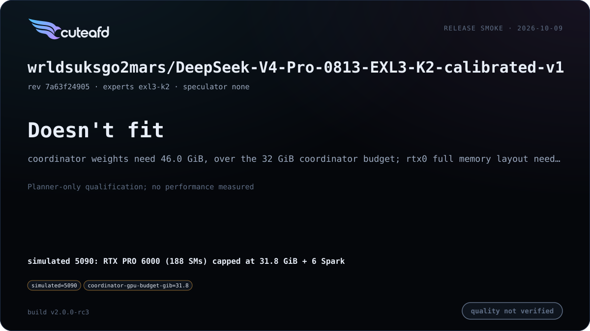

# DeepSeek V4 (Flash / Pro)

Re-hosted on CuteAFD's generic per-layer engine rather than the legacy
`real_full` path. Release cards measure each checkpoint against CuteAFD's
own history, not an external-engine parity campaign.

## Supported checkpoints / quants

- `deepseek-ai/DeepSeek-V4-Flash-0731` — FP8 128x128-block coordinator
  weights, native MXFP4 routed experts.
- `wrldsuksgo2mars/DeepSeek-V4-Pro-0813-EXL3-K2-calibrated-v1` — official
  FP8-named dense tensors with HF-named EXL3 K2 routed experts (~96 GiB per
  Spark rank at TP4).

**Starting configs** (v2.0.0 release cards, natural minimum and maximum; replace the
placeholder Spark hosts and addresses): V4 Flash MXFP4 [min](../../examples/configs/deepseek-v4-flash-mxfp4-min.config) · [max](../../examples/configs/deepseek-v4-flash-mxfp4-max.config); V4 Pro EXL3 K2 [min](../../examples/configs/deepseek-v4-pro-exl3-min.config) · [max](../../examples/configs/deepseek-v4-pro-exl3-max.config).

## Engineering summary

- Attention: compressed MLA with an alternating 4/128 ratio schedule, an
  indexer compressor on each ratio-4 layer, no CED KV sharing; FP8 blocks
  are 128x128 (V4.1 uses 32x32).
- Router: hash routing (`ffn.gate.tid2eid`) on the first `num_hash_layers`,
  sqrtsoftplus noaux_tc scoring on the rest.
- Routed experts run on 2, 3, 4 or 6 Spark ranks over `expertd-native`:
  native MXFP4 for V4 Flash (hidden 4096 / intermediate 2048 / 256 experts),
  EXL3 K2–K4 for V4 Pro (hidden 7168 / intermediate 3072 / 384 experts).
  mHC adds an `hc_head_{fn,base,scale}` output head beyond V4.1's mixing.
- Speculator: three-stage dSpark drafter at this family's width, reusing
  V4.1's structure with family-specific geometry. The launcher drafts with it
  by default when the checkpoint carries it (`dspark_block_size`);
  `SPECULATOR=off` disables it. The KV pool defaults to `POOL_TOKENS=auto`.
- KV format: FP8 128x128 block scales (UE8M0) on coordinator weights.
- RTX/Spark layouts: head split is the default on 2 RTX (measured decode
  -10% Flash / -12% Pro, prefill neutral); TP6 across all six Sparks is an
  option for V4 Pro when it divides the model's width better than TP4.
- Prefix cache: merged — 256-token units covering the C4, index and C128
  pages of one index, per-layer SWA-window marks, dSpark rings included so
  drafts stay warm, plus the compressors' FP32 rolling state.

## Known limits

<!-- release-v2-limits -->
- **32 GB (resolved in rc3):** rc2 rejected V4 Flash on a 31.8 GiB coordinator (the 1M extent's C128 metadata and scratch left the fixed costs 199,716,958 B over budget at TP2/3/4/6). rc3 sizes small-card workspace and graph reserves exactly and scopes V4 scratch and startup programs to the serving family; the planner admits 886,272 pool tokens at 1 RTX + 2 Sparks, and the simulated-5090 card serves 905,216 (effective context 904,960) with 2.76 GiB of physical headroom at peak. V4 Pro EXL3 still does not fit 31.8 GiB with six Sparks (coordinator weights 46.0 GiB).
- **Memory vs. kernel support:** checkpoint and compiled index extent are 1,048,576 tokens. Default effective context is bounded by the admitted pool; cards report that value, independently of the compiled C128 stride. Values below the 262,144-token agentic floor are listed per cell without forcing larger pools. A 31.8 GiB planner rejection with six Sparks is coordinator memory, not proof of a missing TP kernel.
- **rc3 measured capacity** (default context, automatic pool): Flash minimum/maximum admit 663,552/1,320,192 pool tokens (effective context 663,296/1,048,576); Pro minimum/maximum admit 455,680/1,308,928 (455,424/1,048,576). These are serving capacities, not full-length prompt qualifications.
- **Memory-placement limit:** automatic KV sizing follows resident routed-expert placement on GPU0 instead of reserving the pool first, so default context is pool-limited on one RTX. On two RTX, GPU1 holds no routed experts: rc3 plans use 12.4 GiB (Flash) and 29.7 GiB (Pro) of GPU1 against about 90 GiB. Pool-first admission and TP2 expert layers across both RTX cards are v3 work. Planner and runtime pools differ on these layouts (for example Flash minimum: planner 786,432, runtime 663,552), because the runtime places resident layers from measured free memory; cards report the runtime value.
- **V4 Pro EXL3 K2 minimum: fidelity FAIL** at KL 0.0605 against 0.06 (top-1 92.0%); the maximum passes at KL 0.0596 / top-1 92.6%. rc1 and rc2 gave the same straddle (minimum 0.0605 / maximum 0.0596). Placement, coordinator-resident layer count and reduction order differ between the two layouts; this is not an established regression. The minimum stays FAIL and the gate is unchanged.
- V4 Flash fidelity varies between unchanged cold launches (historical top-1 96.552% vs 96.937%); deterministic index top-k does not remove expert-reduction/verify nondeterminism.
- `wrldsuksgo2mars/DeepSeek-V4-Pro-0813-EXL3-K2-calibrated-v1` does not fit a single 32 GB coordinator even with all six Sparks (planner memory rejection, not a missing kernel); it needs a larger coordinator card or a different checkpoint/placement. Actual rc3 planner at the 31.8 GiB cap with automatic pool: coordinator weights need 46.0 GiB, over the 32 GiB coordinator budget; rtx0 full memory layout needs 62,369,870,091 bytes, budget 31,031,138,713 bytes, shortfall 31,338,731,378 bytes. See the linked planner-only 5090 cell; no performance was measured.

- V4 Pro's EXL3 prefill is Spark-compute bound; TP6 raises decode but
  coordinator intake of partial rows is the current prefill bottleneck on
  some layouts (see `PLAN.md` Spark-side reduction notes).
- V4 Pro's rc1 quick golden fidelity check passes on the measured maximum
  layout; it does not establish batch invariance. Speculative and plain
  greedy outputs, and C1/C4 greedy outputs, can differ; verify rounding
  remains open.
- V4 Flash prompt and turn-end prefix restores are byte-exact against their
  own snapshots; cold prefill can differ through arrival-ordered Spark FP32
  atomic reductions. Deterministic prefill and verify are deferred.
- V4 Flash's native TP2 layout is qualified with legacy expert requests;
  the opt-in device exchange does not support that wire geometry.

## Changelog

| Version | Date | Change | Basic eval |
| --- | --- | --- | --- |
| v2 | 2026-10-09 | Unified runtime SM120 launch sizing and probed GPU/RDMA paths; launch-admitted full-prefill fidelity scoring; shared media/benchmark admission and C8 release cards; rc3: fits a 32 GB coordinator (exact small-card reserves, family-scoped scratch and startup programs). |       |
| v1 | 2026-10-04 | Qualify native Flash TP2 on legacy expert requests; honor explicit local-expert placement; compressed-cache and drafter admission; exact turn-end restore check. |     |
| v0 | 2026-10-02 | First release |     |

## Additional benchmarks

| Engine version | Date | Profile | Hardware | Report |
| --- | --- | --- | --- | --- |

_No additional benchmark reports yet._
