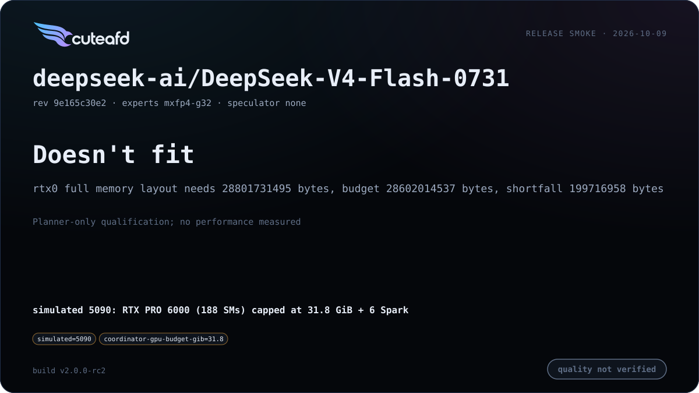

# DeepSeek V4 (Flash / Pro)

Re-hosted on CuteAFD's generic per-layer engine rather than the legacy
`real_full` path. Release cards measure each checkpoint against CuteAFD's
own history, not an external-engine parity campaign.

## Supported checkpoints / quants

- `deepseek-ai/DeepSeek-V4-Flash-0731` — FP8 128x128-block coordinator
  weights, native MXFP4 routed experts.
- `wrldsuksgo2mars/DeepSeek-V4-Pro-0813-EXL3-K2-calibrated-v1` — official
  FP8-named dense tensors with HF-named EXL3 K2 routed experts (~96 GiB per
  Spark rank at TP4).

## Engineering summary

- Attention: compressed MLA with an alternating 4/128 ratio schedule, an
  indexer compressor on each ratio-4 layer, no CED KV sharing; FP8 blocks
  are 128x128 (V4.1 uses 32x32).
- Router: hash routing (`ffn.gate.tid2eid`) on the first `num_hash_layers`,
  sqrtsoftplus noaux_tc scoring on the rest.
- Routed experts run on 2, 3, 4 or 6 Spark ranks over `expertd-native`:
  native MXFP4 for V4 Flash (hidden 4096 / intermediate 2048 / 256 experts),
  EXL3 K2–K4 for V4 Pro (hidden 7168 / intermediate 3072 / 384 experts).
  mHC adds an `hc_head_{fn,base,scale}` output head beyond V4.1's mixing.
- Speculator: three-stage dSpark drafter at this family's width, reusing
  V4.1's structure with family-specific geometry.
- KV format: FP8 128x128 block scales (UE8M0) on coordinator weights.
- RTX/Spark layouts: head split is the default on 2 RTX (measured decode
  -10% Flash / -12% Pro, prefill neutral); TP6 across all six Sparks is an
  option for V4 Pro when it divides the model's width better than TP4.
- Prefix cache: merged — 256-token units covering the C4, index and C128
  pages of one index, per-layer SWA-window marks, dSpark rings included so
  drafts stay warm, plus the compressors' FP32 rolling state.

## Known limits

<!-- release-v2-limits -->
- **32 GB regression:** rc2 regression vs rc1 on 32 GB: the 1M extent adds ~200 MB of V4 C128 metadata and scratch. With the unchanged 31.8 GiB cap and automatic pool (`--pool-tokens 0`), Flash's fixed allocation estimate exceeds the budget by 199,716,958 B at TP2, TP3, TP4 and TP6; the planner admits zero KV records. V4 Flash does not fit on 32 GB with any available Spark count at rc2 (1M extent), so its simulated-5090 cell is planner-only with six Sparks, not a performance measurement. Small-card C128 metadata sizing is targeted for the next RC, not shipped in rc2; no pool or cap override hides this regression.
- **Memory vs. kernel support:** checkpoint and rc2 compiled index extent are 1,048,576 tokens. Default effective context is bounded by the admitted pool; cards report that value, independently of the compiled C128 stride. Values below the 262,144-token agentic floor are listed per cell without forcing larger pools. Superseded rc1 had a 131,072 compiled extent; its Flash/Pro maximum requested 1M but safely ran at 131,072, corrected in historical cards with requested provenance retained. Pro minimum's rc1 600 s timeout and 131,072 correction remain historical evidence. A 31.8 GiB planner rejection with six Sparks is coordinator memory, not proof of a missing TP kernel.
- **rc2 measured capacity:** Flash minimum/maximum admit pools of 657,152/1,314,048 tokens and effective contexts of 654,848/1,048,576; Pro minimum/maximum admit 451,840/1,305,088 pool tokens and 449,536/1,048,576 effective context. These are measured serving capacities under default context and automatic pools, not proof of full-length prompt execution; compiled extent remains 1,048,576.
- **Memory-placement limit:** automatic KV sizing follows resident routed-expert placement on GPU0, rather than reserving the 2M pool first. Saved rc1 planner estimates are Flash 903,168/720,384 tokens on one/two RTX and Pro 731,648/489,984; all fall below the 1M checkpoint context, so default usable context is pool-limited. Corrected runtime cards separately report Flash 774,400/581,376 and Pro maximum 1,387,264 tokens; planner estimates are not measured capacities. In the two-RTX plans, GPU1 uses only 13.10 GiB (Flash) or 24.01 GiB (Pro) of about 89-90 GiB, with no resident routed layers there. v3 work reserves the pool first and splits resident expert layers across both GPUs; the solver prototype is not in rc2. This is a memory-placement limit, not a compiled-kernel extent limit.
- V4 Pro EXL3 K2 straddles the unchanged 0.06 KL gate. Rc2 minimum fails at KL 0.0604968 / top-1 92.02%, maximum passes at KL 0.0595704 / top-1 92.64%; cache passes and native logs are clean. This reproduces rc1's minimum KL 0.0605 / maximum 0.0596 finding. The same checkpoint differs in placement, coordinator-resident layer count and reduction order. This quant result is not established as a regression; the minimum card stays FAIL and thresholds are unchanged.
- V4 Flash fidelity varies between unchanged cold launches (historical top-1 96.552% vs 96.937%); deterministic index top-k does not remove expert-reduction/verify nondeterminism.
- `wrldsuksgo2mars/DeepSeek-V4-Pro-0813-EXL3-K2-calibrated-v1` is not supported on a single 32 GB card with all six available Sparks; needs a larger coordinator card or a different checkpoint/placement. Actual rc2 planner at the 31.8 GiB cap with automatic pool: coordinator weights need 46.0 GiB, over the 32 GiB coordinator budget; rtx0 full memory layout needs 62952874251 bytes, budget 30095094601 bytes, shortfall 32857779650 bytes. See the linked planner-only 5090 cell; no performance was measured.

- V4 Pro's EXL3 prefill is Spark-compute bound; TP6 raises decode but
  coordinator intake of partial rows is the current prefill bottleneck on
  some layouts (see `PLAN.md` Spark-side reduction notes).
- V4 Pro's rc1 quick golden fidelity check passes on the measured maximum
  layout; it does not establish batch invariance. Speculative and plain
  greedy outputs, and C1/C4 greedy outputs, can differ; verify rounding
  remains open.
- V4 Flash prompt and turn-end prefix restores are byte-exact against their
  own snapshots; cold prefill can differ through arrival-ordered Spark FP32
  atomic reductions. Deterministic prefill and verify are deferred.
- V4 Flash's native TP2 layout is qualified with legacy expert requests;
  the opt-in device exchange does not support that wire geometry.

## Changelog

| Version | Date | Change | Basic eval |
| --- | --- | --- | --- |
| v2 | 2026-10-09 | Unified runtime SM120 launch sizing and probed GPU/RDMA paths; launch-admitted full-prefill fidelity scoring; shared media/benchmark admission and C8 release cards. |       |
| v1 | 2026-10-04 | Qualify native Flash TP2 on legacy expert requests; honor explicit local-expert placement; compressed-cache and drafter admission; exact turn-end restore check. |     |
| v0 | 2026-10-02 | First release |     |

## Additional benchmarks

| Engine version | Date | Profile | Hardware | Report |
| --- | --- | --- | --- | --- |

_No additional benchmark reports yet._
