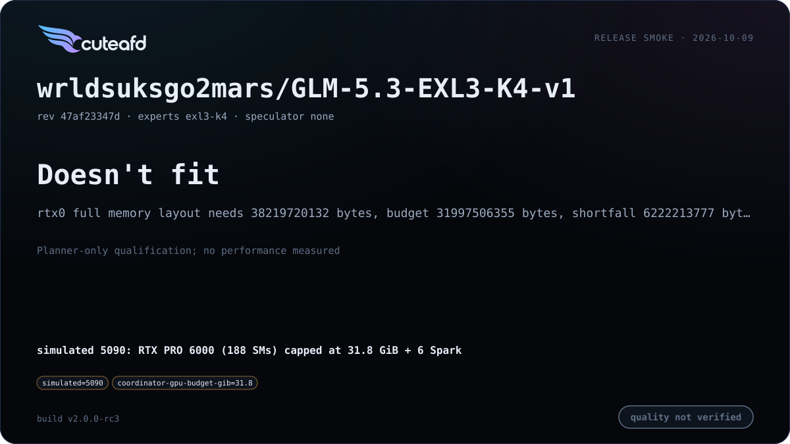
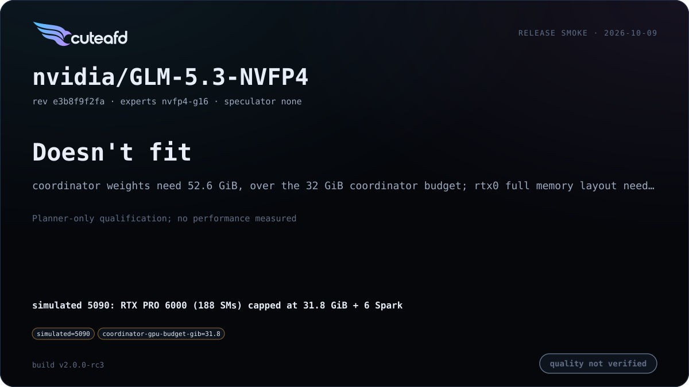

# GLM 5.3

Ported from `../glmrt`: MLA with a DeepSeek Sparse Attention (DSA) indexer,
a top-8 sigmoid router, and a DFlash2 draft speculator.

## Supported checkpoints / quants

- `zai-org/GLM-5.3` official FP8 — supported, but only fits a small KV pool
  at full size; EXL3 and NVFP4 quants are the recommended way to run the
  full model (see `PLAN.md` quant scope).
- `wrldsuksgo2mars/GLM-5.3-EXL3-K4-v1` and similar EXL3 K4/K5 publications —
  the benchmarked path on both reference configs.
- NVIDIA ModelOpt NVFP4 (`nvidia/GLM-5.3-NVFP4`) — routed experts in NVFP4
  group-16; dense parts run through the FP8-block/W8A8 paths described
  below.

## Engineering summary

- Attention: MLA with a DSA indexer selecting top-k tokens; pool-gated
  indexer variant shares a previous full layer's selection on shared-indexer
  layers. Dense first layers, then MoE from `first_moe_layer` on.
- Router: sigmoid noaux_tc with `e_score_correction_bias`, routed scale 2.5,
  top-8 of the checkpoint's expert count.
- Routed experts run on Spark TP x EP via `expertd-native`: FP8 128x128
  blocks, EXL3 K4/K5, or ModelOpt NVFP4 (group 16); GLM 5.3 has no local
  (RTX-resident) expert path.
- Speculator: the native MTP layer is not run — DFlash2 external drafters
  are the measured-best speculator for this family, with an adaptive policy
  priced by distinct Spark expert reads.
- KV format: FP8 MLA latent record (E4M3 + per-128 FP32 group scales, plus
  BF16 RoPE where the layer carries rotary dims); mHC hyper-connections with
  Sinkhorn iterations and an `hc_head` final collapse.
- RTX/Spark layouts: natural minimum is 1 RTX + 4 Sparks with a DFlash2
  drafter; maximum is 2 RTX + 6 Sparks with head split as the default
  (replicated latent, split `q_b`/`kv_b`/`o_proj`/shared-expert across both
  GPUs with one hidden all-reduce per layer).
- Prefix cache: merged — page-only state (no host-tier compaction yet; a
  stand-in tail covers that path).

## Default precision (single residency)

Every weight has one resident format. Precision is chosen by measurement:
FP8 converts at load into the only copy where it is faster and the golden
stays within ~0.005 nat KL/NLL; drafters run FP8 whenever emitted tok/s is
higher (they cannot change the output). Measured 2026-10-03, natural minimum,
one warm launch per arm, `CONCURRENCY=4`, code tok/s (C4 aggregate), golden
512 tokens.

| Arm | C1 | C4 | 8K prefill | KL · top-1 · NLL |
| --- | ---: | ---: | ---: | --- |
| checkpoint (BF16 DFlash2) | 41.5 | 63.9 | 2,609 | 0.022 · 90.2% · 3.548 |
| **FP8 DFlash2 (default)** | 43.9 | 71.1 | 2,627 | 0.022 · 90.2% · 3.548 |

GLM 5.3 EXL3 K4, 1 RTX + 4 Sparks. `SPECULATOR_FP8=off` keeps the BF16 drafter.

## Known limits

<!-- release-v2-limits -->
- **Memory vs. kernel support:** checkpoint context and compiled index extent are 1,048,576 tokens. Default effective context is separately bounded by the admitted pool and reported on each card; below 262,144 is a per-cell agentic-floor finding. A memory-fitting layout alone does not qualify a full-length prompt. The 31.8 GiB no-fit cells are separate memory rejections with six Sparks; increasing compiled extent does not remove their byte shortfalls.
- `wrldsuksgo2mars/GLM-5.3-EXL3-K4-v1` does not fit a single 32 GB coordinator even with all six Sparks (planner memory rejection, not a missing kernel); it needs a larger coordinator card or a different checkpoint/placement. Actual rc3 planner at the 31.8 GiB cap with automatic pool: rtx0 full memory layout needs 38219720132 bytes, budget 31997506355 bytes, shortfall 6222213777 bytes. See the linked planner-only 5090 cell; no performance was measured.
- `nvidia/GLM-5.3-NVFP4` does not fit a single 32 GB coordinator even with all six Sparks (planner memory rejection, not a missing kernel); it needs a larger coordinator card or a different checkpoint/placement. Actual rc3 planner at the 31.8 GiB cap with automatic pool: coordinator weights need 52.6 GiB, over the 32 GiB coordinator budget; rtx0 full memory layout needs 54111029708 bytes, budget 31997506355 bytes, shortfall 22113523353 bytes. See the linked planner-only 5090 cell; no performance was measured.

- Official FP8 is outside the v1 release scope: its routed expert weights
  exceed the six-Spark serving budget. EXL3 and NVFP4 cover this family in
  the release matrix.

- No local (RTX-only) expert path — GLM 5.3 always needs at least one Spark
  rank.
- Speculative verify and plain decode, and C1/C4 greedy outputs, can differ.
  The current smoke gate permits verified numerical rounding; it does not
  establish byte-identical speculative output or batch invariance.
- Prefill remains Spark-bound at both reference layouts; additional RTX
  head-split capacity does not remove the expert-wave bottleneck.
- NVFP4 prefill chunks above 1,024 rows run W4A4 with each expert's own
  `input_scale` and `weight_scale_2`; decode and verify run W4A16 (native W4A4
  for these small-row shapes is deferred). Spark input arrives as FP8 K32 wire
  rows, so W4A4 activations are quantized twice (FP8, then FP4). FC1 quantizes
  with the gate projection's `input_scale` and dequantizes the up half with the
  up projection's. They are bit-identical for every expert in
  `nvidia/GLM-5.3-NVFP4`, but the loader does not yet check.

## Changelog

| Version | Date | Change | Basic eval |
| --- | --- | --- | --- |
| v2 | 2026-10-09 | Thinking-off template correction; exact full-logits fidelity workspace admission; runtime-sized SM120 launches and robust GPU/RDMA selection; shared C8 and fidelity tiers. |       |
| v1 | 2026-10-04 | E4M3 MLA prefill, Spark EXL3 wave scheduling and TP6 tiles; bounded decode graphs and automatic KV pool; FP8 DFlash2; stop-token grammar completion. |     |
| v0 | 2026-10-02 | First release |     |

## Additional benchmarks

| Engine version | Date | Profile | Hardware | Report |
| --- | --- | --- | --- | --- |

_No additional benchmark reports yet._
