# GLM 5.3 Flash

A hybrid-attention sibling of GLM 5.3: most layers run linear Kimi Delta
Attention (KDA), a minority run MLA + DSA.

## Supported checkpoints / quants

- `zai-org/GLM-5.3-Flash` official FP8.
- `brandonmusic/GLM-5.3-Flash-tr3-4bpw` and other standard exllamav3 EXL3
  tr3 publications — read directly from `config.json` + tensor headers, no
  CuteAFD-specific side files required.
- NVIDIA ModelOpt NVFP4 (`nvidia/GLM-5.3-Flash-NVFP4`) — routed experts and
  dense MLPs both run natively in NVFP4.

## Engineering summary

- Attention: hybrid — Kimi Delta Attention (token-sequential linear
  recurrence) on most layers, MLA + DSA (no RoPE, pooled indexer with
  gated-softmax pool keys) on the rest.
- mHC hyper-connections, collapsing with an unweighted mean (GLM 5.3 uses a
  learned `hc_head` instead).
- Routed experts: top-8 of 288 sigmoid experts with a SwiGLU clamp of 10;
  FP8 128x128 blocks, EXL3 K3/K4, or ModelOpt NVFP4 group-16. GLM 5.3 Flash
  is the only GLM family with a local (RTX-resident, TP1) expert path.
- Speculator: the native MTP layer is not run. External drafters: DFlash2
  (incoai/GLM-5.3-Flash-DFlash2, the default for every checkpoint) or the
  RedHat dSpark (`SPECULATOR=dspark`, RedHatAI/GLM-5.3-Flash-speculator.dspark-preview:
  eight drafts per block, Markov and confidence heads); KDA state is backed
  up and replayed per verify step (there is no free rollback for recurrent
  state). DFlash2 vs dSpark, emitted tok/s, C1 / C4 code / agentic C1:

  | checkpoint | layout | DFlash2 | dSpark | no drafter |
  | --- | --- | --- | --- | --- |
  | EXL3 K3.25 | 1 RTX + 2 Sparks | 110.8 / 292 / 100.1 | 101.8 / 275 / 76.6 | 60.7 / 192 / 63.4 |
  | EXL3 K3.25 | 2 RTX + 4 Sparks | 167.4 / 322 / 153.7 | 146.8 / 346 / 100.3 | 82.0 / 287 / 85.9 |
  | NVIDIA NVFP4 | 1 RTX + 2 Sparks | 87.3 / 231 / 77.7 | 69.1 / 190 / 57.4 | 52.8 / 200 / 54.4 |
  | NVIDIA NVFP4 | 2 RTX + 4 Sparks | 117.3 / 415 / 131.1 | 118.2 / 347 / 91.3 | 74.8 / 232 / 79.1 |
  | tr3 4bpw | 1 RTX + 2 Sparks | 99.0 / 212 / 86.8 | 71.4 / 269 / 65.2 | 56.1 / 173 / 58.1 |
  | tr3 4bpw | 2 RTX + 4 Sparks | 149.6 / 435 / 131.0 | 132.0 / 407 / 87.2 | 78.3 / 280 / 81.5 |
- Drafter context rings: one per sequence (`--max-sequences`), the draft
  batch at most that many; `DRAFT_CONTEXT_SLOTS` overrides.
  `draft_ring_misses` (`/v1/stats`, every request-complete line) counts
  drafting admissions that found no ring, and must read 0.
- Dense NVFP4 MLPs run natively on a ModelOpt release; its per-tensor FP8
  dense MLPs prefill as static W8A8 on their own scales; BF16 attention,
  indexer and shared experts quantize to FP8 blocks at load by default
  (`CUTEAFD_GLM_BF16=native` keeps them BF16 at a coordinator-step cost).
- KV format: FP8 MLA latent record on the MLA+DSA layers; a recurrent FP32
  state per KDA layer plus short-convolution state. `GLM5_FLASH_KDA_STATE=bf16`
  (`--kda-state bf16`, opt-in; BF16 KDA projections on one GPU) stores the
  recurrent state in BF16, rounded after every decode, verify and commit row
  and at each chunked-prefill window end: half the state and prefix-mark bytes.
- KDA replay records: `GLM5_FLASH_REPLAY_RECORDS=auto` selects `shared`
  (`--replay-records shared`) on one GPU with Spark experts and a pool sized
  from measured memory; other layouts keep `own`. Shared keeps the speculative
  replay records (321,421,312 B at 64 rows) in the prefill lanes' scratch,
  which no decode step reads, instead of an allocation of their own. A record
  lives from a speculative verify to its commit, and a commit after a prefill
  fails instead of reading records the prefill overwrote.
- RTX/Spark layouts: scales from 1 RTX with local experts up through
  multi-Spark TP for the full checkpoint. `RTX_GPUS=auto/2` selects the
  two-GPU head split when both coordinator GPUs are available;
  `RTX_GPUS=1` or `COORDINATOR_SPLIT=off` serves from one GPU.
- Spark EXL3 worker host path: a call's routes are written straight into
  pinned staging and uploaded with one batched asynchronous copy, the wire
  decode reads the hidden rows in the mapped request frame (no device copy),
  and the worker polls its stream instead of a blocking synchronize (which woke
  about 8 us after the GPU finished). `GLM5_FLASH_EXL3_WORKER_PATH=blocking`
  (`CUTEAFD_EXL3_WORKER_PATH=blocking`) restores the copies and the blocking
  synchronize, for A/B; the kernels, their inputs and their bits are the same.
- Route capture for kernel benchmarks: `GLM5_FLASH_EXL3_ROUTE_DUMP=DIR` (an
  absolute directory on every Spark; `CUTEAFD_EXL3_ROUTE_DUMP=DIR/routes`)
  appends each call's layer, rows, expert ids and gate weights to
  `DIR/routes.<executor>.bin`, at most `GLM5_FLASH_EXL3_ROUTE_DUMP_CALLS` calls
  (default 200,000). SparkInfer's `benchmarks/benchmark_glmf_decode_schedule.py
  --routes file:PATH` replays them.
- Spark EXL3 decode schedule: `GLM5_FLASH_EXL3_SCHEDULE=gb10`
  (`expertd-native --exl3-schedule gb10`, opt-in) runs the TP4 decode exports
  `m1-gb10` and `m80-gb10`: the default exports' products and sums, so the
  same bits, with the weight words staged L2 evict-first (the b12x `gb10`
  decode schedule) and, at m80, 64x128 tiles at two CTAs per SM. On a GB10,
  an expert call at 1-80 rows took 1.4-11.2% less time than the default's.
- 128-row decode and verify steps: `GLM5_FLASH_DECODE_ROWS=auto` selects
  `128` (`--decode-rows 128`) on one GPU when the selected image has every
  required m128 program; other layouts keep `64`. Builds with
  `CUTEAFD_GLMF_WIDE_DECODE_ROWS=128` run steps of 65-128 rows on the
  `*_m128` programs and records 128-row replay records for their commits;
  steps of up to 64 rows keep the `_m64` programs, their bits and speed. A
  verify step schedules up to the GPU's whole sparse MLA waves (127 rows on an
  RTX 5090, 128 on 188 SMs), so 16 sequences verify 6-7 drafts each instead of
  3; the speculative startup graph set ends at that budget. The decode
  workspace, token selector and replay records hold 128 rows (321 MB more
  records on one GPU, charged by every KV admission and `cuteafd plan
  --layout --decode-rows 128`). With `GLM5_FLASH_REPLAY_RECORDS=shared` the
  KDA records of 128 rows (642,842,624 B) still fit the 782,236,672-byte
  prefill scratch, so they take no memory of their own. Start-up loads the
  `*_m128` programs only with 128 rows. Every routed-expert resource (the
  dense NVFP4 package, local FP8 or EXL3 experts, the Spark transports and
  their intake planes) holds the widest step, `max(--prefill-rows,
  --decode-rows)`, so prefill lanes narrower than 128 rows still take a
  127-row verify step through the experts. The launcher passes the decode
  rows to the encoder placement plan as well as to serving.
- Prefix cache: merged — 256-row units (4 MLA pages plus the pool page) and
  a KDA recurrent-state mark at the commit point (`kda_len`). Marks live in a
  device arena of 2C + 2 marks (147.6 MB each with an FP32 state), which both
  KV admissions reserve, or with `GLM5_FLASH_PREFIX_MARKS=pool`
  (`--prefix-marks pool`, opt-in) in units of the KV pool itself (49 per FP32
  mark), taken at capture and evicted with the snapshot's rows. Unit 0 is then
  never handed out: the decode sparse MLA reads its first record for masked
  candidates, and a mark's bytes there would turn decode rows into NaN. Pool
  marks turn the pinned host tier on (`HOST_CACHE_BYTES=auto` unless set; 0
  keeps it off), so the snapshots the pool evicts move to RAM.

## Launcher defaults

The launcher resolves these after selecting the coordinator split. Explicit
values always win; selecting the old values restores the old command stream.
The `serve-glmf` CLI defaults remain unchanged.

| Launcher key | Default | Resolution / old value |
| --- | --- | --- |
| `GLM5_FLASH_DECODE_ROWS` | `auto` | `128` on one GPU when the selected image has every required m128 program; otherwise `64`. Missing metadata falls back to `64`. |
| `GLM5_FLASH_INDEX_CACHE` | `auto` | `compact` on one GPU, `keys` with a head split. |
| `GLM5_FLASH_REPLAY_RECORDS` | `auto` | `shared` on one GPU with Spark experts and an automatic pool; otherwise `own`. |
| `GLM5_FLASH_DRAFT_HEAD` | `tensor` | With an external drafter; `exact` restores the old path. Target verification is unchanged. |
| `GLM5_FLASH_DRAFT_LINEAR` | `w8a8` | With an FP8 external drafter; BF16 or no drafter keeps `w8a16`. |
| `GLM5_FLASH_PREFIX_MARKS` | engine arena | Pool marks remain opt-in pending a matched neutral-or-better hardware gate, including their automatic host tier. |

Each automatic decision logs its resolved value and reason. Encoder placement
uses the same index storage, replay storage, decode rows and mark store as
serving. `cuteafd plan --layout --index-cache compact` uses the engine's exact
compact geometry: 6,172 bytes per token (including the pool-page entry) plus
per-sequence open-pool state; keys use 11,804 bytes per token. A head split
plans keys even when compact is explicitly requested, matching serving.
128-row own replay records double the 64-row allocation (321,421,312 to
642,842,624 bytes); shared records occupy prefill scratch instead. Pool marks
reserve unit 0 outside the admitted token count and enable
`HOST_CACHE_BYTES=auto` unless explicitly set (including `0`).

## Default precision (single residency)

Every weight has one resident format. The launcher resolves precision after
it chooses the serving layout: with one coordinator GPU,
`GLM5_FLASH_KDA_FP8=auto` (including unset) selects `row128` and
`GLM5_FLASH_FP8_HEAD=auto` selects `on`; with the two-GPU head split they
select `off` (BF16 KDA and head). Explicit `off/row128/channel` KDA and
`on/off` head settings always win, including the deprecated `GLMF_*` keys;
current names take precedence over deprecated names. The DFlash2 drafter
defaults to FP8 on both layouts; `SPECULATOR_FP8=off` keeps it BF16.

Matched recheck, 2026-10-04: GLM 5.3 Flash EXL3 K3.25, RTX PRO 6000 at
325 W, fixed code prompts/nonces, one warm batch per concurrency, 512
identical teacher-forced golden positions (reference NLL 3.45433). D uses
BF16 KDA/head + FP8 drafter; F uses FP8 row128 KDA/head/drafter. Rates are
emitted tok/s; C4 is aggregate. Agentic timing replays one common four-turn
reasoning-enabled history and reports median per-turn decode rate.

1 RTX + 2 Sparks, medians of three interleaved launches per arm:

| Arm | C1 | C4 | 8K prefill | Agentic | Top-1 | KL | NLL |
| --- | ---: | ---: | ---: | ---: | ---: | ---: | ---: |
| D | 101.9 | 159.4 | 5,141 | 127.6 | 87.11% | 0.04288 | 3.47328 |
| **F (default)** | **111.1** | **172.4** | **5,137** | **132.6** | 86.52% | 0.04231 | 3.46966 |

F gains 9.0% C1, 8.2% C4 and 3.9% agentic decode, with 0.59 points less
top-1 and better KL/NLL. The three-position top-1 loss is borderline against
the later paired ~0.5-point bar and is noisy on 512 positions; it does not
establish a precise quality ranking. Readiness medians were 41 → 43 s
(worker and container startup included).

2 RTX + 4 Sparks, head split, one warm launch per arm:

| Arm | C1 | C4 | 8K prefill | Agentic | Top-1 | KL | NLL |
| --- | ---: | ---: | ---: | ---: | ---: | ---: | ---: |
| **D (default)** | **157.6** | **283.2** | **6,767** | **202.0** | 88.48% | 0.04508 | 3.47410 |
| F (opt-in) | 172.1 | 255.7 | 5,113 | 209.4 | 86.91% | 0.04780 | 3.47082 |

Original column-split F gains 9.2% C1 but loses 9.7% C4 and 24.4% prefill
in this single pair, loses 1.56 top-1 points and worsens KL. It fails the
nominal paired top-1 bar under the head split; its KL delta of 0.00273 nat
is within the later 0.005-nat bar. The large performance loss was not stable
across subsequent warmed launches. Readiness was 53 → 50 s. Both
arms/layouts pass fidelity and exact prefix-cache restores; the speculation
check permits verify rounding and does not establish byte-identical
speculative output. See the
[full comparison and conditions](../../benchmarks/glm5_flash/2026-10-04-fp8-recheck/comparison.json).

The original timed 8K regression is principally expert-receive waiting:
BF16 expert waits were 387/382 ms, versus 575/979 ms for FP8, while FP8 GPU
wait stayed 487/487 ms (BF16 454/453 ms). The FP8 warm request was faster
than BF16. Profiling separately found a real local wide-row W8A16 expansion
cost, but unchanged synchronization/peer counts and no observed prefill
allocation or graph instantiation. Original route/clock evidence was absent,
so attributing the growing expert wait to thermal throttling is unsupported.
Missing GPU1 exports, BF16 reconversion, duplicated full-head KDA and
row128 slice recalibration were ruled out; all 238 companion KDA tensor
payloads matched.

The matched continuation confirms that the original FP8 arm can prefill at
about 6,816 tok/s and emit C4 at 290.55 tok/s; the historical large loss
does not reproduce. A BF16 launch instead shows the long waits: identical
BF16 routes across launches, ~455 ms coordinator GPU wait, near-stable
expert execution, but synchronized 436-442 ms gaps between worker responses
on all four ranks. Sampled Spark clocks remain ~2.34-2.42 GHz with event
reason masks zero. This points to intermittent coordinator/transport
waiting, not slow FP8 expert compute or established thermal throttling.

Shared-agent contention was considered. In the slow 2026-10-05
01:26:35-01:26:45 UTC window, retained Docker events show W4A4 workers
already stopped by 01:24:36 and Hugh's next workers starting at 01:28:46;
only this task's workers appear active in the intervening lifecycle record.
No overlapping serving/build container was found. These logs do not exclude
all host/fabric traffic or older long-lived processes. Coordinator scheduling
or transport timeout/retry remains an open issue requiring correlated
dispatch, completion, retry and traffic evidence, not a precision verdict.

The numerical contribution is different: the original KDA output computes
half-K partials, rounds each to BF16, then adds them. KDA-only and head-only
ablations put most of the added KL in KDA; retaining FP32 output partials
improves the paired golden result. Full-K token-row ownership removes that
partial-rounding/reduction change at the KDA output. It does not prove
end-to-end batch or speculative numerical invariance.

## Split KDA token-row opt-in

The qualified component path keeps KDA heads, recurrence and state split, but
shares normalized heads for each GPU's owned token rows. Each GPU projects
its rows with the full output-weight K dimension; completed rows concatenate
without a partial sum. This avoids rounding two KDA output partials before
the peer addition. It does not replace MLA, dense/shared FFN, or Spark
expert reduction.

With two distinct coordinator GPUs, select the following on `cuteafd serve-glmf`,
retaining `--fp8-prefill mla,ffn` and the existing FP8 DFlash2 drafter:

```text
--kda-fp8 row128 --fp8-head --kda-output-shard --kda-prefill-expanded
```

The last two switches also accept `CUTEAFD_GLMF_KDA_OUTPUT_SHARD=1` and
`CUTEAFD_GLMF_KDA_PREFILL_EXPANDED=1` inside the coordinator container.
`run-family.sh` does not forward these environment variables from the host;
the task kit's KDA-only image entrypoint selects them explicitly. Do not add
them as unknown launcher configuration keys. Expansion is transient in
existing scratch; there is still one resident FP8 format per tensor.

The full KDA output FP8 payload/scales are replicated once on each GPU,
adding 561 MiB per GPU over column slicing. Extra peer slots add 128 MiB per
GPU at 4096 prefill rows. Global row count chooses GEMV/TMA arithmetic even
when each GPU owns fewer rows; odd and zero-owned suffixes retain matching
peer flag sequences. Component gates cover full-head byte equality, guards,
changed-input graph replay and the 1/22/63/64/512/513/4096-row cases.

At 4096 rows, the qualified whole-output-path component measured column
shard to token rows at 1579.8 to 1212.3 us idle (-23.3%) and 2443.9 to
1791.8 us under 31.7 GB/s GPU0 ingress (-26.7%). Expansion is included;
one warm graph per condition and 16 timed replays were used. Per-GPU peer
payload falls from 48 to 32 MiB. These component timings are not an
end-to-end throughput claim.

Earlier prototype9, EXL3 K3.25 with FP8 DFlash2, two RTX PRO 6000 at
325 W plus TP4, one warmed launch per arm:

| Arm | C1 | C4 | Warm 8K prefill | Top-1 /512 | KL | NLL |
| --- | ---: | ---: | ---: | ---: | ---: | ---: |
| BF16 KDA/head | 156.88 | 253.48 | 6,704 | 453 | 0.045076 | 3.474099 |
| Full-K token-row FP8 KDA/head | 167.65 | 255.18 | 6,796 | 460 | 0.045916 | 3.460224 |

The candidate passes the revised paired quality bar (KL +0.000840 nat,
no top-1 loss). C1 improves 6.9%; C4 and prefill are effectively flat in
this single pair. The seven-position top-1 gain is noisy, not evidence of
better precision. Readiness was 56 to 49 s; exact prefix restores pass.
The warm prefill rate is not the median of all timed requests.

### Final interleaved qualification

2026-10-05, same EXL3 K3.25 / FP8 DFlash2 / two RTX PRO 6000 at 325 W
plus ostrich/dodo/emu/kiwi TP4. Launch order D/O/T/D/T/D/T; the inherited
outer timeout ended after D-b, then the missing T-b/D-c/T-c completed under
separate locks. D and T each have three launches, O one. Fixed code
prompts/nonces, thinking disabled, 320-token cap, one warm batch at C1/C4;
prefill calibration plus one exact-8192 warm request and two timed requests
per launch, zero prefix hits. Source/request SHA256 and actual token hashes
match. Audit and worker timing enabled, no profiler: these are matched
diagnostic numbers, not release-card or reasoning-agent measurements.

Medians across launches, with observed min-max in parentheses. Prefill uses
the median of each launch's two timed rates, then the three-launch median.
No samples, including the slow D-a, are excluded.

| Metric | D: BF16 KDA/head | T: full-K token-row FP8 KDA/head | Median change |
| --- | ---: | ---: | ---: |
| C1 emitted tok/s | 154.16 (144.01-154.64) | 165.83 (162.79-166.17) | +7.6% |
| C4 aggregate emitted tok/s | 248.67 (210.94-276.65) | 259.78 (251.95-279.09) | +4.5% |
| 8K prefill tok/s | 6,713 (3,946-6,783) | 6,823 (6,767-6,865) | +1.6% |
| Reasoning-on agentic | Not measured | Not measured | No claim |
| Readiness s | 61 (53-66) | 61 (52-64) | Flat |
| Golden top-1 /512 | 453 | 460 | +1.37 points; noisy |
| Compact KL nat | 0.0450756 | 0.0459160 | +0.0008404 |
| NLL | 3.474099 | 3.460224 | -0.013875 |

Each paired quality gate passes with zero missing positions. Scores repeat
exactly on the same 512 positions; this is not a larger independent sample.
C1 improves in every pair (+13.0%, +7.2%, +7.8%). C4 varies widely: the
last two paired changes are only +1.3%/+0.9%; call it parity to modest gain,
not a firm 4.5% general speedup. The last two 8K pairs are -0.24%/+1.63%,
also effectively parity. D-a timed rates were 2682/5210 tok/s and exhibit
the synchronized wait issue described above. All six timed T rates lie
6731-6870 tok/s. Original O's one-launch 8K/C1/C4 rates are
6816/169.29/290.55; it still misses the nominal top-1 bar (445/512).

Recommendation to Hugh and TJ: **promote token-row FP8 KDA/head for the
measured two-RTX EXL3 K3.25 split layout** under the stated paired quality
and C1 bar. It passes quality and consistently gains C1 without a meaningful
C4/prefill regression. This branch deliberately leaves BF16 split defaults
unchanged; promotion is their decision. Do not extend this recommendation
without gates to NVFP4, tr3, different hardware or exact speculative/batch
invariance. One-RTX natural-minimum row128 KDA/FP8 head remains recommended
on the existing performance evidence; its historical three-position top-1
loss is borderline/noisy under the revised bar, not a fresh qualification.

Provenance: frozen engine `eb8bf7c`, published fork `6205cb3`, identical
D/O/T binary/native image layers with arm-only environment differences.
The frozen image includes inactive retired prototypes; the clean serving
branch cannot select them. Final evidence and overlap audit are indexed by
the local STATUS; no new V4.1 serving parity launch was performed here.

`--kda-fp32-partials` is a mutually exclusive diagnostic, not the recommended
serving path. The unfinished `--split-mla-rows` and `--split-ffn-rows`
prototypes are retired; their historical commits do not qualify them for
serving. No launcher or precision default changes in this branch.

Hugh Madden owns the follow-up ([issue #1](https://github.com/tpurtell/cuteafd/issues/1)).
The reproducible local kit, provenance, final measurements and gate logs are
indexed by `/home/tj/.cache/cuteafd/builds/glmf-split-fp8/STATUS.md`.
The existing 512-position top-k-plus-tail golden is a smoke check, not a
full-vocabulary teacher KL comparison or a statistically precise top-1
ranking (about 1.4 percentage-point standard error). The paired precision
bar is FP8 minus same-layout BF16 KL at most 0.005 nat and top-1 loss at most
about 0.5 percentage point; small top-1 deltas need a larger fidelity set.

## Known limits

<!-- release-v2-limits -->
- **Memory vs. kernel support:** checkpoint context and rc2 compiled index extent are 1,048,576 tokens. Default effective context is separately bounded by the admitted pool and reported on each card; below 262,144 is a per-cell agentic-floor finding. Superseded rc1 corrected cards explicitly requested its 131,072 compiled extent. A memory-fitting layout alone does not qualify a full-length prompt.
- The tr3 quant's bundled chat template has no image markers or base-model hint, so rc1 `VISION=auto` rejects its launch. Corrected cards use `CHAT_TEMPLATE_FROM=zai-org/GLM-5.3-Flash` explicitly. Auto should disable vision with a clear log line when the template is incompatible, rather than reject an otherwise usable text checkpoint; this is a configuration finding, not proof of a text-quality defect.
- Greedy speculative output is not launch-deterministic (historical unchanged lazy/lazy runs diverged at token 6); live draft-cost timing is a candidate, not a proven cause.
- Synchronized ~440 ms Spark response gaps (normally 15-18 ms) were observed once; coordinator/transport cause is unproven.
- rc2 includes Hugh's #25 m128 programs, #26 Spark transport warm-up, #27 prefix-mark count correction, #28 opt-in drafter modes and #29 warm-up stream RAII. Default release cards do not qualify every opt-in combination; #28 full native kernel selftests pass separately on SM120 and SM121 against the exact rc2 libraries (no quick subset). This does not qualify every opt-in end-to-end serving combination.

- NVFP4 defaults to the official FP8 companion for block projections.
  `GLM5_FLASH_FP8_MODEL_ID=off` now also works with the two-GPU split:
  BF16 projections are packed exactly as in the unsplit path before
  slicing. Native NVFP4 dense and routed experts are unchanged.
- Running BF16 attention natively (`CUTEAFD_GLM_BF16=native`) costs a
  meaningful coordinator-step slowdown versus the default FP8-block path;
  use it only when the extra precision is worth it.
- Original column-split FP8 KDA/head misses the nominal paired top-1 bar
  on the two-GPU layout. Its large single-pair C4/prefill losses were not
  stable across warmed launches. Full-K KDA token rows pass component
  correctness and all three final paired quality gates, but do not establish
  full batch/speculative invariance. BF16 KDA/head stays the split default;
  token rows remain an explicit opt-in, scoped to the measured EXL3 K3.25
  layout rather than qualified across all quants or on RTX 5090.
- Prefill timing is sensitive to the exact smoke prompt, including its
  random nonce. Release comparisons use a separate fixed-prompt probe;
  historical single-card throughput alone does not establish a regression.
- Speculative verify is not byte-identical to plain decode, and C1/C4
  greedy outputs can differ. Prefix-cache restores and rejected-suffix
  causality pass; batch-invariant prefill and verify are deferred.
- One-RTX NVFP4 local experts must fit resident weight and serving
  reservations. Implicit expert paging was removed; `--expert-window` is
  an explicit fallback with a substantial latency cost.
- NVFP4 decode/verify uses W4A16; native W4A4 for these small-row shapes is
  deferred.

## Changelog

| Version | Date | Change | Basic eval |
| --- | --- | --- | --- |
| v2 | 2026-10-09 | Bundled vision auto admission; Hugh Madden ports #14-#29 (pooled prefix marks/pinned host tier, graph accounting, shared lane workspaces, compact-index/BF16-state/GB10-schedule opt-ins); unified SM120 and small-card planning. #25-#29 included; opt-in modes retain separate gates. | <a href="../../benchmarks/glm5_flash/2026-10-09-smoke-glm-5-3-flash-1rtx-4spark-glm53f-fp8-rc2-sim5090/report.svg">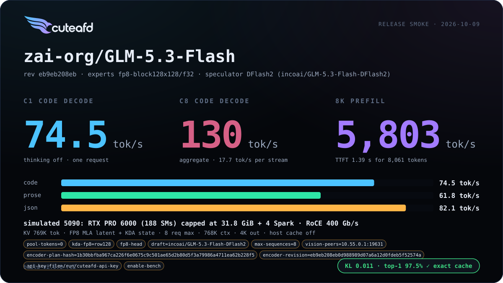</a> <a href="../../benchmarks/glm5_flash/2026-10-09-smoke-glm-5-3-flash-1rtx-4spark-glm53f-fp8-min-rc2/report.svg">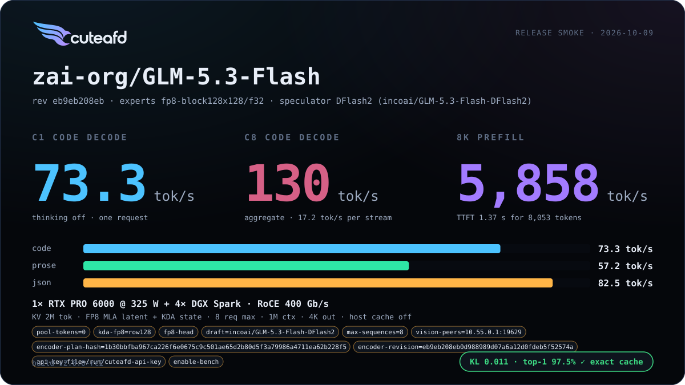</a> <a href="../../benchmarks/glm5_flash/2026-10-09-smoke-glm-5-3-flash-2rtx-4spark-glm53f-fp8-max-rc2/report.svg">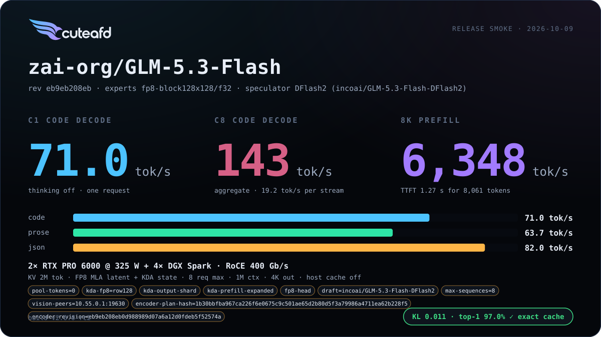</a> <a href="../../benchmarks/glm5_flash/2026-10-09-smoke-glm-5-3-flash-exl3-k3-25-v1-1rtx-2spark-glm53f-exl3-rc2-sim5090/report.svg">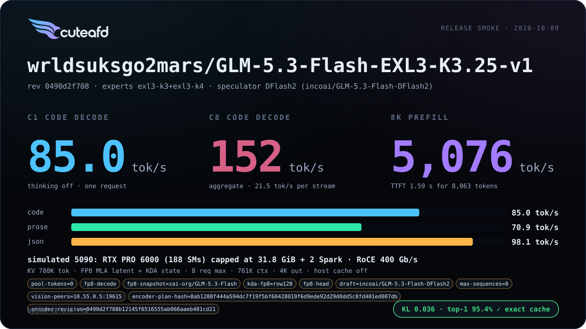</a> <a href="../../benchmarks/glm5_flash/2026-10-09-smoke-glm-5-3-flash-exl3-k3-25-v1-1rtx-2spark-glm53f-exl3-min-rc2/report.svg">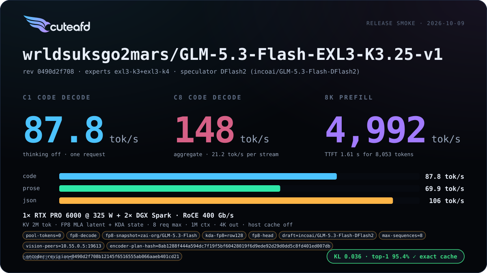</a> <a href="../../benchmarks/glm5_flash/2026-10-09-smoke-glm-5-3-flash-exl3-k3-25-v1-2rtx-4spark-glm53f-exl3-max-rc2/report.svg">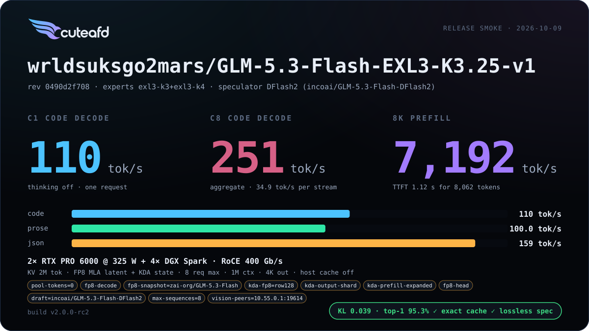</a> <a href="../../benchmarks/glm5_flash/2026-10-09-smoke-glm-5-3-flash-nvfp4-1rtx-2spark-glm53f-nvfp4-rc2-sim5090/report.svg">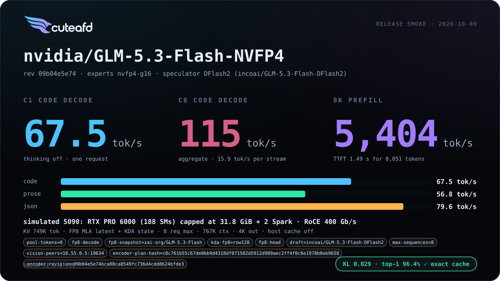</a> <a href="../../benchmarks/glm5_flash/2026-10-09-smoke-glm-5-3-flash-nvfp4-1rtx-2spark-glm53f-nvfp4-min-rc2/report.svg">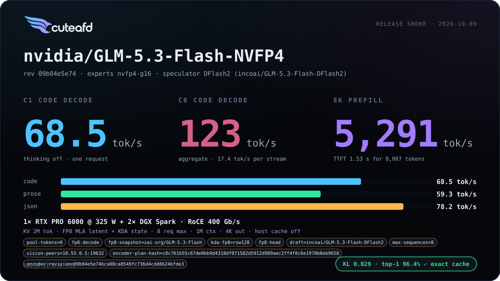</a> <a href="../../benchmarks/glm5_flash/2026-10-09-smoke-glm-5-3-flash-nvfp4-2rtx-4spark-glm53f-nvfp4-max-rc2/report.svg">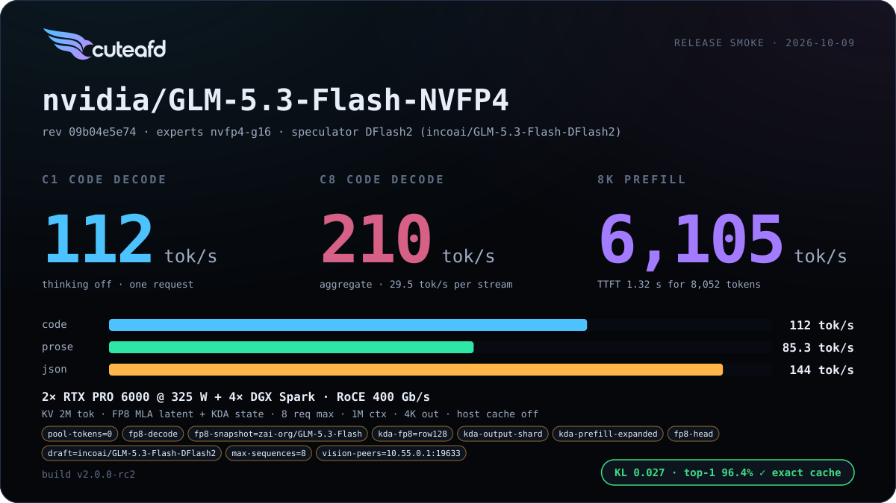</a> <a href="../../benchmarks/glm5_flash/2026-10-09-smoke-glm-5-3-flash-tr3-4bpw-1rtx-2spark-glm53f-tr3-rc2-sim5090/report.svg">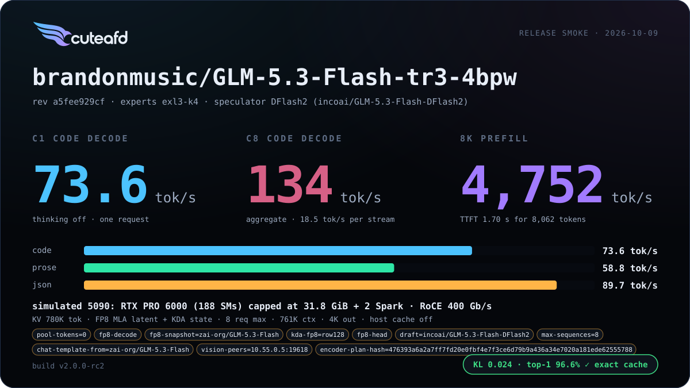</a> <a href="../../benchmarks/glm5_flash/2026-10-09-smoke-glm-5-3-flash-tr3-4bpw-1rtx-2spark-glm53f-tr3-min-rc2/report.svg">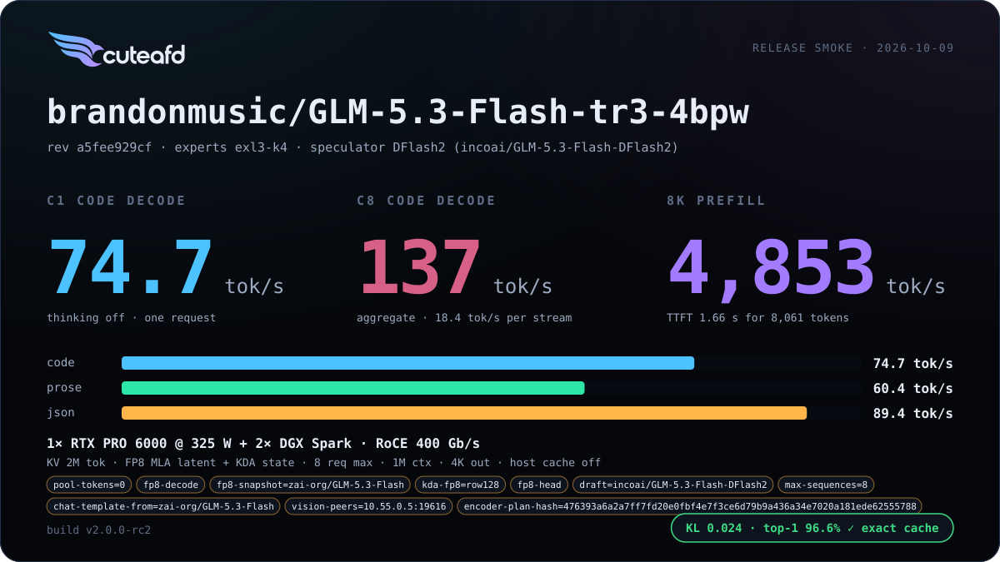</a> <a href="../../benchmarks/glm5_flash/2026-10-09-smoke-glm-5-3-flash-tr3-4bpw-2rtx-4spark-glm53f-tr3-max-rc2/report.svg">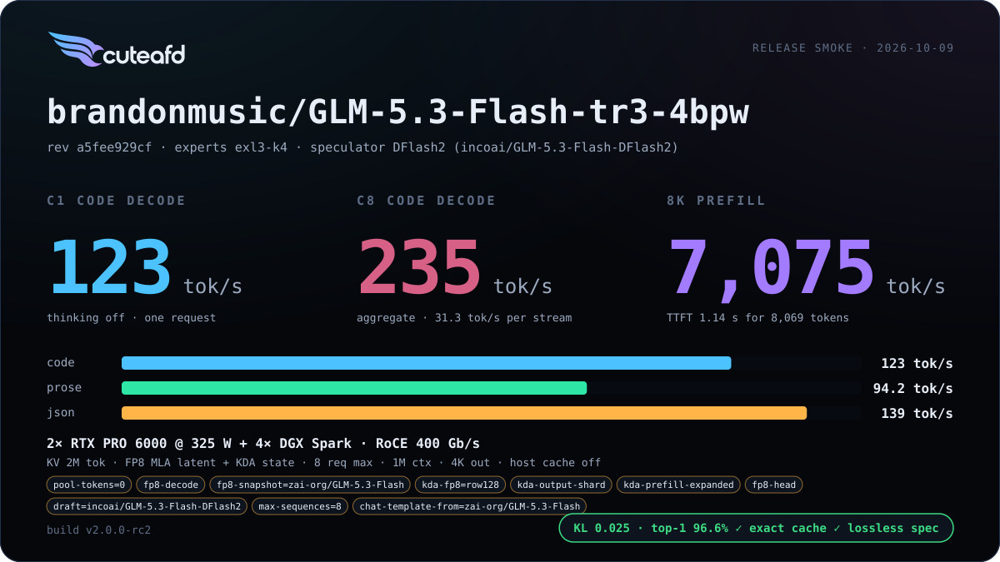</a> |
| v1 | 2026-10-04 | Two-RTX head split and DFlash2 for all quants; single-copy FP8 drafter; FP8 KDA/head on one GPU and BF16 under the split; stop-token grammar completion; resident local NVFP4 experts; corrected NVFP4 split loading without a companion and complete-chunk prefill warm-up. | <a href="../../benchmarks/glm5_flash/2026-10-04-smoke-glm-5-3-flash-1rtx-4spark-glm53f-fp8-min/report.svg"></a> <a href="../../benchmarks/glm5_flash/2026-10-04-smoke-glm-5-3-flash-2rtx-4spark-glm53f-fp8-max/report.svg"></a> <a href="../../benchmarks/glm5_flash/2026-10-04-smoke-glm-5-3-flash-exl3-k3-25-v1-1rtx-2spark-glm53f-exl3-min/report.svg"></a> <a href="../../benchmarks/glm5_flash/2026-10-04-smoke-glm-5-3-flash-exl3-k3-25-v1-2rtx-4spark-glm53f-exl3-max/report.svg"></a> <a href="../../benchmarks/glm5_flash/2026-10-04-smoke-glm-5-3-flash-nvfp4-1rtx-2spark-glm53f-nvfp4-min/report.svg"></a> <a href="../../benchmarks/glm5_flash/2026-10-05-smoke-glm-5-3-flash-nvfp4-2rtx-4spark-rc2/report.svg"></a> <a href="../../benchmarks/glm5_flash/2026-10-04-smoke-glm-5-3-flash-tr3-4bpw-1rtx-2spark-glm53f-tr3-min/report.svg"></a> <a href="../../benchmarks/glm5_flash/2026-10-04-smoke-glm-5-3-flash-tr3-4bpw-2rtx-4spark-glm53f-tr3-max/report.svg"></a> |
| v0 | 2026-10-02 | First release | <a href="../../benchmarks/glm5_flash/2026-10-02-smoke-glm-5-3-flash-exl3-k3-25-v1-1rtx-2spark/report.svg"></a> <a href="../../benchmarks/glm5_flash/2026-10-02-smoke-glm-5-3-flash-exl3-k3-25-v1-1rtx-4spark/report.svg"></a> <a href="../../benchmarks/glm5_flash/2026-10-02-smoke-glm-5-3-flash-nvfp4-1rtx-4spark/report.svg"></a> <a href="../../benchmarks/glm5_flash/2026-10-02-smoke-glm-5-3-flash-tr3-4bpw-1rtx-2spark/report.svg"></a> <a href="../../benchmarks/glm5_flash/2026-10-02-smoke-glm-5-3-flash-tr3-4bpw-1rtx-4spark/report.svg"></a> |

## Additional benchmarks

| Engine version | Date | Profile | Hardware | Report |
| --- | --- | --- | --- | --- |

_No additional benchmark reports yet._
